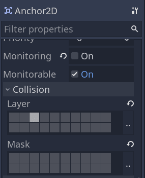
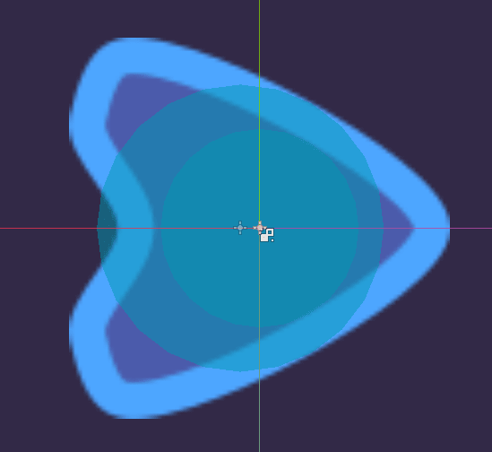
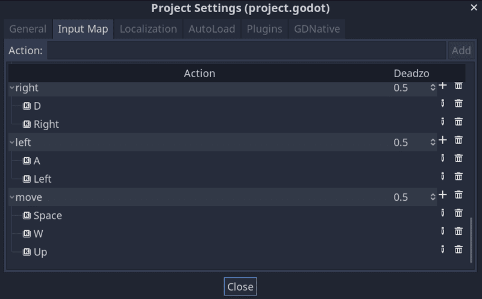

+++
title = "Anchor the camera from the player to fixed points"
description = "Learn to anchor the camera from the player to specific points of the screen with potentially  different zoom levels and in a smooth movement."
author = "raformatico"
coAuthors = ["nathan"]

date = 2020-10-25
weight = 5

difficulty = "intermediate"
keywords = ["godot camera anchor", "2d camera"]

+++

In this tutorial, you will learn to make the camera dynamically switch between following a character and anchoring to a given location. You will:

- Toggle anchoring the camera to the player or a fixed place when entering and leaving specific areas.
- Use steering behaviors to animate the camera's zoom and position smoothly.



You can find the full project [here](https://github.com/GDQuest/godot-mini-tuts-demos/tree/master/2d/anchor-camera).

## How it's done

In short, we have a camera that follows a target point using the arrive steering behavior, a vector math formula that makes an object smoothly move towards a target. The target can be the character the camera is attached to or any global position.

When entering and leaving specific areas, we change the camera's target.

## The code's structure

We created three nodes to build the system:

1. _AnchorCamera2D_, the camera we attach to the player. Although we keep it as a child of the player, we set it to be a top-level node, so it moves independently of its parent. It smoothly follows the player by default unless the ship enters an anchor area.
1. _Anchor2D_, areas that work as anchors. When the player enters this `Area2D`, the camera's target becomes this node's location and zoom level.
1. _AnchorDetector2D_, is an area node we attach to the player to detect when it enters or exits an anchor area.

### Collision layers

We set these three 2D physics layers in _Project -> Project Settings -> 2D Physics_: _actors_, _obstacles_, and _anchors_.


These layers make it easier to manage collisions as the _AnchorDetector2D_ should only detect areas in the _anchors_ layer.


## The anchor area

Let's start with the anchor area as the detector and camera depend on it.

Create a new scene with a root _Area2D_ node named _Anchor2D_ with a _CollisionShape2D_ as its child. The collision shape defines the anchor area. We also used a _Sprite_ node to visualize the area's bounds when running the game.


Set the _Anchor2D_'s _Collision -> Layer_ to _anchors_ only and turn off _Monitoring_ and any _Collision -> Mask_. Doing so makes the anchor detectable, but it doesn't detect other physics bodies and areas itself.



We want our anchors to be rectangular areas. To that end, add a _RectangleShape2D_ to the _CollsionShape2D_'s _Shape_ property. You can open the resource and set its _Extents_ to half the screen resolution, so the area covers one screen by default. We set it to 960x540 as our project has a resolution of 1920x1080.


Attach a new script to _Anchor2D_ with the following code:

```gdscript
class_name Anchor2D
extends Area2D

# The camera's target zoom level while in this area.
export var zoom_level := 1.0
```

## The anchor detector

We'll use another area to detect anchors. Create a new scene with another _Area2D_ node as root, this time name it _AnchorDetector2D_. Add a _CollisionShape2D_ node as a child.


The size of the _CollisionShape2D_ should be a little smaller than the _CollisionShape2D_ of the Player.



This one is going to monitor for anchor areas. Select _AnchorDetector2D_ and set its properties as follows:

- Turn off _Monitorable_.
- Turn off all _Collision -> Layer_.
- Set the _Collision -> Mask_.


Connect the signals _area_entered_ and _area_exited_ of the _AnchorDetector2D_ to itself. We will use this to detect when it enters or leaves an _Anchor2D_ area.


When the node enters or leaves an _Anchor2D_, it will emit the signal _anchor_detected_ or _anchor_detached_, respectively, that we will listen to on the camera. Attach a script to the _AnchorDetector2D_.

```gdscript
class_name AnchorDetector2D
extends Area2D

# Emitted when entering an anchor area.
signal anchor_detected(anchor)
# Emitted after exiting all anchor areas.
signal anchor_detached


func _on_area_entered(area: Anchor2D) -> void:
	emit_signal("anchor_detected", area)


# When exiting an area, we have to ensure we're not entering another anchor.
func _on_area_exited(area: Anchor2D) -> void:
	var areas: Array = get_overlapping_areas()
	# To do so, we check that's there's but one overlapping area left and that it's
	# the one passed to this callback function.
	if get_overlapping_areas().size() == 1 and area == areas[0]:
		emit_signal("anchor_detached")
```

## The camera

Create a new scene with a _Camera2D_ node as root and name it _AnchorCamera2D_. In the _Inspector_, set the camera node as _Current_, so Godot uses it as our game's camera.


Attach a script to the _AnchorCamera2D_ with the following code:

```gdscript
class_name AnchorCamera2D
extends Camera2D

# Distance to the target in pixels below which the camera slows down.
const SLOW_RADIUS := 300.0

# Maximum speed in pixels per second.
export var max_speed := 2000.0
# Mass to slow down the camera's movement
export var mass := 2.0

var _velocity = Vector2.ZERO
# Global position of an anchor area. If it's equal to `Vector2.ZERO`,
# the camera doesn't have an anchor point and follows its owner.
var _anchor_position := Vector2.ZERO
var _target_zoom := 1.0


func _ready() -> void:
	# Setting a node as top-level makes it move independently of its parent.
	set_as_toplevel(true)


# Every frame, we update the camera's zoom level and position.
func _physics_process(delta: float) -> void:
	update_zoom()

	# The camera's target position can either be `_anchor_position` if the value isn't
	# `Vector2.ZERO` or the owner's position. The owner is the root node of the scene in which we
	# instanced and saved the camera. In our demo, it's the Player.
	var target_position: Vector2 = (
		owner.global_position
		if _anchor_position.is_equal_approx(Vector2.ZERO)
		else _anchor_position
	)

	arrive_to(target_position)


# Entering in an `Anchor2D` we receive the anchor object and change our `_anchor_position` and
# `_target_zoom`
func _on_AnchorDetector2D_anchor_detected(anchor: Anchor2D) -> void:
	_anchor_position = anchor.global_position
	_target_zoom = anchor.zoom_level


# Leaving the anchor the zoom return to 1.0 and the camera's center to the player
func _on_AnchorDetector2D_anchor_detached() -> void:
	_anchor_position = Vector2.ZERO
	_target_zoom = 1.0


# Smoothly update the zoom level using a linear interpolation.
func update_zoom() -> void:
	if not is_equal_approx(zoom.x, _target_zoom):
		# The weight we use considers the delta value to make the animation frame-rate independent.
		var new_zoom_level: float = lerp(
			zoom.x, _target_zoom, 1.0 - pow(0.008, get_physics_process_delta_time())
		)
		zoom = Vector2(new_zoom_level, new_zoom_level)


# Gradually steers the camera to the `target_position` using the arrive steering behavior.
func arrive_to(target_position: Vector2) -> void:
	var distance_to_target := position.distance_to(target_position)
	# We approach the `target_position` at maximum speed, taking the zoom into account, until we
	# get close to the target point.
	var desired_velocity := (target_position - position).normalized() * max_speed * zoom.x
	# If we're close enough to the target, we gradually slow down the camera.
	if distance_to_target < SLOW_RADIUS * zoom.x:
		_velocity *= (distance_to_target / (SLOW_RADIUS * zoom.x))

	_velocity += (desired_velocity - _velocity) / mass
	position += _velocity * get_physics_process_delta_time()

```

## Creating the Player scene

We designed a player-controlled ship to test our camera for this small demo. It's a _KinematicBody2D_ node with the following code attached to it:

```gdscript
# Ship that rotates and moves forward, similar to the game classic Asteroid.
class_name Player
extends KinematicBody2D

export var speed := 520
export var angular_speed := 3.0


func _physics_process(delta):
	var direction := Input.get_action_strength("right") - Input.get_action_strength("left")
	var velocity = Input.get_action_strength("move") * transform.x * speed
	rotation += direction * angular_speed * delta
	move_and_slide(velocity)
```

To control the Player's movement, we defined the following input actions in _Project -> Project Settings... -> Input Map_: _right_, _left_, and _move_.



The _AnchorCamera2D_ should be a child of our _Player_ to follow it by default, using the `owner` variable. To detect _Anchor2D_ nodes, we also instantiate _AnchorDetector2D_.


We need to connect the signals _anchor_detected_ and _anchor_detached_ from _AnchorDetector2D_ to the methods _on_AnchorDetector2D_anchor_detected_ and _on_AnchorDetector2D_anchor_detached_ of _AnchorCamera2D_.


And that is it! 



With the connections done and some anchor areas in the level, the camera dynamically moves between the player and other areas of interest.

