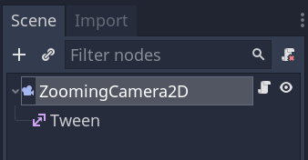
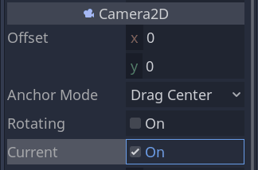
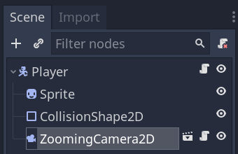

+++
title = "Zooming with the mouse wheel"
description = "Learn how to implement a camera with smooth zoom."
author = "raformatico"
coAuthors = ["nathan"]

date = 2020-10-06
weight = 5

difficulty = "beginner"
keywords = ["godot camera zoom", "godot smooth zoom"]
+++

In this tutorial, you will learn to make a camera zoom smoothly in 2D using tween animation. We will code a camera that can zoom using the mouse wheel with a minimum and maximum zoom level.



You can find the full project [here](https://github.com/GDQuest/godot-mini-tuts-demos/tree/master/2d/camera-zoom).

## Setting up the Scene

First, we need to create a new scene with a _Camera2D_ as its root. Name it _ZoomingCamera2D_ and add a _Tween_ node as a child.



In the _Inspector_, set the camera node as _Current_ so Godot uses it as our game's camera. The active camera is always the last one that set its `current` property to `true`.



## Input actions

Below, you will see we have some input actions we defined in the _Project -> Project Settings... -> Input Map_. Three are related to movement and two map the mouse wheel button to zooming in and out.


## Attaching the camera to a Player scene

We designed a player-controlled ship to test our camera for this small demo. It's a `KinematicBody2D` node with the following code attached to it:

```gdscript
# Ship that rotates and moves forward, similar to classics like Asteroid.
class_name Player
extends KinematicBody2D

export var speed := 250
export var angular_speed := 2.0


func _physics_process(delta):
	# Calculation of the direction to rotate.
	var direction := Input.get_action_strength("right") - Input.get_action_strength("left")
	var velocity = Input.get_action_strength("move") * transform.x * speed
	rotation += direction * angular_speed * delta
	move_and_slide(velocity)
```

Finally, to get the camera and its zoom centered in the _Player_, the _ZoomingCamera2D_ should be a child of our _Player_.



## Coding the zoom

Attach a new script to _ZoomingCamera2D_. Let's define some properties to control the camera's zoom range and speed.

```gdscript
class_name ZoomingCamera2D
extends Camera2D

# Lower cap for the `_zoom_level`.
export var min_zoom := 0.5
# Upper cap for the `_zoom_level`.
export var max_zoom := 2.0
# Controls how much we increase or decrease the `_zoom_level` on every turn of the scroll wheel.
export var zoom_factor := 0.1
# Duration of the zoom's tween animation.
export var zoom_duration := 0.2

# The camera's target zoom level.
var _zoom_level := 1.0 setget _set_zoom_level

# We store a reference to the scene's tween node.
onready var tween: Tween = $Tween
```

Let's look at `_zoom_level`'s setter function next. We use it to trigger the tween animation and smoothly zoom in and out.

```gdscript
func _set_zoom_level(value: float) -> void:
	# We limit the value between `min_zoom` and `max_zoom`
	_zoom_level = clamp(value, min_zoom, max_zoom)
	# Then, we ask the tween node to animate the camera's `zoom` property from its current value
	# to the target zoom level.
	tween.interpolate_property(
		self,
		"zoom",
		zoom,
		Vector2(_zoom_level, _zoom_level),
		zoom_duration,
		tween.TRANS_SINE,
		# Easing out means we start fast and slow down as we reach the target value.
		tween.EASE_OUT
	)
	tween.start()
```

Finally, we use the `_unhandled_input()` callback to update the camera's zoom level, using the input actions defined earlier. Notice how the `Camera2D.zoom` value zooms in when it becomes smaller and zooms out when it increases.

```gdscript
func _unhandled_input(event):
	if event.is_action_pressed("zoom_in"):
		# Inside a given class, we need to either write `self._zoom_level = ...` or explicitly
		# call the setter function to use it.
		_set_zoom_level(_zoom_level - zoom_factor)
	if event.is_action_pressed("zoom_out"):
		_set_zoom_level(_zoom_level + zoom_factor)
```

