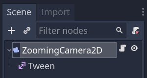
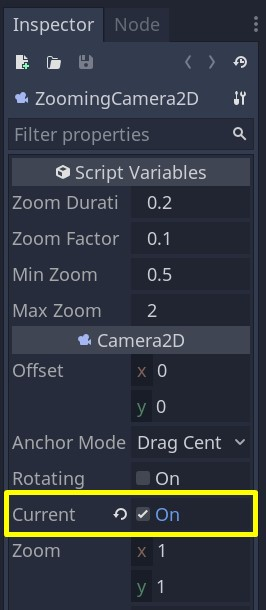
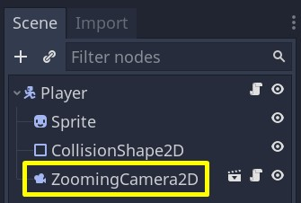
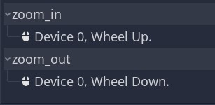

+++
title = "Smooth Zoom with Camera 2D node"
description = "Learn how to implement a camera with smooth zoom for Godot 2D games."
author = "raformatico"

date = 2020-09-18T18:12:50-03:00
weight = 5

difficulty = "beginner"
keywords = ["Godot", "Camera 2D", "Smooth Zoom"]

+++

In this tutorial, you will use a `Camera2D` and a `Tween` node to implement a smooth zoom. You will be able to use this same code and structure in a wide variety of games.

More, specifically with this tutorial you will learn to:

* Control the zoom of the game using the mouse wheel
* Center the camera and its zoom in the player
* Render the zoom as a smooth transition
* Restrict zoom level between a maximum and a minimum

 

Find the full project [here](https://github.com/GDQuest/godot-mini-tuts-demos/tree/master/2d/camera-zoom).

## Setting up the Scene

Firstly, we need to create a new scene with a _Camera2D_ as root named _ZoomingCamera2D_ and a child _Tween_.



Remember that this _ZoomingCamera2D_ should be set as _Current_ to ensure that it will be active. 



Finally, to get the camera and its zoom centered in the _Player_ the _ZoomingCamera2D_ should be a child of our _Player_.



## Coding the zoom

Attach a new script to  _ZoomingCamera2D_ and define the variables of this _class_: the minimum and maximum values for the zoom_level (_min_zoom_ and _max_zoom_), the amount of zoom we add or subtract (_zoom_factor_) and the time of the zoom transition (_zoom_duration_).

The key part of this tutorial is to modify in the way we want the zoom_level. Therefore, we use _\_zoom_level_ with a setter to easily control its changes.

```gdscript
class_name ZoomingCamera2D
extends Camera2D

export var min_zoom := 0.5
export var max_zoom := 2.0
export var zoom_factor := 0.1
export var zoom_duration := 0.2

var _zoom_level := 1.0 setget _set_zoom_level

onready var tween: Tween = $Tween
```

After this, we capture the action of the mouse wheel and call the _\_set_zoom_level_ function. Note, that we should link the actions _zoom_in_ and _zoom_out_ as mouse wheel up and down in the _Input Map_. 



```gdscript
func _unhandled_input(event):
	if event.is_action_pressed("zoom_in"):
		_set_zoom_level(_zoom_level - zoom_factor)
	if event.is_action_pressed("zoom_out"):
		_set_zoom_level(_zoom_level + zoom_factor)
```

We define _\_set_zoom_level_ function to change _zoom_ property of the _Zooming_Camera2D_. Additionally, to restrict the zoom level between a maximum and a minimum we use [clamp](https://docs.godotengine.org/en/stable/development/cpp/common_engine_methods_and_macros.html#clamp-a-value).

```gdscript
func _set_zoom_level(value: float) -> void:
	_zoom_level = clamp(value, min_zoom, max_zoom)
	zoom = Vector2(_zoom_level, _zoom_level)
```

 

This zoom effect is not visually pleasant, so to make it smooth we should use the _Tween_ node. We will interpolate from the current _zoom_level_ to the _value_ obtained as an argument during _zoom_duration_. Find [here](https://docs.godotengine.org/es/stable/classes/class_tween.html) more details about Tween node.

```gdscript
func _set_zoom_level(value: float) -> void:
	_zoom_level = clamp(value, min_zoom, max_zoom)
	tween.interpolate_property(
		self,
		"zoom",
		zoom,
		Vector2(_zoom_level, _zoom_level),
		zoom_duration,
		tween.TRANS_SINE,
		tween.EASE_OUT
	)
	tween.start()
```

