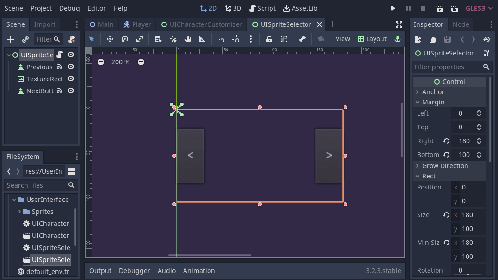
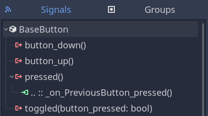
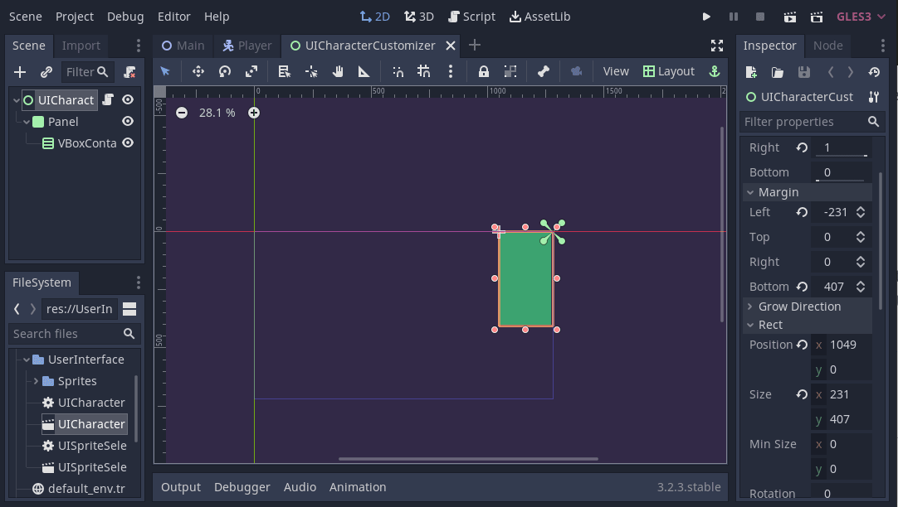
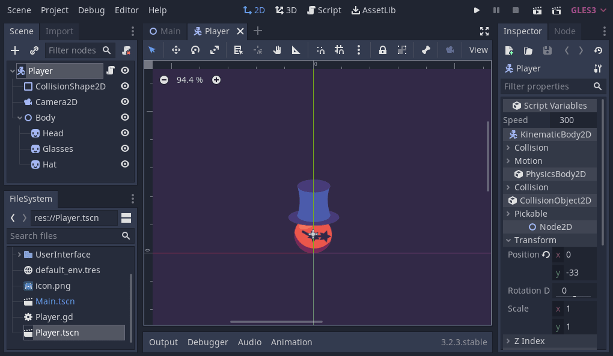

+++
title = "Character Customization"
description = "Create a menu to customize your character's look in-game."
author = "azagaya"
coAuthors = ["nathan"]

date = 2020-09-30T19:22:42-03:00
weight = 5
draft = true

difficulty = "beginner"
keywords = ["customization"]
+++

In this tutorial, you will learn how to customize a character through a GUI and see real-time results. By the end, you will be able to customize the character's hat, the head, and sunglasses.



You can download the full project [here](https://github.com/GDQuest/godot-mini-tuts-demos/tree/master/2d/character-customization).

To select the desired textures for each part of the character, we will make a User Interface (UI) that lets the user cycle between the different options. As the code for changing any part is the same, we will make a single scene with the functions to cycle between the available textures. Then we will use three instances of that scene to build the final interface.

## Creating a widget to select sprites

Let's first create a UI component we can duplicate in our menu.

Create a new scene with a `Control` node as root, and name it _UISpriteSelector_. Add two `Button` nodes to the scene and a `TextureRect`. Name the buttons _PreviousButton_ and _NextButton_. We will use them to cycle between available textures, and the `TextureRect` will display the currently selected one. Use the _Layout_ in the toolbar to anchor the _PreviousButton_ on the center left and the _NextButton_ on the center right. Your scene should look like this:



Add a script to the newly created _UISpriteSelector_ scene.

Before writing code, we should connect the buttons' `pressed` signal to _UISpriteSelector_. For each button, select it, head to the _Node_ dock, and double click _pressed_. In the newly opened window, click on the _Connect_ button.


You should see the signal connected like so:



Here's the `UISpriteSelector`'s code and how it works:

```gd
# Scene with the necessary controls to select a texture for the customization
class_name UISpriteSelector
extends Control

# Emitted when the selected texture changes.
signal sprite_changed(texture)
# We store all available textures to cycle through in this array.
var _sprites := []
# The index of the currently selected texture from the `_sprites` array.
var _index := 0 setget _set_index

# We store a reference to the TextureRect node to update its texture.
onready var texture_rect: TextureRect = $TextureRect

# This function allows another node to pass an array of textures to store in `_sprites`
func setup(sprite_textures: Array) -> void:
	_sprites = sprite_textures
	# We reset the index to update the texture. See `_set_index()` below.
	_set_index(0)


# We use this function to update the _index value and the selected texture.
# We use a setter function because we always want to update the texture when the _index value changes.
func _set_index(value: int) -> void:
	# `wrapi()` cycles the value between the second and the third argument - 1.
	# Here, we use it to cycle between our textures.
	_index = wrapi(value, 0, _sprites.size())
	# The next two lines get and display the newly selected texture.
	var texture: StreamTexture = _sprites[_index]
	texture_rect.texture = texture
	emit_signal("sprite_changed", texture)


# The two callbacks below were generated by Godot.
func _on_PreviousButton_pressed() -> void:
	# When clicking the previous button, we lower the index by one.
	_set_index(_index - 1)


func _on_NextButton_pressed() -> void:
	# When clicking the next button, we increment the index by one.
	_set_index(_index + 1)
```

## The character customization menu

We can use the _UISpriteSelector_ scene created previously to build a menu to customize game characters.

Create a new scene with a _Control_ as its root node. Name it _UICharacterCustomizer_. After that, add a _Panel_ node to the scene. We are going to use it as a background. Add a _VBoxContainer_ as the _Panel_'s child. We will add the _UISpriteSelector_ instances as children of this container via code so they automatically stack vertically. Your scene should look like this:



In the image above, we anchored _UISpriteSelector_ in the top-right corner using the _Layout_ menu.

Create a new script for _UISpriteSelector_.

```gd
# This script builds the character customizer GUI, with a `UISpriteSelector`
# for each customizable part.
extends Control

# We're going to have three customizable parts on our character:
# the hat, head, and glasses. We define three corresponding signals.
# Emitted when the user changes the hat texture.
signal hat_changed(texture)
# Same as above, but for the head texture.
signal head_changed(texture)
# Same as above, but for the glasses texture.
signal glasses_changed(texture)

# The `DATA` dictionary contains the possible textures of each part of the
# character. Each key represents a customizable part.
const DATA := {
	"hat" :
	[
		preload("Sprites/hat1.png"),
		preload("Sprites/hat2.png"),
		preload("Sprites/hat3.png")
		],
	"glasses" : [
		preload("Sprites/sun-glasses1.png"),
		preload("Sprites/sun-glasses2.png"),
		preload("Sprites/sun-glasses3.png")
		],
	"head": [
		preload("Sprites/head1.png"),
		preload("Sprites/head2.png"),
		preload("Sprites/head3.png") ]
	}

# We want to instance our UISpriteSelector scene from code so we preload it.
const SpriteSelectorScene: PackedScene = preload("UISpriteSelector.tscn")

onready var vbox_container: VBoxContainer = $Panel/VBoxContainer


# When the node enters the tree, we instantiate `SpriteSelectorScene` for each 
# customizable part.
func _ready() -> void:
	for key in DATA:
        # Get the textures available for the current `key`
		var textures: Array = DATA[key]
		# Create an instance of the `SpriteSelectorScene`
		var sprite_selector: UISpriteSelector = SpriteSelectorScene.instance()
		vbox_container.add_child(sprite_selector)
		# We feed the UI widget's textures by calling its `setup()` method.
		sprite_selector.setup(textures)
		# We connect to the `UISpriteSelector`'s `sprite_changed` signal, binding the `key` as an
		# extra parameter, to know which texture changed and emit the corresponding signal.
		sprite_selector.connect("sprite_changed", self, "_on_SpriteSelector_sprite_changed", [key])


# When a texture changes, we emit the corresponding signal, to notify the
# character in the main scene.
func _on_SpriteSelector_sprite_changed(texture: StreamTexture, key: String) -> void:
	emit_signal(key + "_changed", texture)

```

When calling the `emit_signal()` function, we use `key + "*changed` because `key` corresponds to the part we customized. For instance, if a hat changes, `key` should be equal to `"hat"`, and `hat_changed` would be emitted. The `texture` parameter of this function comes from the signal defined in the _UISpriteSelector_.

## Customizing the character

The only remaining task is making a character to customize. Create a new scene, with a `KinematicBody2D` node as root, and name it _Player_. This character should have a sprite for each customizable part. In this case, we will have three sprites: _Head_, _Glasses_, and _Hat_. Build the scene like in the following image.



We placed all `Sprite` nodes as children of a `Node2D` called _Body_. With this, we can flip them all at once by flipping _Body_.

Attach a script to the _Player_ scene.

```gd
# Character script with some basic movement, and the functions needed to update
# the sprites of the customizable parts.
extends KinematicBody2D

export var speed := 300.0

onready var body := $Body
# We store references to each customizable sprite, for later use.
onready var hat := $Body/Hat
onready var glasses := $Body/Glasses
onready var head := $Body/Head


# Basic movement is handled here, just for demonstration purposes.
func _physics_process(_delta) -> void:
	var direction := Vector2(
		Input.get_action_strength("ui_right") - Input.get_action_strength("ui_left"),
		Input.get_action_strength("ui_down") - Input.get_action_strength("ui_up")
	).normalized()

	move_and_slide(direction * speed)

	if direction.x != 0:
		body.scale.x = sign(direction.x)


# This functions changes the glasses' texture. It needs to be connected to the
# `glasses_changed` signal of the `UICharacterCustomizer`
func _on_CharacterCustomizer_glasses_changed(texture) -> void:
	glasses.texture = texture


# Same as previous funciton, but for the `hat`.
func _on_CharacterCustomizer_hat_changed(texture) -> void:
	hat.texture = texture


# Same as previous function, but for the `head`.
func _on_CharacterCustomizer_head_changed(texture) -> void:
	head.texture = texture
```

In the main scene, we will connect the signals emitted from the _UICharacterCustomizer_ scene to the three functions defined above.

## Putting it all together in the main scene

Make a new scene from a `Node2D`, and name it _Main_. Add the _Player_ and a `CanvasLayer` to it. Then, add the _UICharacterCustomizer_ scene to the `CanvasLayer` node. Doing so makes the interface follow the screen.


Remember to connect the `hat_changed`, `head_changed` and `glasses_changed` signals from the _UICharacterCustomizer_, to the matching functions defined in the _Player_ script. This way, when the user changes some texture from the interface, the character sprite will be updated as well.
