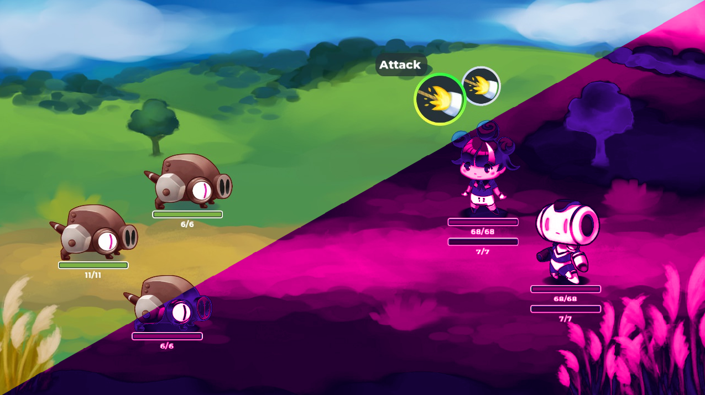
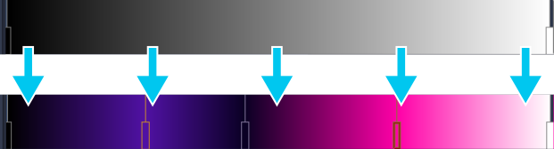
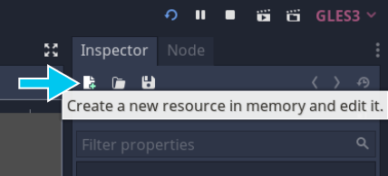
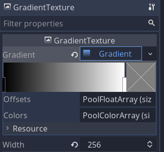
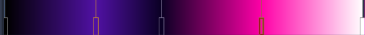
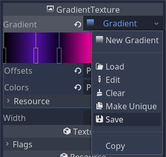
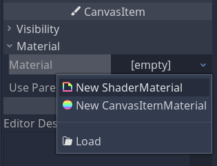
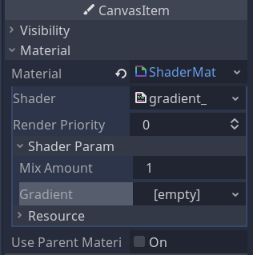

+++
title = "Gradient map"
description = "Learn to alter sprite colors with shaders."
author = "johnny"
programVersion = "3.2"

difficulty = "intermediate"
tags = ["godot", "tutorial"]
keywords = ["godot shaders tutorial", "godot shaders", "gradient map shader", "godot 2d shaders",]

date = "2020-07-19"
draft = true
weight = 5

+++

# Gradient Mapping Outline

In this tutorial, you'll learn how to use a shader to change the colors of a sprite. This is useful for refining or completely changing the mood of your game. It's also how many filters work in apps such as Instagram.



The shader works by first converting the sprite to greyscale, then mapping each shade of grey to another color defined by a gradient resource.



## Creating the gradient

Let's first create the gradient we'll map to. With Godot open, create a new resource by clicking the new resource button in the top right of the editor.



Select _GradientTexture_ from the list that pops up and click _Create_.

In the inspector, set the _Width_ to `256` pixels because we don't need a large texture for our purposes. Click the `empty` _Gradient_ property to create a new gradient. Your settings should look like this.



Modify the gradient by left clicking on it to create a stop, then clicking on the color square to the right. Doing so will open the color picker.


You can also right click a stop to delete it and drag stops to move them around.

Experiment with making an appealing color scheme. I used the following gradient in the above example to create a spooky other-world feel.



Save your gradient by clicking the down arrow. I saved mine as `spooky.tres`.



## Coding the shader

Now we have our gradient, we'll create the shader.

Select the sprite you'd like to alter and create a new _ShaderMaterial_ for it.



In the same way, create a new _Shader_ for this material and click on it to open the shader editor. Let's start coding!

```glsl
shader_type canvas_item;
render_mode unshaded;

uniform sampler2D gradient: hint_black;
uniform float mix_amount = 1.0;
```

First we define our shader type so Godot knows what it's working with. We're working in 2D so or `shader_type` is `canvas_item`.

You can choose to ignore the built in lighting system by flagging the `render_mode` as `unshaded`.

Uniforms allow us to pass data into the shader. We'll need the gradient texture we just made so we define the `gradient` uniform for that. As a precaution, we use `hint_black` which returns a black texture if we forget to define the gradient.

Our `mix_amount` will dictate how strongly we want our gradient colors to come through.

Let's move on to the fragment function.

```glsl
void fragment(){
	vec4 input_color = texture(TEXTURE, UV);
	float greyscale_value = dot(input_color.rgb, vec3(0.299, 0.587, 0.114));
```

Here we sample the sprite and store the color at the `UV` co-ordinates.

We then convert this color into a greyscale value using the dot product with a pre-defined vector. The dot product multiplies the red part of the color by `0.299`, the green part by `0.587` and the blue value by `0.114`. It then adds these three values together to return a value between `0.0` and `1.0`. This is a common way to convert colors to greyscale.

```glsl
vec3 sampled_color = texture(gradient, vec2(greyscale_value, 0.0)).rgb
```

We then sample the gradient using the greyscale value at the `UV.x` co-ordinate. The `UV.y` value is `0.0` because our gradient texture is only 1 pixel tall and we're only interested in sampling the texture from left to right. If the greyscale value is `1.0`, it samples the very right edge of the gradient; if it's `0.0`, it samples the very left edge.

```glsl
COLOR.rgb = mix(input_color.rgb, sampled_color, mix_amount);
COLOR.a = input_color.a;
```

We then mix the input color with the sampled color using the mix amount.

We still want to conserve the alpha value of the original texture so we use it's alpha value.

Here's the final shader:

```glsl
shader_type canvas_item;
render_mode unshaded;

uniform sampler2D gradient: hint_black;
uniform float mix_amount = 1.0;

void fragment(){
	vec4 input_color = texture(TEXTURE, UV);
	float greyscale_value = dot(input_color.rgb, vec3(0.299, 0.587, 0.114));
	vec3 sampled_color = texture(gradient, vec2(greyscale_value, 0.0)).rgb;

	COLOR.rgb = mix(input_color.rgb, sampled_color, mix_amount);
	COLOR.a = input_color.a;
}
```

The final thing to do is load `spooky.tres` into _Shader Param > Gradient_. You can load it by clicking on it or simply dragging the `spooky.tres` resource from the _FileSystem_ dock.



And we're done! Enjoy playing around with all sorts of gradients and colors in your game!