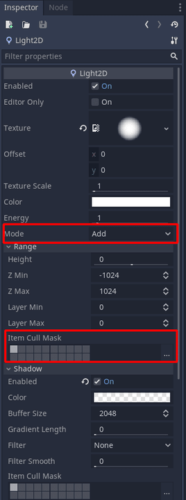
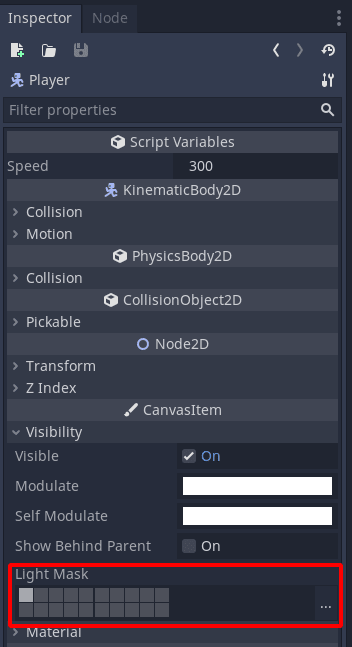
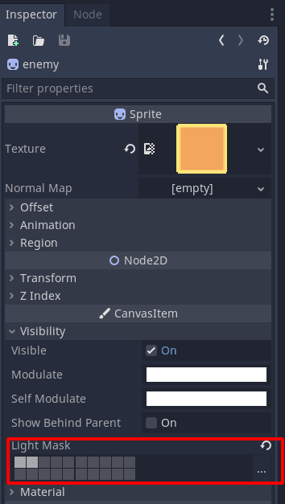

+++
title = "Limited player vision with lights"
menuTitle = "Limited player vision"
description = "Learn how to make limited player vision with lights and masks."
author = "azagaya"

date = 2020-09-23T17:55:55-03:00
weight = 5

difficulty = "beginner"
keywords = ["Light Masks", "Limited Vision"]
+++

In this tutorial, you will learn how to make a player with limited vision using `Light2D` nodes. 

The limited vision mechanic consists of:

 - Enemies outside the vision range should not be visible.
 - Lights and shadows should affect the environment.
 - Walls should interrupt the line of sight.
 
 

You can download the full project of this tutorial [here](https://github.com/GDQuest/godot-mini-tuts-demos/tree/master/2d/limited-player-vision).

We are going to use two `Light2D` nodes to implement this effect. One will add light and shadows to the environment, while the other will occlude the lit area's enemies.

For the first light, add a texture and enable shadows by checking _Shadows->Enabled_. You can find a soft circle texture to use for your light in the project linked above. Set that the _Mode_ attribute to _Add_. Doing so adds the light's value to underlying pixels.

We can use the light's cull mask to control which nodes it affects. Update the _Range->Item Cull Mask_ property of the light so it only has _Layer 1_ enabled. That's the first rectangle in the top-left of the grid.

 There is also a _Shadow->Item Cull Mask_ property. Ensure you're modifying the property under the _Range_ group. 

By default, all sprites are on the light layer 1. You can change that by selecting any node that extends `Node2D`, including sprites and tilemaps, and changing their _Visibility->Light Mask_ property.

For the second light, use the same texture, enable shadows, and change its _Mode_ to _Mask_. The mask mode hides sprites outside the light's area.

Set its _Range->Item Cull Mask_ to _Layer 2_. With this, the light only applies the mask to nodes with _Layer 2_ enabled in their _Visibility->Light Mask_.

 The light in _Mask_ mode only occludes nodes within its range. So, make sure the light's texture covers the entire viewport. 

All nodes you want the mask to occlude should have _Layer 2_ layer enabled in _Visibility->Light Mask_.

In the demo project, the _Player_ and _TilemMap_ nodes have only _Layer 1_ enabled in _Visibility->Light Mask_. 

_Enemies_ have both _Layer 1_ and _Layer 2_. As a result, the masking light will only occlude enemies.

