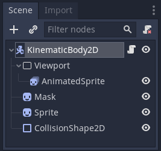
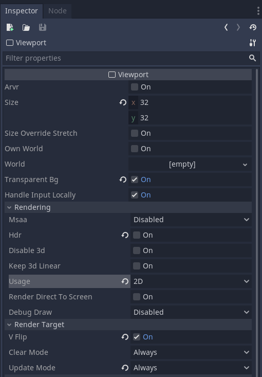
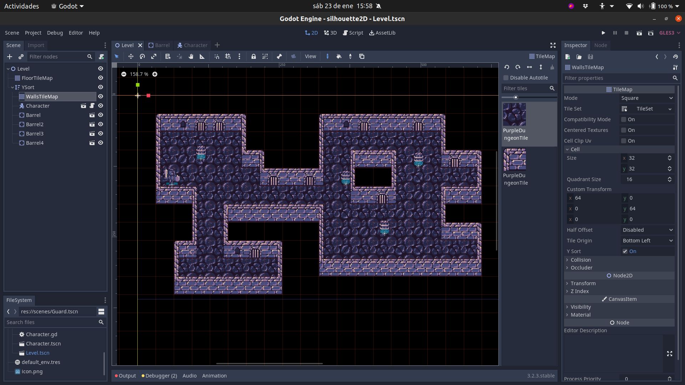
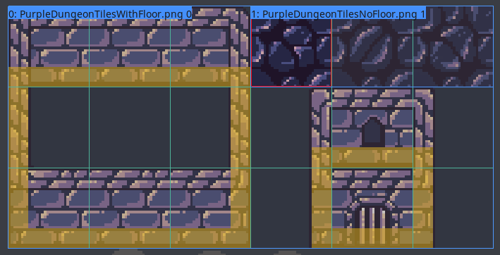

+++
title = "Silhouette of hidden character"
description = "Learn how to show a silhouette when a character is behind objects in 2D games."
author = "azagaya"

date = 2021-01-23T13:26:00-03:00
weight = 5
draft = true

difficulty = "beginner"
keywords = ["silhouette"]
+++

In this tutorial, you will learn how to use viewports and shaders to show a silhouette when a player is occluded by other objects in 2D games.



You can download the full project of this tutorial [here](https://github.com/GDQuest/godot-mini-tuts-demos/tree/master/shaders/silhouette2D).

## Setting up the Character scene

Start by creating a new scene with a `KinematicBody2D` as the root node. Add a `Viewport` node to the scene, and an `AnematedSprite` as a child to the viewport. We are going to use the viewport to render the animations, and then we will use the viewport's texture. Add also two `Sprite` nodes to the scene, and name the first one as "Mask". Assign a high value, like 10, to the second sprite's z-index in the inspector, so the silhouette can render above everything else. Also, add a `CollisionShape2D`. Your scene should look like this:



Next, let's configure the viewport. Assign 32 to both width and height. Note that this value depends on the size of what you want to render inside the viewport.

As the viewport's origin is set to the top-left corner, we need to move the `AnimatedSprite` node so that it can be fully rendered. This is, set its "Transform->Position" property in the inspector to 16 in both `x` and `y`.

Make sure to check the "Transparent Bg" option. Without this option, the rendered texture will have a solid background color.

Under the "Render" category in the inspector, disable "HDR" and change the usage to 2D. Also, check the option "Render Target -> V Flip", as, by default, the texture will be rendered upside-down. Lastly, change the "Update Mode" property to "Always". Your viewport's settings in the inspector should look like this:



 Remember to set an animation to the `AnimatedSprite` using the provided assets. The configuration of this node is outside the scope of this tutorial. 

You won't see anything yet, because we need to set what the viewport is rendering as the texture for both sprites. So, for each sprite, select "New ViewportTexture" in the "Texture" property in the inspector, and select the viewport node in the popup window. Now you should see the animation.

For testing purposes, let's add the following script to the character's scene, to be able to move it when testing:

```gd
extends KinematicBody2D

export var speed := 100.0

onready var animated_sprite := $Viewport/AnimatedSprite


func _physics_process(_delta) -> void:
	var direction := Vector2(
		Input.get_action_strength("ui_right") - Input.get_action_strength("ui_left"),
		Input.get_action_strength("ui_down") - Input.get_action_strength("ui_up")
	).normalized()

	move_and_slide(direction * speed)

	if direction.x != 0:
		animated_sprite.scale.x = sign(direction.x)
```

Also, as we are going to use this in a top-down oblique example, set the offset of both sprites to `(0, -16)`, so that the feet of the guard is placed at the origin of the scene. This will be needed later when we make the level scene.

Save this scene as "Character.tscn"

## Shaders

We are going to use two shaders to accomplish this effect. Add a shader to the sprite called "Mask" with the following code:

```glsl
shader_type canvas_item;

void fragment() {
	float a = texture(TEXTURE, UV).a;
	COLOR = vec4(10.0) * a;
}
```

This simple shader will set 10 to all three RGB channels of the texture while keeping the transparent area. We are going to use that color because it is a color that we shouldn't have in any other rendered texture, as normally color channels take values from 0 to 1. So, whenever we sample a color with 10 in one of the RGB channels, we know we are sampling the mask.

Let's add another shader to the second sprite, with the following code:

```glsl
shader_type canvas_item;
uniform vec4 silhouette_color : hint_color;

void fragment() {
	vec4 screen_color = texture(SCREEN_TEXTURE, SCREEN_UV);
	vec4 tex_color = texture(TEXTURE, UV);
	COLOR = tex_color;
	if (screen_color.r < 10.0){
		COLOR.rgb = silhouette_color.rgb;
	}
}
```

We declare a uniform for the silhouette color, so you can change it according to your game. In this shader, we sample the screen's texture and the sprite's texture. We then assign the sprite's texture color to the `COLOR` out built-in parameter. 

If the sampled screen color is less than 10, it means that the mask is hidden by some other object. So in that case we need to show the silhouette color. In the other case, we should show the texture color, that was already assigned.

## Level scene

Let's create a level with a top-down oblique perspective for testing purposes. Create a scene with a `Node2D` as root, and add a `TileMap` and name it "FloorTileMap". Add an `YSort` node, with a `TileMap` child named "WallsTileMap". Also, add an instance of the character scene as a child of the `YSort`. Explaining what the `YSort` node does is out of the scope of this tutorial, but you can check the official documentation [here](https://docs.godotengine.org/en/stable/classes/class_ysort.html).

The `TileMap` inside the `YSort` is for the walls of the level, and the one outside is for the floor. The reason for this setup is that we need the walls sometimes to render behind the player and other times in front of the player. So we need them to be in a tilemap affected by the `YSort`. As the floor is always to be rendered behind, we set it in a separated `TileMap` outside the `YSort` and above it in the scene tree.

For the "WallsTileMap" to be rendered as we expect, check the "Cell -> Y Sort" option in the inspector, and change the "Cell -> Tile Origin" to "Bottom Left". As the Guard's feet are placed at the character's scene origin, with the tile origin set to the bottom left corner, we ensure that as soon as the character's foot surpasses the wall tile's bottom left corner, it will be rendered behind it.

Set up the tilemaps using the provided assets, and create a level like this:




When setting up the wall tilemap, make sure to set the collision polygon at the bottom of each wall tile. This is needed for this example to work in this perspective. For example, these are the collisions used in the example project:



Finally, execute the level scene, and check that the silhouette appears when the character is hidden by a wall.

## Final Exercise

Modify the silhouette shader so that it shows an outline instead of a silhouette when the Character is hidden behind a wall. The final result should look like this:



