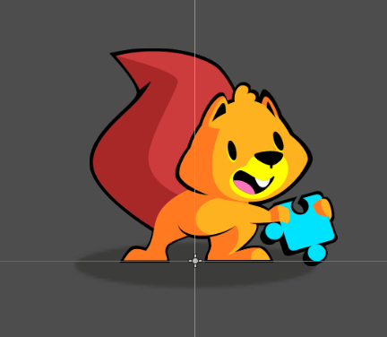
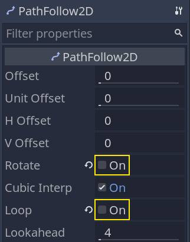
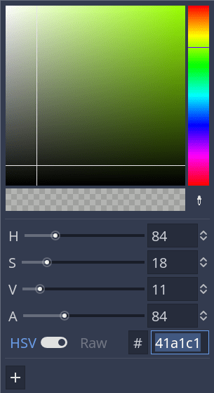
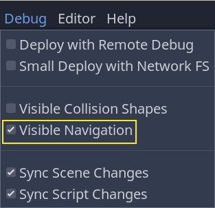
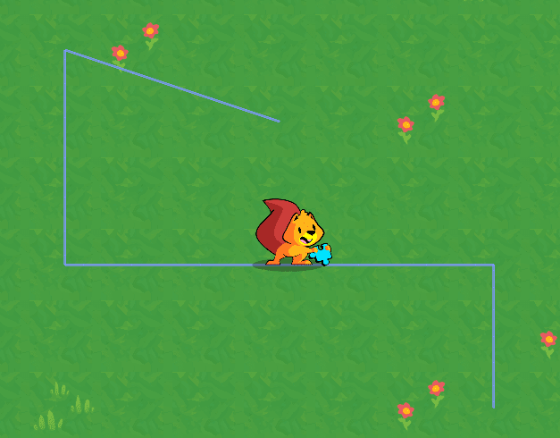

+++
title = "Creating the Unit"
author = "nathan"
date = "2021-01-30"
description = "We create a scene for the game's units and use the path follow node to set up their movement system."
weight = 3
+++

In this lesson, we'll create the unit, another core building block of the movement system.



The unit will only handle the visuals and the movement of a pawn on the game board. 

This will allow us to test it even though we don't have the rest of the systems implemented yet. Coding independent nodes like that make it more efficient to reuse or modify them within and across projects. 

You can think of the unit we will make as a lifeless pawn on a game board. It's like a little figurine that you can move around.

## The unit's scene

Let us start by designing the unit's scene.

We will use the _Path2D_ and the _PathFollow2D_ nodes to make our sprites move along a path. 

_Path2D_ gives you tools to define a curve using a bezier spline, but you can also use it for straight lines. 

The _PathFollow2D_ node allows you to move along that path conveniently by animating an offset value.

Create a new scene with a _Path2D_ node as its root and add a _PathFollow2D_ as a child.

Select the _Path2D_ node and in the _Inspector_, clear its _Curve_ property. With the _PathFollow2D_ node, the curve would lock the node in place. We'll set the _Curve_ in the script.


By default, when using _PathFollow2D_, the node will rotate its children along the path and cycle back to the start. Select the node and turn off the _Rotate_ and _Loop_ properties.



Then, add two sprites as children of _PathFollow2D_. The first is there to represent the shadow while the other there is going to be the unit. I named them respectively _Shadow_ and _Sprite_. Assign the texture `unit_shadow.svg` to the _Shadow_ in the _Inspector_ and set its _Modulate_ color to a dark tone.



You can lower the scale of the _Sprite_ node to `0.25`, as the assets we included in the project are large for this game.


We will use the _Path2D_ and the _PathFollow2D_ nodes to make our sprites move along a path.

_Path2D_ gives you tools to define a curve using a bezier spline, but you can also use it for straight lines.
Finally, add an _AnimationPlayer_ as a child of the _Unit_ node. We will use it to make the _Sprite_ blink when the player selects it.


## Blinking animation for selected units

We will use an animation to make the character blink or flash when it is selected. To do that, we'll use the _Modulate_ property and its RAW color mode.

We'll also animate the _Sprite_ node directly so that the _Shadow_ doesn't change color with it.

First, though, let's define an animation named `idle`. It's an empty animation that resets the sprite's _Modulate_ property. As animations in Godot override the nodes' properties, I recommend always setting up an animation to reset your node to it's default state.

Our `idle` animation should only have one key for the _Modulate_ property. I typically give this kind of animation a duration of 0 seconds.


Now, we can work on the `selected` animation.

Let's temporarily assign a texture to the _Sprite_ to preview the animation. Drag the `squirrel.png` to the node's _Texture_.

Select the _AnimationPlayer_ and create a new animation named `selected`. It should loop and last a bit more than one second. I set its duration to `1.4` seconds.


The animation needs two keys that make the _Sprite -> Modulate_ property cycle:

1. The first one, at the start of the timeline, should use the current modulate color, an opaque white.
2. The second one should use the RAW color mode with values higher than `1` in the R, G, and B channels. I used `1.5` for each of them. Doing so makes the sprite become brighter.


Now, you may clear the _Sprite_ node's _Texture_. We'll use an exported variable in the script to assign a different sprite to each unit instance.

## Coding the Unit

Let's move to the code. Attach a script to the _Unit_ node with the following content.

We'll start with most of the node's properties and corresponding setter functions.

```gdscript
# Represents a unit on the game board.
# The board manages the Unit's position inside the game grid.
# The unit itself is only a visual representation that moves smoothly in the game world.
# We use the tool mode so the `skin` and `skin_offset` below update in the editor.
tool
class_name Unit
extends Path2D

# Preload the `Grid.tres` resource you created in the previous part.
export var grid: Resource = preload("res://Grid.tres")
# Distance to which the unit can walk in cells.
# We'll use this to limit the cells the unit can move to.
export var move_range := 6
# Texture representing the unit.
# With the `tool` mode, assigning a new texture to this property in the inspector will update the
# unit's sprite instantly. See `set_skin()` below.
export var skin: Texture setget set_skin
# Our unit's skin is just a sprite in this demo and depending on its size, we need to offset it so
# the sprite aligns with the shadow.
export var skin_offset := Vector2.ZERO setget set_skin_offset
# The unit's move speed in pixels, when it's moving along a path.
export var move_speed := 600.0

# Coordinates of the grid's cell the unit is on.
var cell := Vector2.ZERO setget set_cell
# Toggles the "selected" animation on the unit.
var is_selected := false setget set_is_selected

# Through its setter function, the `_is_walking` property toggles processing for this unit.
# See `_set_is_walking()` at the bottom of this code snippet.
var _is_walking := false setget _set_is_walking

onready var _sprite: Sprite = $PathFollow2D/Sprite
onready var _anim_player: AnimationPlayer = $AnimationPlayer
onready var _path_follow: PathFollow2D = $PathFollow2D


# When changing the `cell`'s value, we don't want to allow coordinates outside the grid, so we clamp
# them.
func set_cell(value: Vector2) -> void:
	cell = grid.clamp(value)


# The `is_selected` property toggles playback of the "selected" animation.
func set_is_selected(value: bool) -> void:
	is_selected = value
	if is_selected:
		_anim_player.play("selected")
	else:
		_anim_player.play("idle")


# Both setters below manipulate the unit's Sprite node.
# Here, we update the sprite's texture.
func set_skin(value: Texture) -> void:
	skin = value
	# Setter functions are called during the node's `_init()` callback, before they entered the
	# tree. At that point in time, the `_sprite` variable is `null`. If so, we have to wait to
	# update the sprite's properties.
	if not _sprite:
		# The yield keyword allows us to wait until the unit node's `_ready()` callback ended.
		yield(self, "ready")
	_sprite.texture = value


func set_skin_offset(value: Vector2) -> void:
	skin_offset = value
	if not _sprite:
		yield(self, "ready")
	_sprite.position = value


func _set_is_walking(value: bool) -> void:
	_is_walking = value
	set_process(_is_walking)
```

Now, here's the smooth movement logic.

```gdscript
# Emitted when the unit reached the end of a path along which it was walking.
# We'll use this to notify the game board that a unit reached its destination and we can let the
# player select another unit.
signal walk_finished


func _ready() -> void:
	# We'll use the `_process()` callback to move the unit along a path. Unless it has a path to
	# walk, we don't want it to update every frame. See `walk_along()` below.
	set_process(false)

	# The following lines initialize the `cell` property and snap the unit to the cell's center on the map.
	self.cell = grid.calculate_grid_coordinates(position)
	position = grid.calculate_map_position(cell)

	if not Engine.editor_hint:
		# We create the curve resource here because creating it in the editor prevents us from
		# moving the unit.
		curve = Curve2D.new()


# When active, moves the unit along its `curve` with the help of the PathFollow2D node.
func _process(delta: float) -> void:
	# Every frame, the `PathFollow2D.offset` property moves the sprites along the `curve`.
	# The great thing about this is it moves an exact number of pixels taking turns into account.
	_path_follow.offset += move_speed * delta

	# When we increase the `offset` above, the `unit_offset` also updates. It represents how far you
	# are along the `curve` in percent, where a value of `1.0` means you reached the end.
	# When that is the case, the unit is done moving.
	if _path_follow.unit_offset >= 1.0:
		# Setting `_is_walking` to `false` also turns off processing.
		self._is_walking = false
		# Below, we reset the offset to `0.0`, which snaps the sprites back to the Unit node's
		# position, we position the node to the center of the target grid cell, and we clear the
		# curve.
		# In the process loop, we only moved the sprite, and not the unit itself. The following
		# lines move the unit in a way that's transparent to the player.
		_path_follow.offset = 0.0
		position = grid.calculate_map_position(cell)
		curve.clear_points()
		# Finally, we emit a signal. We'll use this one with the game board.
		emit_signal("walk_finished")


# Starts walking along the `path`.
# `path` is an array of grid coordinates that the function converts to map coordinates.
func walk_along(path: PoolVector2Array) -> void:
	if path.empty():
		return

	# This code converts the `path` to points on the `curve`. That property comes from the `Path2D`
	# class the Unit extends.
	curve.add_point(Vector2.ZERO)
	for point in path:
		curve.add_point(grid.calculate_map_position(point) - position)
	# We instantly change the unit's cell to the target position. You could also do that when it
	# reaches the end of the path, using `grid.calculate_grid_coordinates()`, instead.
	# I did it here because we have the coordinates provided by the `path` argument.
	# The cell itself represents the grid coordinates the unit will stand on.
	cell = path[-1]
	# The `_is_walking` property triggers the move animation and turns on `_process()`. See
	# `_set_is_walking()` below.
	self._is_walking = true
```

Here's the complete `Unit.gd` script without the comments.

```gdscript
tool
class_name Unit
extends Path2D

signal walk_finished

export var grid: Resource = preload("res://Grid.tres")
export var skin: Texture setget set_skin
export var move_range := 6
export var skin_offset := Vector2.ZERO setget set_skin_offset
export var move_speed := 600.0

var cell := Vector2.ZERO setget set_cell
var is_selected := false setget set_is_selected

var _is_walking := false setget _set_is_walking

onready var _sprite: Sprite = $PathFollow2D/Sprite
onready var _anim_player: AnimationPlayer = $AnimationPlayer
onready var _path_follow: PathFollow2D = $PathFollow2D


func _ready() -> void:
	set_process(false)

	self.cell = grid.calculate_grid_coordinates(position)
	position = grid.calculate_map_position(cell)

	if not Engine.editor_hint:
		curve = Curve2D.new()


func _process(delta: float) -> void:
	_path_follow.offset += move_speed * delta

	if _path_follow.unit_offset >= 1.0:
		self._is_walking = false
		_path_follow.offset = 0.0
		position = grid.calculate_map_position(cell)
		curve.clear_points()
		emit_signal("walk_finished")


func walk_along(path: PoolVector2Array) -> void:
	if path.empty():
		return

	curve.add_point(Vector2.ZERO)
	for point in path:
		curve.add_point(grid.calculate_map_position(point) - position)
	cell = path[-1]
	self._is_walking = true


func set_cell(value: Vector2) -> void:
	cell = grid.clamp(value)


func set_is_selected(value: bool) -> void:
	is_selected = value
	if is_selected:
		_anim_player.play("selected")
	else:
		_anim_player.play("idle")


func set_skin(value: Texture) -> void:
	skin = value
	if not _sprite:
		yield(self, "ready")
	_sprite.texture = value


func set_skin_offset(value: Vector2) -> void:
	skin_offset = value
	if not _sprite:
		yield(self, "ready")
	_sprite.position = value


func _set_is_walking(value: bool) -> void:
	_is_walking = value
	set_process(_is_walking)
```

## Testing the unit

We'll now test our newly created class so you can see how it works. There's quite a lot of code at a glance, but the unit is fairly easy to use.

We'll create our _Main_ scene right away, where we'll add other nodes as we code them.

Create a new _2D Scene_ with a node named _Main_ at its root.

We prepared a map to fill the game's background. Create an instance of the `Map.tscn` file included in the start project and an instance of the _Unit_ scene you just created.


In the `Unit.gd` script, at the end of its `_ready()` function, call `walk_along()`. It takes a `PoolVector2Array` of grid coordinates as its argument, and the easiest way to create one is to first create an array with the coordinates that we want to use. Here's an example.

```gdscript
func _ready() -> void:
	#...
	var points := [
		Vector2(2, 2),
		Vector2(2, 5),
		Vector2(8, 5),
		Vector2(8, 7),
	]
	walk_along(PoolVector2Array(points))
```

Before running the game, you can enable _Visible Navigation_ in the _Debug_ menu. This will allow you to preview the curve generated by our function.



If you play the game you will see that the unit moves without any issue.

To get the result below, I assigned `squirrel.png` to the _Unit_'s _Skin_ property.



In the next part, we will work on the cursor. It's the other element we need to implement unit selection and to issue orders through the game board.
