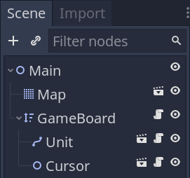
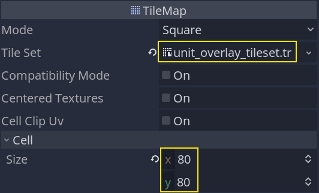
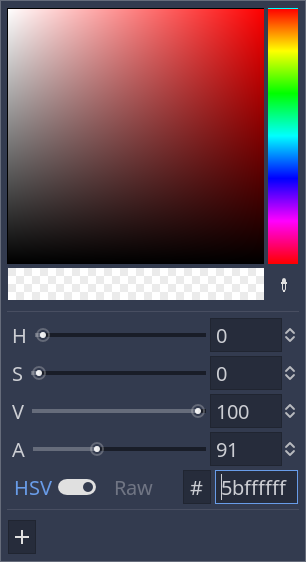
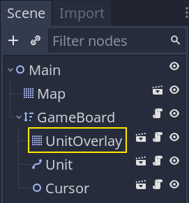

+++
title = "The flood fill algorithm"
author = "nathan"
date = "2021-01-30"
description = "We implement the flood fill algorithm to find and draw the cells a unit can walk to."
weight = 7
+++

In this lesson, we will finally create the _GameBoard_ and implement the flood fill algorithm.

We'll use it to find and draw the cells that a given unit can walk.

## Creating the GameBoard

In our demo, the _GameBoard_ will be a direct parent of the units and the cursor.

We'll make it a YSort node to manage the visual order of the units. If you put several units on the board and move them up and down, they will maintain their order and appear in front of another while they should appear behind it.

In your main scene, create a new _YSort_ node named _GameBoard_. Make the units and the _Cursor_ a child of it.



Everything else happens in the code.

## Storing obstacles

Attach a new script to the _GameBoard_, and let's start by registering all the obstacles on the board. We'll need to take them into account in our flood fill algorithm. In our case, the only obstacles will be the units.

```gdscript
# Represents and manages the game board. Stores references to entities that are in each cell and
# tells whether cells are occupied or not.
# Units can only move around the grid one at a time.
class_name GameBoard
extends Node2D

# This constant represents the directions in which a unit can move on the board. We will reference
# the constant later in the script.
const DIRECTIONS = [Vector2.LEFT, Vector2.RIGHT, Vector2.UP, Vector2.DOWN]

# Once again, we use our grid resource that we explicitly define in the class.
export var grid: Resource = preload("res://Grid.tres")


# We use a dictionary to keep track of the units that are on the board. Each key-value pair in the
# dictionary represents a unit. The key is the position in grid coordinates, while the value is a
# reference to the unit.
# Mapping of coordinates of a cell to a reference to the unit it contains.
var _units := {}


# At the start of the game, we initialize the game board. Look at the `_reinitialize()` function below.
# It populates our `_units` dictionary.
func _ready() -> void:
	_reinitialize()


# Returns `true` if the cell is occupied by a unit.
func is_occupied(cell: Vector2) -> bool:
	return true if _units.has(cell) else false


# Clears, and refills the `_units` dictionary with game objects that are on the board.
func _reinitialize() -> void:
	_units.clear()

	# In this demo, we loop over the node's children and filter them to find the units. As your game
	# becomes more complex, you may want to use the node group feature instead to place your units
	# anywhere in the scene tree.
	for child in get_children():
		# We can use the "as" keyword to cast the child to a given type. If the child is not of type
		# Unit, the variable will be null.
		var unit := child as Unit
		if not unit:
			continue
		# As mentioned when introducing the units variable, we use the grid coordinates for the key
		# and a reference to the unit for the value. This allows us to access a unit given its grid
		# coordinates.
		_units[unit.cell] = unit
```

To test the code, in the `_ready()` function, you can `print()` the `_units` variable. The output should look like this:

```sh
{(8, 7):[Path2D:1217]}
```

## Implementing the flood fill

Let's code the flood fill algorithm.

It works by starting from a cell and looking at its neighbors. If a neighbor meets some conditions, we add it to an array and apply the same flood fill instructions to it.

You end up expanding from a starting point until all neighboring cells fail to meet the conditions.
In a drawing application, the conditions to fill a neighboring pixel would be:

1. Being within the document's bounds.
1. The adjacent pixel is of the same color as the one you filled initially.

In our case, with a grid, it's similar. The conditions to fill a neighbor are that:

1. The coordinates are within the grid's bounds.
1. The neighboring cell is not occupied
1. We are within the unit's maximum movement range.

There are two main ways to implement this algorithm. On the one hand, you can implement a recursive function, one that will call itself until you filled all the cells.

Here, we will use a while loop instead. This is because I had some issues with references to the output array with the recursive calls.

Arrays are passed by reference in GDScript. Even if you do recursive function calls, as long as you keep passing the same array around, all functions on the stack should point to the same reference.

But when experimenting with recursivity, I found that some calls on the stack would return early, and some parts of the board would not get filled as expected. This could be my mistake, although a teammate confirmed having a similar issue in a complex recursive function.

Anyway, here's the implementation.

```gdscript
# Returns an array of cells a given unit can walk using the flood fill algorithm.
func get_walkable_cells(unit: Unit) -> Array:
	return _flood_fill(unit.cell, unit.move_range)


# Returns an array with all the coordinates of walkable cells based on the `max_distance`.
func _flood_fill(cell: Vector2, max_distance: int) -> Array:
	# This is the array of walkable cells the algorithm outputs.
	var array := []
	# The way we implemented the flood fill here is by using a stack. In that stack, we store every
	# cell we want to apply the flood fill algorithm to.
	var stack := [cell]
	# We loop over cells in the stack, popping one cell on every loop iteration.
	while not stack.empty():
		var current = stack.pop_back()

		# For each cell, we ensure that we can fill further.
		#
		# The conditions are:
		# 1. We didn't go past the grid's limits.
		# 2. We haven't already visited and filled this cell
		# 3. We are within the `max_distance`, a number of cells.
		if not grid.is_within_bounds(current):
			continue
		if current in array:
			continue

		# This is where we check for the distance between the starting `cell` and the `current` one.
		var difference: Vector2 = (current - cell).abs()
		var distance := int(difference.x + difference.y)
		if distance > max_distance:
			continue

		# If we meet all the conditions, we "fill" the `current` cell. To be more accurate, we store
		# it in our output `array` to later use them with the UnitPath and UnitOverlay classes.
		array.append(current)
		# We then look at the `current` cell's neighbors and, if they're not occupied and we haven't
		# visited them already, we add them to the stack for the next iteration.
		# This mechanism keeps the loop running until we found all cells the unit can walk.
		for direction in DIRECTIONS:
			var coordinates: Vector2 = current + direction
			# This is an "optimization". It does the same thing as our `if current in array:` above
			# but repeating it here with the neighbors skips some instructions.
			if is_occupied(coordinates):
				continue
			if coordinates in array:
				continue

			# This is where we extend the stack.
			stack.append(coordinates)
	return array
```

## The interactive overlay

We could test the `get_walkable_cells()` function and our flood fill implementation through it by calling the `print()` function. But we might as well implement the UnitOverlay, which will display the cells on the map.

Create a new scene with a _TileMap_ node named _UnitOverlay_. Assign the `unit_overlay_tileset.tres` to its _TileSet_ property and set the _Cell -> Size_ to `80` by `80`.



Change its _Visibility -> Modulate_ property to a transparent white. Otherwise, the tilemap will draw an opaque yellow.



Attach a script to it with the following code.

```gdscript
# Draws an overlay over an array of cells.
class_name UnitOverlay
extends TileMap

# By making the tilemap half-transparent, using the modulate property, we only have two draw the
# cells, and we automatically get a nice overlay on the board.
# The function fills the tilemap with the cells, giving visual feedback on where a unit can walk.
func draw(cells: Array) -> void:
	clear()
    # We loop over the cells and assign them the only tile available in the tileset, tile 0.
	for cell in cells:
		set_cellv(cell, 0)
```

Instantiate the _UnitOverlay_ in the _Main_ scene as a child of _GameBoard_ and above everything else. Placing it before every unit will make it draw behind them, so long as you leave it at its default position, `Vector2(0, 0)`.



We can now access it from the _GameBoard_'s script and call its `draw()` function.

Open `GameBoard.gd` again and add the following code.

```gdscript
onready var _unit_overlay: UnitOverlay = $UnitOverlay


func _ready() -> void:
    #...
    # This call is temporary, remove it after testing and seeing the overlay works as expected.
    _unit_overlay.draw(get_walkable_cells($Unit))
```


## The code so far

Here's the _GameBoard_ script so far, without all the comments.

```gdscript
class_name GameBoard
extends Node2D

const DIRECTIONS = [Vector2.LEFT, Vector2.RIGHT, Vector2.UP, Vector2.DOWN]

export var grid: Resource = preload("res://Grid.tres")

var _units := {}

onready var _unit_path: UnitPath = $UnitPath


func _ready() -> void:
	_reinitialize()


func is_occupied(cell: Vector2) -> bool:
	return true if _units.has(cell) else false


func get_walkable_cells(unit: Unit) -> Array:
	return _flood_fill(unit.cell, unit.move_range)


func _reinitialize() -> void:
	_units.clear()

	for child in get_children():
		var unit := child as Unit
		if not unit:
			continue
		_units[unit.cell] = unit


func _flood_fill(cell: Vector2, max_distance: int) -> Array:
	var array := []
	var stack := [cell]
	while not stack.empty():
		var current = stack.pop_back()

		if not grid.is_within_bounds(current):
			continue
		if current in array:
			continue

		var difference: Vector2 = (current - cell).abs()
		var distance := int(difference.x + difference.y)
		if distance > max_distance:
			continue

		array.append(current)
		for direction in DIRECTIONS:
			var coordinates: Vector2 = current + direction
			if is_occupied(coordinates):
				continue
			if coordinates in array:
				continue

			stack.append(coordinates)
	return array
```
