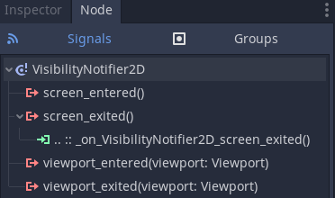
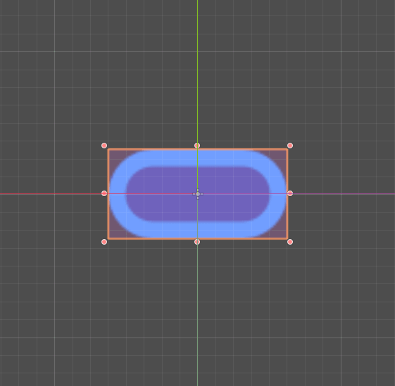
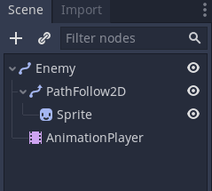
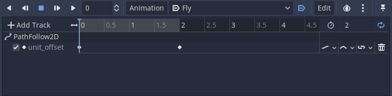
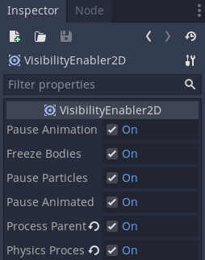

+++
author = "henrique"
date = "2019-05-17T17:00:01"
description = "In this Godot tutorial, Pigdev shows you how to react to easily detect when a node enters or leaves the screen with the built-in Visibility Notifier and Visibility Enabler nodes."
title = "Godot Nodes 101: VisibilityNotifier and VisibilityEnabler 2d"
weight = "5"
keywords = []
tags = []
videoId = "6V6Oq60_KpQ"
videoDuration = ""
type = "video"
difficulty = "beginner"
menuTitle = "VisibilityNotifier2D"
+++

> So, what do you think is located on the other side of this wall?

> There's nothing. The graphics for backgrounds that can't be seen by players are not rendered in order to save processing power.

In this dialogue from _.hack//Rebirth_ Ovan and Yata have a discussion similar to the philosophical question known as "if a tree falls in a forest".

We don't have an answer for the real life problem, but in games we do prevent processing objects that players can't interact with, namely when they are off screen.

In Godot Engine we can use visibility nodes to detect when an object is inside the player's screen or viewport. There are two types of visibility nodes:

- VisibilityNotifier
- VisibiltiyEnabler, which inherits the VisibilityNotifier

Let's understand what each of those can achieve. You can download our demo project in [our repository for mini tutorials demo](https://github.com/GDQuest/godot-mini-tuts-demos), you'll find the demo for this tutorial at the _2d/visibility-nodes_ folder.

## VisibilityNotifier2D

Projectiles are a common use case where we may want to know when an object left the screen. Usually a bullet doesn't have any in game usage after it leaves the screen, because this often means the player missed the target, especially on scroller games like jump 'n' shoots and space shooters.

So, to save some processing power we can delete the projectile when it leaves the screen. For that we can attach a _VisibilityNotifier2D_ and connect its _screen_exited_ signal to the projectile script, calling the `queue_free()` inside the callback.



This is the final Bullet script:

```gd
class_name Bullet
extends Node2D

export var speed := 800.0

func _physics_process(delta: float) -> void:
	var velocity := Vector2.RIGHT.rotated(rotation) * speed
	translate(velocity * delta)


func _on_VisibilityNotifier2D_screen_exited() -> void:
	queue_free()
```

Note that the _VisibilityNotifier2D_ renders a purple-ish rectangle inside the editor. This is what Godot uses to check if the rectangle entered or exited the boundaries of the screen or viewport. You can adjust this rectangle to fit your object's visibility.



With that, whenever a Bullet leaves the screen, it's going to be automatically freed from memory.

Note that this approach is not as accurate as it should be. For performance reasons, the grid used to detect when the object left the screen isn't pixel perfect. You can check [this issue](https://github.com/godotengine/godot/issues/4803#issuecomment-225460236) to know more about this approach.

## VisibiltiyEnabler2D

Another usage for a _VisibilityNotifier_ is to trigger object's behaviors. Let's say you want your enemy to stop chasing the player if the player can't see the enemy anymore. Or, let's say you want you enemy to perform its movement pattern only when the player can see it. For that, we can use a _VisibilityEnabler2D_.

A _VisibilityEnabler2D_ is a specialized version of the _VisibilityNotifier2D_ that can automatically toggle some processes on its parent node.

For instance, in our project's _DemoEnabler_ scene we have some enemies that move in circles using a _Path2D_, a _PathFollow2D_, and an _AnimationPlayer_.



The animation interpolates the _PathFollow2D > unit_offset_ property looping from `0.0` to `1.0`.



Now we can attach a _VisibiltiyEnabler2D_ as a child of the _Enemy_, usually I toggle all the available options in order to prevent any behavior on the _VisibiltiyEnabler2D's_ parent.



Notice that even animations can be paused using this method and we don't even need to write any code. But, for testing purposes we can attach a script on the _Enemy_ and in the `_process` callback let's print the _Sprite_ `global_position` to test when the _Enemy_ will start processing.

```gd
extends Path2D


func _process(delta: float) -> void:
	print($PathFollow2D/Sprite.global_position)

```

As you can see in the Output, it only prints the _Sprite_ `global_position` when the _VisibiltiyEnabler2D_ rectangle enters the screen.

That's it, these are some applications of the Visibility* nodes. You can mix these possibilities to achieve many other behaviors. For instance, what about a player skill that hits all enemies inside on the screen? Or an enemy that explodes as soon as it enters the screen? Now, it's up to you to use these new powers wisely!
