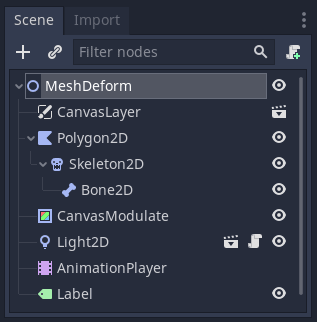

_Normal maps_ allow you to add volume and details to any sprite or 3D object's surface. A normal map's pixels encode the direction the surface is facing, allowing the engine to fake volume when interacting with lights.

In this tutorial, you will learn to add normal maps to your 2D art in Godot and make it interact with lights.

You will learn to add normal maps to:

- Sprites.
- Seamless textures.
- Animated characters.
- AnimatedSprite nodes.
- Tilemaps.



To download the sprites we'll use in the following examples, [click here](https://github.com/GDQuest/godot-mini-tuts-demos/releases/download/NormalMapHintsAssets/NormalMapHintsAssets.zip). Each image comes with a corresponding normal map named with the `_n` suffix. For instance, `azagaya_n.png` is the normal map for `azagaya.png`.

We're going to focus on using normal maps in Godot here. To learn more about how normal maps work under the hood, read [What are normal maps?](https://laigter.readthedocs.io/en/latest/Introduction/intro.html#what-are-normal-maps) in Laigter's documentation.

## Adding a normal map to a sprite

Let's see how to add a normal map to a sprite to get started.

Open Godot, create a new scene, and add a _Sprite_ node. Assign the image _azagaya.png_ to its _Texture_ property.

Sprite nodes have a _Normal Map_ property you can set in the _Inspector_. Drag an image from the _File System_ dock and drop it on the sprite's _Normal Map_ property.



Nothing changes because normal maps only affect lit surfaces. Add a _Light2D_ node to the scene.

Assign the _LightSprite.png_ texture to it, move the light over the sprite, and increase its _Range -> Height_ property. The light's _Height_ controls how far the light is from our sprite on the Z-axis. Increasing the value accentuates the lighting effect.



The sprite should look embossed. However, the scene may be too bright overall, making the shading not look believable. You can use a _CanvasModulate_ and set its _Color_ property to a dark gray for a better result. In this case, the _CanvasModulate_ node allows you to simulate the ambient light property of 3D environments, tinting the entire scene.



## Seamless texture with a normal map

You can use normal maps with seamless textures as with any sprite. To do so, select both the color texture and the normal map, and head to the _Import_ dock. Enable _Repeat_ and click reimport to make the pictures tile.

Create a new scene with the same nodes as the previous one, but use _simplebrick.png_ and _simplebrick_n.png_ for the sprite's _Texture_ and _Normal Map_, respectively.

Also, enable the _Region_ property and set the _Rect_ to something bigger than the original texture.



Provided both the normal map and the texture are set to _Repeat_, you should end up with something like this:



This example shows that Godot uses the same UV coordinates for the texture and normal map.

## Animations with Normal Maps

In the following examples, you will learn some tips about using normal maps with animations.

There are two ways to create animations from a sprite sheet in Godot. The first is setting each frame in an _AnimationPlayer_ node, and the second is using an _AnimatedSprite_.

 For cutout animations, all you have to do is assign a normal map to each sprite that makes up your character. 

### Using an AnimationPlayer

Once again, create a new scene with a _Sprite_, _Light2D_, and _CanvasModulate_ nodes. Add the _spritesheet.png_ sprite sheet and its normal map to the sprite node's corresponding properties.

Set the _Animation -> Hframes_ property to `11`, our sprite sheet's columns.

Add an _AnimationPlayer_ node and create a new animation called "Idle" lasting `0.8` seconds. Enable looping and add a keyframe for the sprite's _Animation -> Frame_ property. You can add one for each of the eleven frames. 

And that's it! Each frame will use the same region for the sprite's texture and normal map.

You should see something like this:



### Using an AnimatedSprite

Depending on the kind of game you're creating the _AnimatedSprite_ node may be more convenient than using an _AnimationPlayer_. Unfortunately, that node doesn't have a _Normal Map_ property. 

To assign a normal map to animated sprites, we have to use a shader.

Add an _AnimatedSprite_ node to the scene. In the _Inspector_, add a new _SpriteFrames_ resource in the _Frames_ property. 



Click on the newly created resource to open the _SpriteFrames_ bottom panel. Click on the grid-like button with the tooltip "Add frames from Spritesheet". In the popup file dialog, double-click _spritesheet.png_ and set the _Horizontal_ and _Vertical_ settings to `11` and `1`, respectively. 



Click "Select all frames" in the window's top-right and click "Add 11 Frames". Set the _FPS_ setting in the _SpriteFrames_ editor to `12`. 



If you turn on _Playing_ in the _Inspector_, you should see the idle animation playing on your _AnimatedSprite_.



Lets add support for the normal map. Expand the _AnimatedSprite_ node's _Material_  in the _Inspector_ and create a new _Shader Material_ and add a new _Shader_ in the corresponding property. Click the _Shader_ to open the shader editor and paste this code into it:

```glsl
// Mandatory line to define 2D shaders
shader_type canvas_item;

// Allows us to assign a normal map to the shader in the Inspector
uniform sampler2D normal_map;

void fragment(){
	// Converts the texture data into a unit vector, with each channel in the [-1, 1] range

NORMAL = 2.0 * texture(normal_map, UV).rgb - 1.0;
}
```

In the `fragment()` function, we are sampling the normal map texture, transforming each sampled value to a valid unit vector, and assigning that unit vector to the `NORMAL` built-in attribute. After setting the normal map in the _Inspector_ to the uniform, you should end up with a lit character, similar to the version using the _AnimationPlayer_.

### Normal Maps with Skeleton Deform

For this example, we are going to use _azagaya.png_ once again. If you are not familiar with 2D Skeleton Deform, read the [2D Skeletons](https://docs.godotengine.org/en/stable/tutorials/animation/2d_skeletons.html) page from Godot's reference manual.

Create a new scene and add a _Polygon2D_ node. Assign _azagaya.png_ to it as a texture. Add a _Skeleton2D_ with a _Bone2D_ child, and an _AnimationPlayer_ to create the animation. Also, add _Light2D_ and _CanvasModulate_ nodes. Your scene should look like this:



You can create a simple animation for testing purposes. Here's the one I designed:



You surely noticed that _Polygon2D_ doesn't have a _Normal Map_ attribute. As with the _AnimatedSprite_ node, you need to add the same shader to it. Do so, assign a normal map to the shader material, and you should end up with a lit character:



## Normal maps with TileMap nodes

Now you know how to use normal maps with sprites, you probably want your environment to react to lighting similarly.
 
 Learning to create tilesets and using tilemaps is beyond the scope of this tutorial. To learn how to make one, check out our video:
 
 

Once you created a tileset and at least one tile, you should see a group named _Selected Tile_ in the _Inspector_. You can assign a normal map to the corresponding property there. Note that in Godot 3.2, you need to assign the normal map of the whole tileset to each tile manually. This is a bit tedious, but that's how it is for now.

We included a tileset for you to try this out, `tile.png`.



 If you are using autotiles, you need to set the normal map once per autotile. 

If you did it right, you should see something like this:


