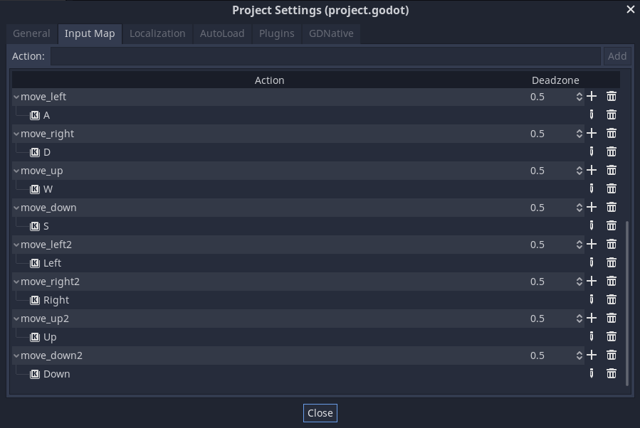

+++
title = "Local Multiplayer Input"
description = ""
author = "henrique"
coAuthors = ["johnny"]

date = 2020-07-25T10:25:59-03:00
weight = 5

difficulty = "beginner"
keywords = ["godot multiplayer", "local multiplayer", "input", "godot networking"]
+++

A common mistake when coding player movement is using constants for the inputs. For instance:

```gd
export var speed := 600.0
export var direction := Vector2.ZERO

var _velocity := Vector2.ZERO

func _process(delta: float) -> void:
  update_direction()
  _velocity = direction * speed
  translate(_velocity * delta)


func update_direction() -> void:
	direction.x = Input.get_action_strength("move_right") - Input.get_action_strength("move_left")
	direction.y = Input.get_action_strength("move_down") - Input.get_action_strength("move_up")
```

Note that all the `"move_*"` checks are constants. Here the `Player.gd` class always reacts to the same inputs, which leads to one player controlling both players characters:



In this mini-tutorial, you'll learn a quick fix for that.

## Use variables!

Using constants means we can't change the reference to input actions and prevents us from checking for different inputs on instances of the `Player.gd` class.

To solve that, we need to check for variables instead. We can export the input variables to be able to set them through the Editor.

```gd
export var move_right_action := "move_right"
export var move_left_action := "move_left"
export var move_down_action := "move_down"
export var move_up_action := "move_up"
```

In the `update_direction()` method, we check for these variables instead of constants:

```gd
func update_actor_direction() -> void:
	_actor.direction.x = Input.get_action_strength(move_right_action) - Input.get_action_strength(move_left_action)
	_actor.direction.y = Input.get_action_strength(move_down_action) - Input.get_action_strength(move_up_action)
```

## Player 2 controls

We create the Player 2 controls in the _Project > Project Settings > Input Map_. In our demo project, we added the suffix `2` to differentiate them from Player 1's actions.



It's important when creating an instance of the `Player.tscn` scene that we update the actions to Player 2's.


Now we have independent players characters. 

Note that you can extend this approach to any number of local players. You just need to set their actions in the _Input Map_ and match them on their characters instance. The same approach works for jump, shoot, hold, throw, and any other player action.


