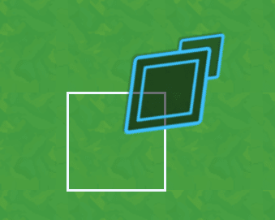
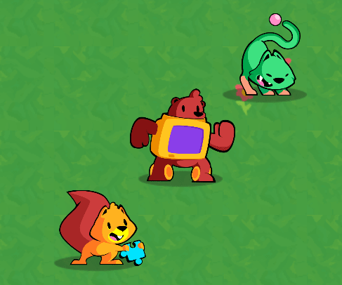

There are two main ways to handle grid movement and interactions in an engine like Godot:

1. Relying on the **physics engine.** In particular, areas and ray casts.
2. Using an **object that represents the game board** and manages what's on it.

Either can work well.

The first approach allows you to encapsulate many features on the pawns or units that move on the grid. Units can detect each-other with areas and ray casts, and they can directly interact with one another. It's quite convenient.

However, that physics-based approach can have its limitations, depending on the game: if multiple units can move simultaneously, two might move to the same target cell, causing a conflict. You end up needing to block cells when a unit starts to move using invisible collision shapes.

Also, in a tactical-RPG like this one, you still need a way to find the path a unit can walk. For that, you need an object that knows about all the units and other obstacles on the grid.

In other words, in our case, using the physics-based approach would still require an object to represent and keep track of what's on the game board.

That's why we'll use the second approach. It consists of letting an object represent and not only track but also manage the game board. That object knows where every unit is and moves them. With this model, any item on the grid becomes like a lifeless pawn rather than an independent entity.

## Code structure

Here the way we're going to structure our code and an overview of what you'll build in the next lessons.

As mentioned before, we'll use a single node to manage interactions between units, and more: the _GameBoard_. It's going to tell units to move and generally handle "collisions", preventing you from moving a unit to an occupied grid cell.

As usual with our projects, we favor composition: you could reuse most scripts and systems from this project in another as they don't have strict dependencies on one another, except for the _GameBoard_.

Let's briefly go through each component's responsibility.

The _Cursor_ is the player's cursor, a selection tool you can move across grid cells and use to select and move units.

_Unit_ represents one pawn on the game board. It only handles a unit's visual aspect: animating and moving smoothly around the board. It's the _GameBoard_ that handles actual movement behind the scenes.

_UnitOverlay_ draws the cells a given unit can walk to when it's selected.

_UnitPath_ displays the path a unit will move based on how the player moves their cursor after selecting a unit. It's inspired by Fire Emblem games.

The _PathFinder_ finds the best available path for the unit to walk to a target position, using the AStar algorithm. The _UnitPath_ uses it to draw the path the node found.

Finally, the `Grid` is a class that extends Godot's built-in `Resource` type. It represents the game's grid and provides useful functions to convert coordinates from and to grid space.

It's the first element we're going to code in this series, as everything else depends on it.

We will then code in the order of the dependencies, starting with everything the game board needs and end the series with it.

See you in the next lesson, where you'll get to code the `Grid` and learn why it's a resource.
