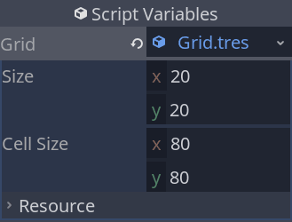

+++
title = "The Grid"
author = "nathan"
date = "2021-01-30"
description = "We lay the foundations of our grid-based system using a Resource that we'll attach to the nodes that need access to the grid."
weight = 2
+++

In a game like a turn-based tactical RPG, many actions take place on a grid.

Units have to move to the middle of cells, the player's cursor has to move along the grid, and so on. In our demo, five classes will need access to the grid's data and helper functions, as we saw in the introduction.


In Godot, an option to give many objects access to another is to make the `Grid` an Autoload (singleton). That way, every script in the codebase could access it.

However, you don't need everything in the game to access the `Grid`: only five classes need it. In our demo, which focuses on movement, it happens to be all the scenes we'll code. But in a complete game project, this number won't change.

There is an excellent alternative to using a singleton in Godot: using a resource.

Like singletons, many nodes can share access to a given resource. Unlike singletons, only the nodes that explicitly hold a reference to a resource can access it. 

_What's the point, if you can use a singleton instead?_

This forces you to be **deliberate** about giving nodes access to the grid: you _must_ define a dedicated variable in their script. We'll use exported variables to do so.

Using a "less convenient" option removes the temptation of using the singleton in unintended ways and coupling it to more parts of the game than needed. 

If you're really careful and intentional about how you use singletons and prefer their convenience, you may use them instead.

However, when you create a singleton, as anything can access it, any bug that involves it can be anywhere in your codebase.

I keep seeing developers use singletons in fragile ways. People access them in illogical places, adding unnecessary coupling, because it's the easiest thing to do at a given point in time. Or they mutate the singleton's state directly from various places, making their code bug-prone.

And not only beginners do that: I've seen professionals use singletons carelessly many times over. They end up having to rewrite code late in a project's lifecycle _painfully_.

## The advantages of a resource

Our `Grid` will extend the built-in `Resource` type. This will allow us to save it as a file in the FileSystem tab and to attach it directly to the nodes that need it in the _Inspector_.



I mentioned that with a resource, every reference to the grid will point to the same instance in memory. Changing the grid's size in one place will update the data for all other nodes.

You don't have to be afraid of freeing any node that has a reference to the grid either. This is perfectly supported.

## Creating the grid script

Let's get coding. You can find a start project on the [Tactical RPG movement repository](https://github.com/GDQuest/godot-2d-tactical-rpg-movement). It contains the sprites we'll use in this series.

To download it:

1. Click the link above.
2. Click the green `Code` button, then click `Download ZIP`.
3. Navigate to the downloaded .zip file and extract it.
4. _Import_ the `start-project/` directory in Godot.

Right-click on the _FileSystem_ tab and create a new script where we'll define our `Grid` class. Name it `Grid.gd` and make it extend `Resource`.


```gdscript
# Represents a grid with its size, the size of each cell in pixels, and some helper functions to
# calculate and convert coordinates.
# It's meant to be shared between game objects that need access to those values.
class_name Grid
extends Resource

# The grid's size in rows and columns.
export var size := Vector2(20, 20)
# The size of a cell in pixels.
export var cell_size := Vector2(80, 80)

# Half of ``cell_size``.
# We will use this to calculate the center of a grid cell in pixels, on the screen.
# That's how we can place units in the center of a cell.
var _half_cell_size = cell_size / 2


# Returns the position of a cell's center in pixels.
# We'll place units and have them move through cells using this function.
func calculate_map_position(grid_position: Vector2) -> Vector2:
	return grid_position * cell_size + _half_cell_size


# Returns the coordinates of the cell on the grid given a position on the map.
# This is the complementary of `calculate_map_position()` above.
# When designing a level, you'll place units visually in the editor. We'll use this function to find
# the grid coordinates they're placed on, and call `calculate_map_position()` to snap them to the
# cell's center.
func calculate_grid_coordinates(map_position: Vector2) -> Vector2:
	return (map_position / cell_size).floor()


# Returns true if the `cell_coordinates` are within the grid.
# This method and the following one allow us to ensure the cursor or units can never go past the
# map's limit.
func is_within_bounds(cell_coordinates: Vector2) -> bool:
	var out := cell_coordinates.x >= 0 and cell_coordinates.x < size.x
	return out and cell_coordinates.y >= 0 and cell_coordinates.y < size.y


# Makes the `grid_position` fit within the grid's bounds.
# This is a clamp function designed specifically for our grid coordinates.
# The Vector2 class comes with its `Vector2.clamp()` method, but it doesn't work the same way: it
# limits the vector's length instead of clamping each of the vector's components individually.
# That's why we need to code a new method.
func clamp(grid_position: Vector2) -> Vector2:
	var out := grid_position
	out.x = clamp(out.x, 0, size.x)
	out.y = clamp(out.y, 0, size.y)
	return out


# Given Vector2 coordinates, calculates and returns the corresponding integer index. You can use
# this function to convert 2D coordinates to a 1D array's indices.
#
# There are two cases where you need to convert coordinates like so:
# 1. We'll need it for the AStar algorithm, which requires a unique index for each point on the
# graph it uses to find a path.
# 2. You can use it for performance. More on that below.
func as_index(cell: Vector2) -> int:
	return int(cell.x + size.x * cell.y)
```

You can use `Grid.as_index()` to pre-allocate and index a one-dimensional array representing a 2D grid. Depending on your game's needs, you can store your game board's state using an array, including all obstacles.

There are two advantages to doing that:

1. One-dimensional arrays are faster to iterate over and to index than two-dimensional arrays in GDScript.
2. If you use AStar pathfinding, you can work with the same indices everywhere in your game.

You'd have a one-dimensional array representing your grid's state and an AStar2D instance using the same indices. We won't be using such an array in this series. Instead, we'll use a dictionary to keep track of units conveniently, as you'll see when we work on the _GameBoard_.

However, in games with large maps, using a 1D array along with the AStar pathfinding can allow you to update the AStar graph fast whenever a unit moves or an obstacle disappears, at the cost of a little more code complexity, maybe.

## Creating the grid resource

Let's create the resource file we'll attach to our nodes in future lessons. It'll define the grid's base properties.

Right-click in the _FileSystem_ tab to create a _New Resource..._. And create a resource of type "Grid". I've named it `Grid.tres`.

The resource opens in the _Inspector_. You can leave the default values we defined in the script.


In the next part, we will code a simple unit and put the grid resource to use.
