In this lesson, we'll create the unit, another core building block of the movement system.


The unit will only handle the visuals and the movement of a pawn on the game board.

This will allow us to test it even though we don't have the rest of the systems implemented yet. Coding independent nodes like that make it more efficient to reuse or modify them within and across projects.

You can think of the unit we will make as a lifeless pawn on a game board. It's like a little figurine that you can move around.

## The unit's scene

We will use the [Path2D](https://docs.godotengine.org/en/latest/classes/class_path2d.html?highlight=path2d) and the [PathFollow2D](https://docs.godotengine.org/en/latest/classes/class_pathfollow2d.html#class-pathfollow2d) nodes to make our sprites move along a path.

[Path2D](https://docs.godotengine.org/en/latest/classes/class_path2d.html?highlight=path2d) gives you tools to define a curve using a bezier spline, but you can also use it for straight lines.

The [PathFollow2D](https://docs.godotengine.org/en/latest/classes/class_pathfollow2d.html#class-pathfollow2d) node allows you to move along that path conveniently by animating an offset value.

Let's get into it! Create a new scene with a [Path2D](https://docs.godotengine.org/en/latest/classes/class_path2d.html?highlight=path2d) node as its root and add a [PathFollow2D](https://docs.godotengine.org/en/latest/classes/class_pathfollow2d.html#class-pathfollow2d) as a child.

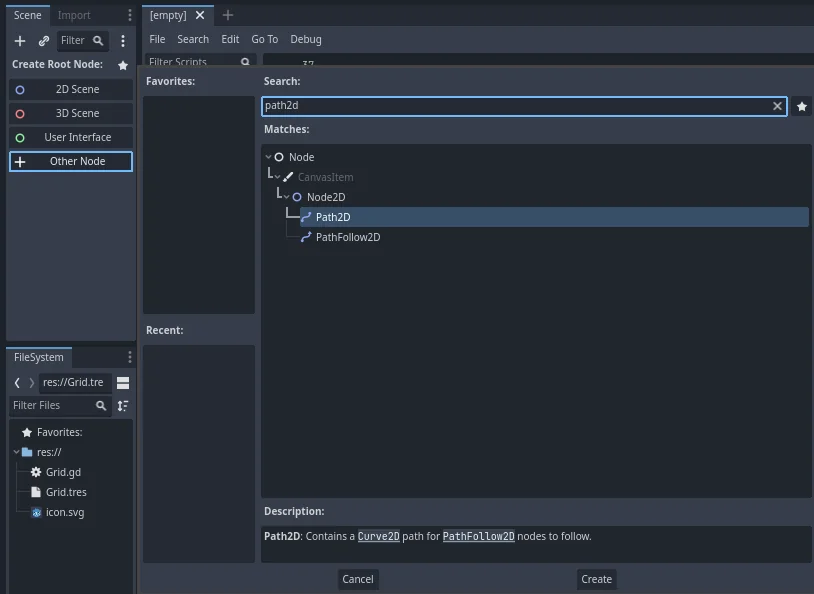

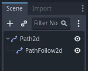

Select the [Path2D](https://docs.godotengine.org/en/latest/classes/class_path2d.html?highlight=path2d) node and in the _Inspector_, clear its _Curve_ property. With the [PathFollow2D](https://docs.godotengine.org/en/latest/classes/class_pathfollow2d.html#class-pathfollow2d) node, the curve would lock the node in place. We'll set the _Curve_ in the script.

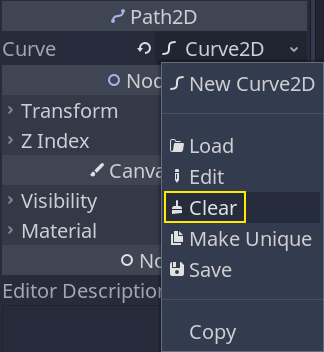

By default, when using [PathFollow2D](https://docs.godotengine.org/en/latest/classes/class_pathfollow2d.html#class-pathfollow2d), the node will rotate its children along the path and cycle back to the start. Select the node and turn off the _Rotate_ and _Loop_ properties.


Then, add 2 [Sprite2D](https://docs.godotengine.org/en/latest/classes/class_sprite2d.html?highlight=sprite2d) as children of [PathFollow2D](https://docs.godotengine.org/en/latest/classes/class_pathfollow2d.html#class-pathfollow2d). The first is there to represent the shadow while the other there is going to be the unit. I named them respectively _ShadowSprite_ and _CharacterSprite_. Assign the texture `unit_shadow.svg` to the _ShadowSprite_ in the _Inspector_ and set its _Modulate_ color to a dark tone.

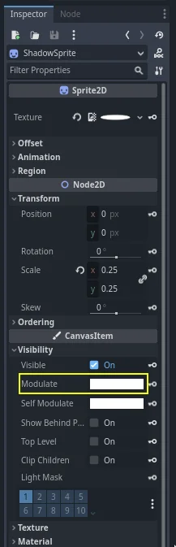


You can lower the scale of the _Sprite_ node to `0.25`, as the assets we included in the project are large for this game.

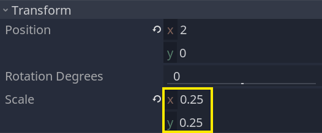

We will use the [Path2D](https://docs.godotengine.org/en/latest/classes/class_path2d.html?highlight=path2d) and the [PathFollow2D](https://docs.godotengine.org/en/latest/classes/class_pathfollow2d.html#class-pathfollow2d) nodes to make our sprites move along a path.

[Path2D](https://docs.godotengine.org/en/latest/classes/class_path2d.html?highlight=path2d) gives you tools to define a curve using a bezier spline, but you can also use it for straight lines.
Finally, add an [AnimationPlayer](https://docs.godotengine.org/en/latest/classes/class_animationplayer.html?highlight=animationplayer) as a child of the _Unit_ node. We will use it to make the _CharacterSprite_ blink when the player selects it.

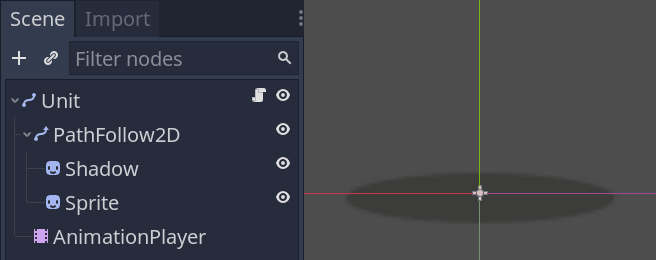

## Blinking animation for selected units

We will use an animation to make the character blink or flash when it is selected. To do that, we'll use the _Modulate_ property and its RAW color mode.

We'll also animate the _CharacterSprite_ directly so that the _ShadowSprite_ doesn't change color with it.

First though, let's create an animation named `idle`.

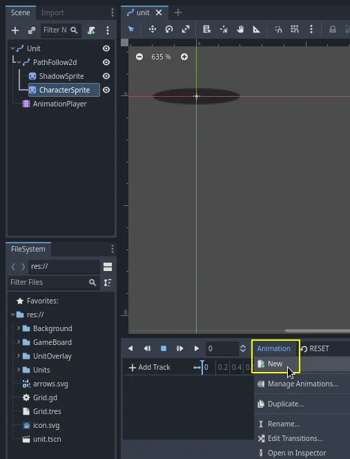


It's an empty animation that resets the sprite's _Modulate_ property. As animations in Godot override the nodes' properties, I recommend always setting up an animation to reset your node to it's default state.

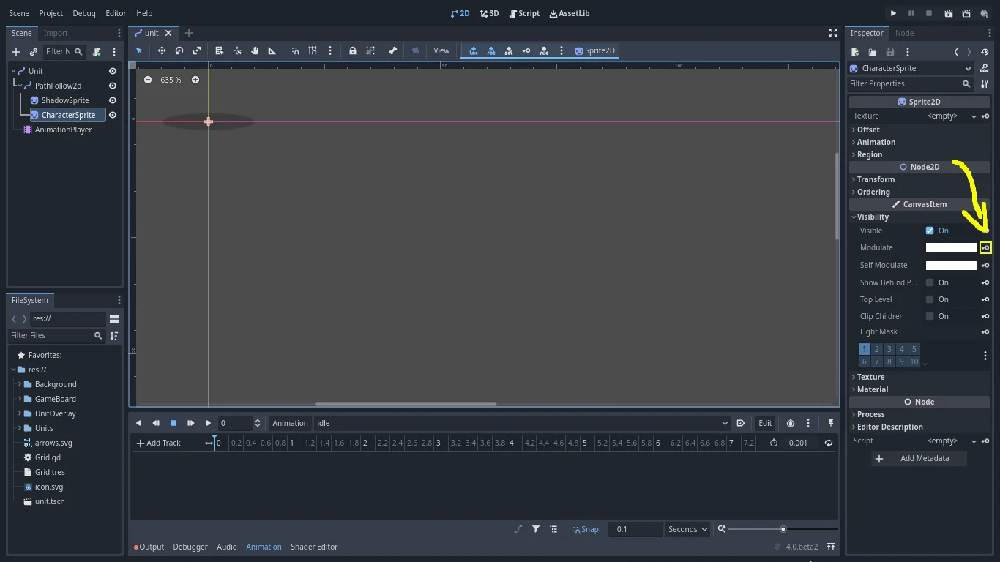

Our `idle` animation should only have one key for the _Modulate_ property. I typically give this kind of animation a duration of 0 seconds.

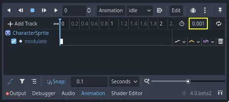

Now, we can work on the `selected` animation. Select the _AnimationPlayer_ and create a new animation and name it `selected`, just like we did with `idle`.

Let's temporarily assign a texture to the _CharacterSprite_ to preview the animation. Drag the `squirrel.png` to the node's _Texture_.

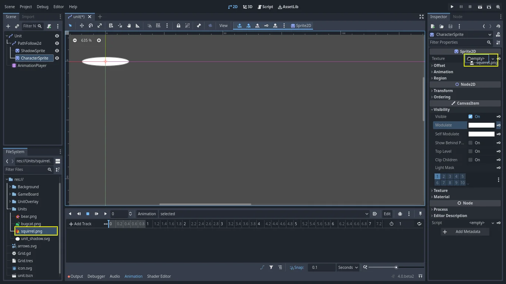

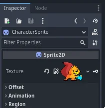

For the `selected` animation, like `idle`, we need to animate the modulate property.

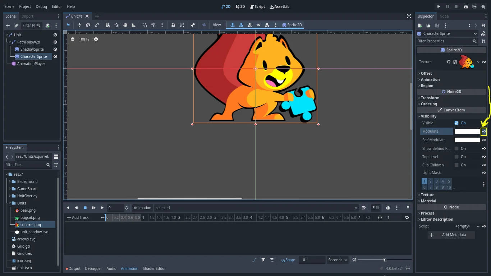

The `selected` animation should last 1.4 seconds, and loop.

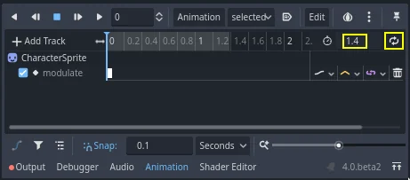

Our goal is to brighten the _CharacterSprite_ when the player selects it. With a loop, after 1.4 seconds it will look like normal and then brighten again. This change in brightness while selected fits greatly for highlighting a unit.

So, the first key in our animation is a purely opaque white (default). The second key must have very bright color, so let's add a new key animation by clicking the key icon next to the _Modulate_ property as shown above. Then move it to 0.7 seconds.

Your animation panel should look like this:

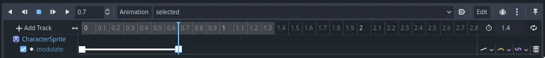
The second key should use the RAW color mode with values higher than `1` in the R, G, and B channels. `1.5` makes the sprite become brighter.


Now, you may clear the _CharacterSprite_ node's _Texture_. We'll use an exported variable in the script to assign a different sprite to each unit instance.

## Coding the Unit

Let's move to the code. Attach a script to the _Unit_ node with the following content.

We'll start with most of the node's properties and corresponding setter functions.

```gdscript
# Represents a unit on the game board.
# The board manages the Unit's position inside the game grid.
# The unit itself is only a visual representation that moves smoothly in the game world.
# We use the tool mode so the `skin` and `skin_offset` below update in the editor.
tool
class_name Unit
extends Path2D

# Preload the `Grid.tres` resource you created in the previous part.
export var grid: Resource = preload("res://Grid.tres")
# Distance to which the unit can walk in cells.
# We'll use this to limit the cells the unit can move to.
export var move_range := 6
# Texture representing the unit.
# With the `tool` mode, assigning a new texture to this property in the inspector will update the
# unit's sprite instantly. See `set_skin()` below.
export var skin: Texture setget set_skin
# Our unit's skin is just a sprite in this demo and depending on its size, we need to offset it so
# the sprite aligns with the shadow.
export var skin_offset := Vector2.ZERO setget set_skin_offset
# The unit's move speed in pixels, when it's moving along a path.
export var move_speed := 600.0

# Coordinates of the grid's cell the unit is on.
var cell := Vector2.ZERO setget set_cell
# Toggles the "selected" animation on the unit.
var is_selected := false setget set_is_selected

# Through its setter function, the `_is_walking` property toggles processing for this unit.
# See `_set_is_walking()` at the bottom of this code snippet.
var _is_walking := false setget _set_is_walking

onready var _sprite: Sprite = $PathFollow2D/Sprite
onready var _anim_player: AnimationPlayer = $AnimationPlayer
onready var _path_follow: PathFollow2D = $PathFollow2D


# When changing the `cell`'s value, we don't want to allow coordinates outside the grid, so we clamp
# them.
func set_cell(value: Vector2) -> void:
	cell = grid.clamp(value)


# The `is_selected` property toggles playback of the "selected" animation.
func set_is_selected(value: bool) -> void:
	is_selected = value
	if is_selected:
		_anim_player.play("selected")
	else:
		_anim_player.play("idle")


# Both setters below manipulate the unit's Sprite node.
# Here, we update the sprite's texture.
func set_skin(value: Texture) -> void:
	skin = value
	# Setter functions are called during the node's `_init()` callback, before they entered the
	# tree. At that point in time, the `_sprite` variable is `null`. If so, we have to wait to
	# update the sprite's properties.
	if not _sprite:
		# The yield keyword allows us to wait until the unit node's `_ready()` callback ended.
		yield(self, "ready")
	_sprite.texture = value


func set_skin_offset(value: Vector2) -> void:
	skin_offset = value
	if not _sprite:
		yield(self, "ready")
	_sprite.position = value


func _set_is_walking(value: bool) -> void:
	_is_walking = value
	set_process(_is_walking)
```

Now, here's the smooth movement logic.

```gdscript
func _ready() -> void:
	# We'll use the `_process()` callback to move the unit along a path. Unless it has a path to
	# walk, we don't want it to update every frame. See `walk_along()` below.
	set_process(false)

	# The following lines initialize the `cell` property and snap the unit to the cell's center on the map.
	occupyingCell = grid.calculate_grid_coordinates(position)
	position = grid.calculate_map_position(occupyingCell)

	if Engine.is_editor_hint:
		# We create the curve resource here because creating it in the editor prevents us from
		# moving the unit.
		curve = Curve2D.new()

# When active, moves the unit along its `curve` with the help of the PathFollow2D node.
func _process(delta: float) -> void:
	# Every frame, the `PathFollow2D.progress` property moves the sprites along the `curve`.
	# The great thing about this is it moves an exact number of pixels taking turns into account.
	_path_follow.progress += move_speed * delta

	# When we increase the progress` above, the `progress_ratio` also updates. It represents how far you
	# are along the `curve` in percent, where a value of `1.0` means you reached the end.
	# When that is the case, the unit is done moving.
	if _path_follow.progress_ratio >= 1.0:
		# Setting `_is_walking` to `false` also turns off processing.
		_is_walking = false
		# Below, we reset the progress to `0.0`, which snaps the sprites back to the Unit node's
		# position, we position the node to the center of the target grid cell, and we clear the
		# curve.
		# In the process loop, we only moved the sprite, and not the unit itself. The following
		# lines move the unit in a way that's transparent to the player.
		_path_follow.progress = 0.0
		position = grid.calculate_map_position(occupyingCell)
		curve.clear_points()
		# Finally, we emit a signal. We'll use this one with the game board.
		emit_signal("walk_finished")


# Starts walking along the `path`.
# `path` is an array of grid coordinates that the function converts to map coordinates.
func walk_along(path: PackedVector2Array) -> void:
	if path.is_empty():
		return

	# This code converts the `path` to points on the `curve`. That property comes from the `Path2D`
	# class the Unit extends.
	curve.add_point(Vector2.ZERO)
	for point in path:
		curve.add_point(grid.calculate_map_position(point) - position)
	# We instantly change the unit's cell to the target position. You could also do that when it
	# reaches the end of the path, using `grid.calculate_grid_coordinates()`, instead.
	# I did it here because we have the coordinates provided by the `path` argument.
	# The cell itself represents the grid coordinates the unit will stand on.
	occupyingCell = path[-1]
	# The `_is_walking` property triggers the move animation and turns on `_process()`. See
	# `_set_is_walking()` below.
	self._is_walking = true
```

Now, here's the smooth movement logic.

```gdscript
# Emitted when the unit reached the end of a path along which it was walking.
# We'll use this to notify the game board that a unit reached its destination and we can let the
# player select another unit.
signal walk_finished


func _ready() -> void:
	# We'll use the `_process()` callback to move the unit along a path. Unless it has a path to
	# walk, we don't want it to update every frame. See `walk_along()` below.
	set_process(false)

	# The following lines initialize the `cell` property and snap the unit to the cell's center on the map.
	self.cell = grid.calculate_grid_coordinates(position)
	position = grid.calculate_map_position(cell)

	if not Engine.editor_hint:
		# We create the curve resource here because creating it in the editor prevents us from
		# moving the unit.
		curve = Curve2D.new()


# When active, moves the unit along its `curve` with the help of the PathFollow2D node.
func _process(delta: float) -> void:
	# Every frame, the `PathFollow2D.offset` property moves the sprites along the `curve`.
	# The great thing about this is it moves an exact number of pixels taking turns into account.
	_path_follow.offset += move_speed * delta

	# When we increase the `offset` above, the `unit_offset` also updates. It represents how far you
	# are along the `curve` in percent, where a value of `1.0` means you reached the end.
	# When that is the case, the unit is done moving.
	if _path_follow.unit_offset >= 1.0:
		# Setting `_is_walking` to `false` also turns off processing.
		self._is_walking = false
		# Below, we reset the offset to `0.0`, which snaps the sprites back to the Unit node's
		# position, we position the node to the center of the target grid cell, and we clear the
		# curve.
		# In the process loop, we only moved the sprite, and not the unit itself. The following
		# lines move the unit in a way that's transparent to the player.
		_path_follow.offset = 0.0
		position = grid.calculate_map_position(cell)
		curve.clear_points()
		# Finally, we emit a signal. We'll use this one with the game board.
		emit_signal("walk_finished")


# Starts walking along the `path`.
# `path` is an array of grid coordinates that the function converts to map coordinates.
func walk_along(path: PoolVector2Array) -> void:
	if path.empty():
		return

	# This code converts the `path` to points on the `curve`. That property comes from the `Path2D`
	# class the Unit extends.
	curve.add_point(Vector2.ZERO)
	for point in path:
		curve.add_point(grid.calculate_map_position(point) - position)
	# We instantly change the unit's cell to the target position. You could also do that when it
	# reaches the end of the path, using `grid.calculate_grid_coordinates()`, instead.
	# I did it here because we have the coordinates provided by the `path` argument.
	# The cell itself represents the grid coordinates the unit will stand on.
	cell = path[-1]
	# The `_is_walking` property triggers the move animation and turns on `_process()`. See
	# `_set_is_walking()` below.
	self._is_walking = true
```

Here's the complete `Unit.gd` script without the comments.

```gdscript
# Represents a unit on the game board.
# The board manages the Unit's position inside the game grid.
# The unit itself is only a visual representation that moves smoothly in the game world.
# We use the tool mode so the `skin` and `skin_offset` below update in the editor.
@tool
extends Path2D

# Emitted when the unit reached the end of a path along which it was walking.
# We'll use this to notify the game board that a unit reached its destination and we can let the
# player select another unit.
signal walk_finished


# Preload the `Grid.tres` resource you created in the previous part.
@export var grid: Resource = preload("res://Grid.tres")
# Distance to which the unit can walk in cells.
# We'll use this to limit the cells the unit can move to.
@export var move_range : int = 6
# Texture representing the unit.
# With the `tool` mode, assigning a new texture to this property in the inspector will update the
# unit's sprite instantly. See `set_skin()` below.
@export var skin : Texture  :
	set(value):
		skin = await on_skin_change(value)
	get:
		return skin

# Our unit's skin is just a sprite in this demo and depending on its size, we need to offset it so
# the sprite aligns with the shadow.
# @export var skin_offset : Vector2 = Vector2.ZERO setget set_skin_offset
@export var skin_offset : Vector2 = Vector2.ZERO :
	set (value):
		skin_offset = await on_skin_offset_change(value)
	get:
		return skin_offset
# The unit's move speed in pixels, when it's moving along a path.
@export var move_speed := 600.0

# Coordinates of the grid's cell the unit is on.
var occupyingCell : Vector2 = Vector2.ZERO :
	set (value):
		# When changing the `cell`'s value, we don't want to allow coordinates outside the grid
		# so we clamp the coordinates
		occupyingCell = grid.clamp(value)
	get:
		return occupyingCell

# Toggles the "selected" animation on the unit.
var is_selected: bool = false :
	set(value):
		is_selected = on_selection_change(value)
	get:
		return is_selected

# Through its setter function, the `_is_walking` property toggles processing for this unit.
# See `_set_is_walking()` at the bottom of this code snippet.
var _is_walking : bool = false :
	set(value):
		_is_walking = value
		set_process(_is_walking)
	get:
		return _is_walking

@onready var _sprite : Sprite2D = $PathFollow2D/CharacterSprite
@onready var _anim_player: AnimationPlayer = $AnimationPlayer
@onready var _path_follow: PathFollow2D = $PathFollow2D


# The `is_selected` property toggles playback of the "selected" animation.
func on_selection_change(value: bool) -> bool:
	if value:
		_anim_player.play("selected")
	else:
		_anim_player.play("idle")
	return value


# Both setters below manipulate the unit's Sprite node.
# Here, we update the sprite's texture.
func on_skin_change(value: Texture) -> Texture:
	# Setter functions are called during the node's `_init()` callback, before they enter the
	# tree. At that point in time, the `_sprite` variable is `null`.
	# If so, we have to wait to update the sprite's properties.
	if _sprite == null:
		# The await keyword allows us to wait until
		# this script's _ready() function has finished.
		await ready
	_sprite.texture = value
	return value


func on_skin_offset_change(value: Vector2) -> Vector2:
	if not _sprite:
		await ready
	_sprite.position = value
	return value


func _ready() -> void:
	# We'll use the `_process()` callback to move the unit along a path. Unless it has a path to
	# walk, we don't want it to update every frame. See `walk_along()` below.
	set_process(false)

	# The following lines initialize the `cell` property and snap the unit to the cell's center on the map.
	occupyingCell = grid.calculate_grid_coordinates(position)
	position = grid.calculate_map_position(occupyingCell)

	if Engine.is_editor_hint:
		# We create the curve resource here because creating it in the editor prevents us from
		# moving the unit.
		curve = Curve2D.new()

# When active, moves the unit along its `curve` with the help of the PathFollow2D node.
func _process(delta: float) -> void:
	# Every frame, the `PathFollow2D.progress` property moves the sprites along the `curve`.
	# The great thing about this is it moves an exact number of pixels taking turns into account.
	_path_follow.progress += move_speed * delta

	# When we increase the progress` above, the `progress_ratio` also updates. It represents how far you
	# are along the `curve` in percent, where a value of `1.0` means you reached the end.
	# When that is the case, the unit is done moving.
	if _path_follow.progress_ratio >= 1.0:
		# Setting `_is_walking` to `false` also turns off processing.
		_is_walking = false
		# Below, we reset the progress to `0.0`, which snaps the sprites back to the Unit node's
		# position, we position the node to the center of the target grid cell, and we clear the
		# curve.
		# In the process loop, we only moved the sprite, and not the unit itself. The following
		# lines move the unit in a way that's transparent to the player.
		_path_follow.progress = 0.0
		position = grid.calculate_map_position(occupyingCell)
		curve.clear_points()
		# Finally, we emit a signal. We'll use this one with the game board.
		emit_signal("walk_finished")


# Starts walking along the `path`.
# `path` is an array of grid coordinates that the function converts to map coordinates.
func walk_along(path: PackedVector2Array) -> void:
	if path.is_empty():
		return

	# This code converts the `path` to points on the `curve`. That property comes from the `Path2D`
	# class the Unit extends.
	curve.add_point(Vector2.ZERO)
	for point in path:
		curve.add_point(grid.calculate_map_position(point) - position)
	# We instantly change the unit's cell to the target position. You could also do that when it
	# reaches the end of the path, using `grid.calculate_grid_coordinates()`, instead.
	# I did it here because we have the coordinates provided by the `path` argument.
	# The cell itself represents the grid coordinates the unit will stand on.
	occupyingCell = path[-1]
	# The `_is_walking` property triggers the move animation and turns on `_process()`. See
	# `_set_is_walking()` below.
	self._is_walking = true
```

## Testing the unit

We'll now test our newly created class so you can see how it works. There's quite a lot of code at a glance, but the unit is fairly easy to use.

We'll create our _Main_ scene right away, where we'll add other nodes as we code them.

Create a new _2D Scene_ with a node named _Main_ at its root.

We prepared a map to fill the game's background. Create an instance of the `Map.tscn` file included in the start project and an instance of the _Unit_ scene you just created.

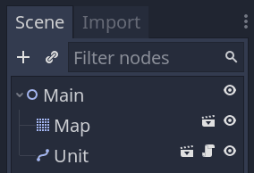

In the `Unit.gd` script, at the end of its `_ready()` function, call `walk_along()`. It takes a `PackedVector2Array` of grid coordinates as its argument, and the easiest way to create one is to first create an array with the coordinates that we want to use. Here's an example.

```gdscript
func _ready() -> void:
	#...
	var points := [
		Vector2(2, 2),
		Vector2(2, 5),
		Vector2(8, 5),
		Vector2(8, 7),
	]
	walk_along(PoolVector2Array(points))
```

Before running the game, you can enable _Visible Navigation_ in the _Debug_ menu. This will allow you to preview the curve generated by our function.


If you play the game you will see that the unit moves without any issue.

To get the result below, I assigned `squirrel.png` to the _Unit_'s _Skin_ property.


If the squirrel is too big, increase the transform of the _Map_ node, to 16.

In the next part, we will work on the cursor. It's the other element we need to implement unit selection and to issue orders through the game board.
