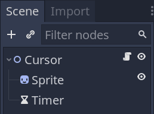
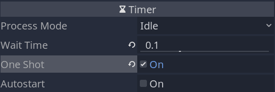

The cursor will allow the player to navigate the game board and to interact with a cell.


We will make it move on its own and emit signals, so it has zero external dependencies. Any other node in our game will be able to intercept the signals and react to them.

In the final demo, we only use the cursor to select units. But you could also use the "moved" signal that we'll define in a moment to display the current cell in the user interface, for example.

Our cursor will also move automatically at a fixed rate if you keep a direction key down.

## Creating the cursor

Create the cursor scene with a _Node2D_ as its root named _Cursor_, a _Sprite_ node, and a _Timer_ node we'll use to limit the frequency of movement when keeping a direction key down.



We need to set the _Timer_ to _One Shot_. By default, timers keep running in a loop. But to make them work as a cooldown, we have to toggle off that behavior.



Assign the texture `menu_selection_arrow.png` to the _Sprite_'s _Texture_. I've rotated the sprite so it points down at the origin like so.


Attach a script to the _Cursor_, and let's get coding.

```gdscript
# Player-controlled cursor. Allows them to navigate the game grid, select units, and move them.
# Supports both keyboard and mouse (or touch) input.
# The `tool` mode allows us to preview the drawing code you'll see below in the editor.
tool
class_name Cursor
extends Node2D

# We'll use signals to keep the cursor decoupled from other nodes.
# When the player moves the cursor or wants to interact with a cell, we emit a signal and let
# another node handle the interaction.

# Emitted when clicking on the currently hovered cell or when pressing "ui_accept".
signal accept_pressed(cell)
# Emitted when the cursor moved to a new cell.
signal moved(new_cell)

# Grid resource, giving the node access to the grid size, and more.
export var grid: Resource = preload("res://Grid.tres")
# Time before the cursor can move again in seconds.
# You can see how we use it in the unhandled input function below.
export var ui_cooldown := 0.1

# Coordinates of the current cell the cursor is hovering.
var cell := Vector2.ZERO setget set_cell

# We use the timer to have a cooldown on the cursor movement.
onready var _timer: Timer = $Timer


# When the cursor enters the scene tree, we snap its position to the centre of the cell and we
# initialise the timer with our ui_cooldown variable.
func _ready() -> void:
	_timer.wait_time = ui_cooldown
	position = grid.calculate_map_position(cell)


func _unhandled_input(event: InputEvent) -> void:
	# If the user moves the mouse, we capture that input and update the node's cell in priority.
	if event is InputEventMouseMotion:
		self.cell = grid.calculate_grid_coordinates(event.position)
	# If we are already hovering the cell and click on it, or we press the enter key, the player
	# wants to interact with that cell.
	elif event.is_action_pressed("click") or event.is_action_pressed("ui_accept"):
		#  In that case, we emit a signal to let another node handle that input. The game board will
		#  have the responsibility of looking at the cell's content.
		emit_signal("accept_pressed", cell)
		get_tree().set_input_as_handled()

	# The code below is for the cursor's movement.
	# The following lines make some preliminary checks to see whether the cursor should move or not
	# if the user presses an arrow key.
	var should_move := event.is_pressed()
	# If the player is pressing the key in this frame, we allow the cursor to move. If they keep the
	# keypress down, we only want to move after the cooldown timer stops.
	if event.is_echo():
		should_move = should_move and _timer.is_stopped()

	# And if the cursor shouldn't move, we prevent it from doing so.
	if not should_move:
		return

	# Here, we update the cursor's current cell based on the input direction. See the set_cell()
	# function below to see what changes that triggers.
	if event.is_action("ui_right"):
		self.cell += Vector2.RIGHT
	elif event.is_action("ui_up"):
		self.cell += Vector2.UP
	elif event.is_action("ui_left"):
		self.cell += Vector2.LEFT
	elif event.is_action("ui_down"):
		self.cell += Vector2.DOWN


# We use the draw callback to a rectangular outline the size of a grid cell, with a width of two
# pixels.
func _draw() -> void:
	# Rect2 is built from the position of the rectangle's top-left corner and its size. To draw the
	# square around the cell, the start position needs to be `-grid.cell_size / 2`.
	draw_rect(Rect2(-grid.cell_size / 2, grid.cell_size), Color.aliceblue, false, 2.0)


# This function controls the cursor's current position.
func set_cell(value: Vector2) -> void:
	# We first clamp the cell coordinates and ensure that we weren't trying to move outside the
	# grid's boundaries.
	var new_cell: Vector2 = grid.clamp(value)
	if new_cell.is_equal_approx(cell):
		return

	cell = new_cell
	# If we move to a new cell, we update the cursor's position, emit a signal, and start the
	# cooldown timer that will limit the rate at which the cursor moves when we keep the direction
	# key down.
	position = grid.calculate_map_position(cell)
	emit_signal("moved", cell)
	_timer.start()
```

You can now instantiate your cursor in the _Main_ scene to test it. Its code is self-contained, so it should work out of the box.


The cursor currently displays over the unit. We'll address that when with the game board, using a _YSort_ node.
