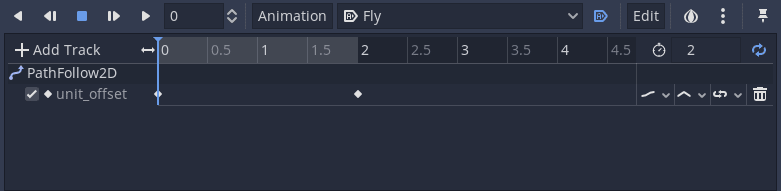

> So, what do you think is located on the other side of this wall?

> There's nothing. The graphics for backgrounds that can't be seen by players are not rendered in order to save processing power.

In this dialogue from _.hack//Rebirth_, Ovan and Yata have a discussion similar to the philosophical question known as [if a tree falls in a forest](https://en.wikipedia.org/wiki/If_a_tree_falls_in_a_forest).

In games, we want to avoid processing objects that players can't interact with, for example, when they're off-screen.

In Godot, we can use visibility nodes to detect when an object is inside the player's screen or viewport.

There are two types:

1. `VisibilityNotifier`. It emits signals when a node enters or exits the view.
1. `VisibiltiyEnabler`, which extends the `VisibilityNotifier`. It can automatically toggle processing on a parent node when it enters or leaves the view.

Let's look at what each allows you to do.

To follow along, you can download our demo project in the [Godot mini-tutorials repository](https://github.com/GDQuest/godot-mini-tuts-demos). You'll find the demo for this tutorial in the _2d/visibility-nodes_ folder.

## Destroying projectiles outside the view

When firing a bullet, usually, it doesn't have any use after it leaves the screen. Because this often means the player missed the target, especially on scroller games like jump 'n' shoots and space shooters.

We can free projectiles when they leave the view. For that, we can attach a _VisibilityNotifier2D_ and connect its _screen_exited_ signal to the projectile script. In the callback function, we can call `queue_free()` to destroy the node.


Here's a bullet script that moves a virtual bullet in a straight line and destroys it when it leaves the view.

```gd
# Virtual bullet, we don't handle collisions here.
class_name Bullet
extends Node2D

export var speed := 800.0


func _physics_process(delta: float) -> void:
	var velocity := Vector2.RIGHT.rotated(rotation) * speed
	translate(velocity * delta)


func _on_VisibilityNotifier2D_screen_exited() -> void:
	queue_free()
```

Notice how the _VisibilityNotifier2D_ displays as a pink rectangle inside the editor. It's the notifier's bounding-box. Godot uses it to check if the node entered or exited the view's bounds.

Adjust this rectangle to control when the object is within or outside the view. If even a small part of the bounding box is inside the view, the notifier considers it's "visible". It will only emit the `view_exited` signal when the entire rectangle leaves the view.


With that, whenever a Bullet leaves the screen, it's going to be automatically freed from memory.


The visibility notifier isn't pixel-accurate. For performance reasons, the grid used to detect when the object left the screen is coarse. See [this issue](https://github.com/godotengine/godot/issues/4803#issuecomment-225460236) to know more about how it works.


## Toggling AI agents on and off

Let's say you want enemies to stop chasing the player if they're outside the player's view. Or maybe you only want it to start an attack pattern when the player can see it.

For that, we can use a _VisibilityEnabler2D_.

_VisibilityEnabler2D_ is a specialized version of the _VisibilityNotifier2D_ that automatically toggles processing on its parent node.

For instance, in our project's _DemoEnabler_ scene, we have some enemies that move in circles using a _Path2D_, a _PathFollow2D_, and an _AnimationPlayer_.


The animation interpolates the _PathFollow2D > unit_offset_ property looping from `0.0` to `1.0`.



Now we can attach a _VisibiltiyEnabler2D_ as a child of the _Enemy_. Usually, I turn on all the available options to prevent any behavior on the parent.


Notice that even animations can pause using this method without writing any code.

For testing purposes, we can attach a script on the _Enemy_ and in the `_process` callback, print the _Sprite_'s `global_position` to test when the _Enemy_ starts processing.

```gd
extends Path2D

func _process(delta: float) -> void:
	print($PathFollow2D/Sprite.global_position)
```

As you can see in the _Output_ bottom panel, lines only appear when the _VisibiltiyEnabler2D_ enters the screen.

These are the two main uses of the visibility nodes: emitting signals and toggling processing automatically. They come in handy in many situations and help you improve performance significantly, especially in large game levels.

For instance, you can use these notifiers to preload a next room or chunk of an open world when the player enters an area. In that, it's an excellent alternative to the [Area2D](/tutorial/godot/2d/area2d/) node.

There are many more cases you'll find these nodes useful. Now, it's up to you to use these new powers wisely!


