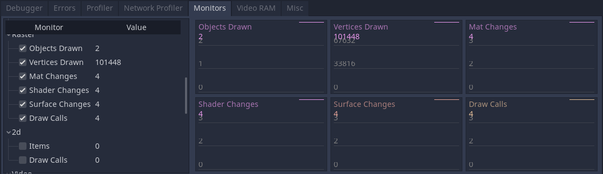

+++
title = "Optimizing a 3D scene"
description = "Improve your framerate in 3D by optimizing meshes and materials"
author = "razoric"
menuTitle = "3D Optimization"

date = 2020-08-21T14:22:00-04:00
weight = 5
draft = true

difficulty = "beginner"
keywords = ["tutorial"]
+++

## The graphics Monitors

The profiler measures functions, but Monitors measure individual systems in Godot, including the 3D renderer.

## Optimizing for draw calls (or how to not make the graphics card wait)

The GPU is a hunting hound held back by a chain. It's ready to go and is waiting for the grip to loosen before it goes as fast as it can. But before it goes, the CPU has to prepare it. It has to tell it what it's about to draw, what data to use, and in what order. The more work the CPU has to do, the longer the GPU waits and the lower the framerate.

### Reducing draw calls by optimizing meshes

Combine meshes in 3D software.

MultiMeshInstance.

### Reducing draw calls with fewer lights and shadows

Each light after the first adds a draw call.

Casting shadows adds draw calls per light as it draws each mesh from the viewpoint of the light.

Light baking.

### Reduce material and shader changes

Copy and paste the same material on objects that look the same.

Use the same shader instance.

Make objects share the same texture.

### Reduce overdrawing

Godot hides what is outside the bounds of the camera (frustum culling) but does not hide objects that are behind walls.

Design levels and scene trees in such a way that you can toggle visibility on large portions of your level when it will be invisible.

## The graphics card's amount of work and fill-rates

Once the CPU gives the go-ahead, the GPU can do all the work it needs to do on its to-do list. But even though it's blazing fast at its job, it still has limits it can reach.

### Reduce the amount of vertices to draw

Remove vertices from angles from which you guarantee the user will never see, like the underside of houses.

Reduce number of vertices on all objects.

### Reduce the amount of pixel and texture work

Pixel fill rate

Texel fill rate

### Offload expensive fragment work to the vertex shader

### Optimize shader code
