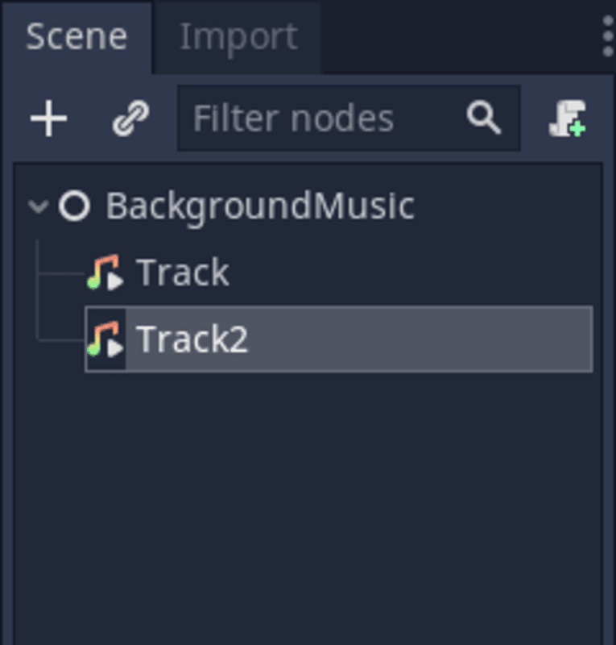
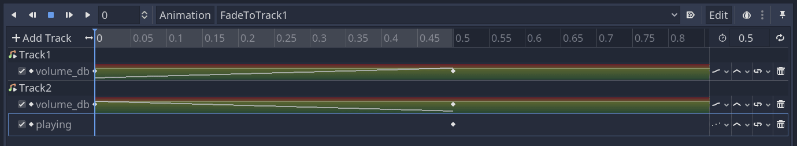
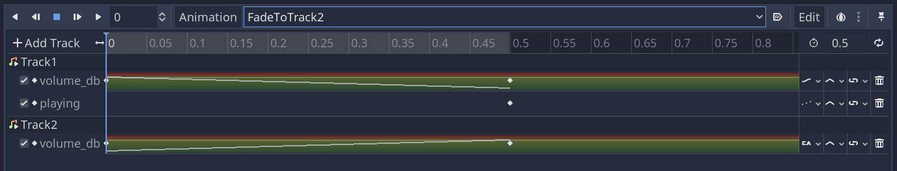
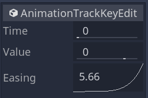

+++
title = "Crossfade Background Music"
author = "henrique"

date = 2020-07-17

difficulty = "beginner"
keywords = ["godot audio", "godot crossfade", "godot music", "godot audio transition"]

coAuthors = ["nathan"]
+++


In the [background music tutorial](), we saw how to keep the music playing when transitioning between game levels or screens. 

What if we want to **transition between two soundtracks smoothly**? In this tutorial, you'll learn to crossfade two music tracks smoothly.



## Setting up the scene

To achieve a _crossfade_ effect in Godot, we need two _AudioStreamPlayer_ nodes, one for each music track. Create a new scene with a node named _BackgroundMusic_. Add two _AudioStreamPlayer_ and an _AnimationPlayer_ node as its children. I've called the stream players _Track1_ and _Track2_. Leave them without a stream and set them to not autoplay as we will control them from _BackgroundMusic_'s script.




Let's start with the crossfade animations. We need two, respectively, to fade from track one to track two and vice-versa.

Animate the _Volume dB_ property of the audio tracks. One Node should animate from `0.0` to `-80.0` dB, and the other from `-80.0` to `0.0`. For the track that ends the animation at `-80.0` dB, add a track and keyframe that sets its `Playing` property to `false`.

Here is my animation _FadeToTrack1_:



And _FadeToTrack2_:



Note that you need to change the easing on the animation keys at the start of the animation. Because audio volume follows a logarithmic scale, linear interpolation will cause the music to fade out in a split second. Instead, we want them to blend for a moment.



One curve should ease in, as on the image above, and the other ease out.


## Coding the crossfade

We need some code to play music and automatically fade from one track to the other. Internally, our _BackgroundMusic_ Node should toggle between the two audio stream players. From the user's perspective, all we want is to call a function and let the fade happen magically.

Attach a script to _BackgroundMusic_ and add the following code to it.

```gdscript
extends Node

# References to the nodes in our scene
onready var _anim_player := $AnimationPlayer
onready var _track_1 := $Track1
onready var _track_2 := $Track2


# crossfades to a new audio stream
func crossfade_to(audio_stream: AudioStream) -> void:
	# If both tracks are playing, we're calling the function in the middle of a fade.
	# We return early to avoid jumps in the sound.
	if _track_1.playing and _track_2.playing:
		return

	# The `playing` property of the stream players tells us which track is active. 
	# If it's track two, we fade to track one, and vice-versa.
	if _track_2.playing:
		_track_1.stream = audio_stream
		_track_1.play()
		_anim_player.play("FadeToTrack1")
	else:
		_track_2.stream = audio_stream
		_track_2.play()
		_anim_player.play("FadeToTrack2")
```

You can use the script above by adding _BackgroundMusic_ as an [autoload](https://docs.godotengine.org/en/stable/getting_started/step_by_step/singletons_autoload.html) in your project and calling `BackgroundMusic.crossfade_to()`. Note that the function takes an `AudioStream`.


You can download our open-source sample project in the [Godot mini demos](https://github.com/GDQuest/godot-mini-tuts-demos) repository. It is in the `audio/background-music-transition` directory.

