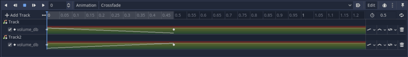

+++
title = "Crossfade Background Music"
author = "henrique"

date = 2020-07-17
draft = true

difficulty = "beginner"
keywords = ["godot audio", "godot music", "godot audio transition"]
+++

# Crossfade background music

To give each of our game levels a strong identity on top of good visuals and unique characters and enemies we need good unique music.

As seen in the background music mini-tutorial one of the problems in transitioning between scenes is that the music is often cutoff. With the solution provided there, we solve the problem when we have one single music playing, but how to make smooth transitions between menu music to a level music? Or between exploration music to combat music?

If we simply change the current playing music there will be a subtle cut in the previous song and a sudden start in the next. Well, if you listen to music on any media player it is common to have what is called a _crossfade_ that makes so that as the previous music is finishing the volume smoothly drops and the volume from the next music smoothly raises.

<video controls width="640">
   <source src="demo.mp4"
           type="video/mp4">
</video>

To achieve a _crossfade_ effect in Godot we need a _Node_ that uses two _AudioStreamPlayers_ one for each music track, as such:


As for the actual effect, we can add an _AnimationPlayer_ and animate the _Track > Volume dB_ from `0.0` to `-80.0` and do the opposite for the _Track2 > Volume dB_. The duration of the animation dictates the duration of the effect.



With the effect in place, we need to work with a bit of logic so that we are always toggling between the tracks. For instance, when we fade from _Track_ to _Track2_, in the next _crossfade_ we need to fade from _Track2_ to _Track_.

Let's attach a script to the _BackgroundMusic_. This node performs the _Crossfade_ animation between two songs and can change the next music to be played.

```
extends Node

var next_music: AudioStream setget set_next_music

var _play_backwards := false

onready var _anim_player := $AnimationPlayer
onready var _track_1 := $Track
onready var _track_2 := $Track2
onready var _next_track := _track_2


func crossfade() -> void:
	_next_track.play()
	if not _play_backwards:
		_anim_player.play("Crossfade")
		_next_track = _track_1
	else:
		_anim_player.play_backwards("Crossfade")
		_next_track = _track_2
	_play_backwards = not _play_backwards


func set_next_music(audio_stream: AudioStream) -> void:
	next_music = audio_stream
	_next_track.stream = next_music

```

It plays our _Crossfade_ animation backward whenever `_play_backwards == true`, so we always toggle this variable when we call `crossfade`. We also toggle the `_next_track` between the `_track_1` and the `track_2` to ensure that when we set the `next_music` it sets it on the track that is not currently playing.
