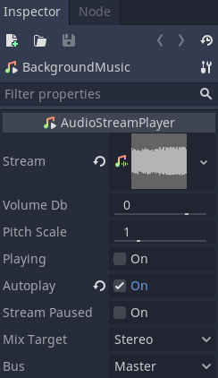
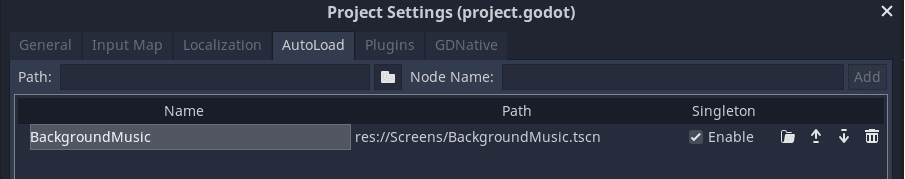

+++
title = "Persistent background music"
author = "henrique"
menuTitle = "Persistent BGM"
+++

Background music is one of the most immersive elements of a game. It dictates the mood and pace of a level or even of the whole play through, but there's a common mistake that may happen when we are working with background music in most game engines. When transitioning between game scenes the music gets cut and is common that it restart from beginning, completely breaking the immersion.

One of the simplest ways we can solve this problem is by using a Singleton responsible to play the background music. Since singletons are accessible globally and there can only be a _single_ instance of them, they can be used to maintain the music playing while all other objects are freed from memory between scene transitions.

## The _BackgroundMusic_ Singleton

In Godot Engine we can play audio stream files through an _AudioStreamPlayer_ Node. We are going to use it and rename it as _BackgroundMusic_, alternatively you can already drag your music file to the _Stream_ property slot and toggle on the _Autoplay_ flag.

With that we just need to turn this scene into an _Autoload_. In Godot Engine an _Autoload_ is a scene that is loaded automatically and instanced aside from the main scene, allowing it to be apart from changes in the SceneTree structure caused by the `get_tree().change_scene` and `get_tree().change_scene_to` methods. In other words, when calling one of those methods an _Autoload_ stays in the SceneTree processing normally.

Let's turn our _BackgroundMusic_ into an _Autoload_ now. In the _Project > Project Settings > Autoload_ browse the _BackgroundMusic_ file to set it as an _Autoload_.

Now whenever you test your game the _BackgroundMusic_ will instance alongside the scene you are testing and won't be removed unless you manually `queue_free` it and with that our _BackgroundMusic_ can keep playing throughout scenes.


You can download our open-source sample project in the [Godot mini demos](https://github.com/GDQuest/godot-mini-tuts-demos) repository. It is in the `audio/background-music` directory.

