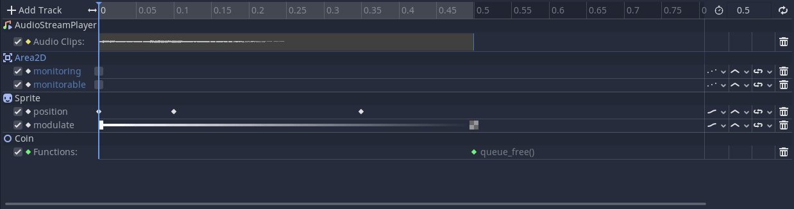
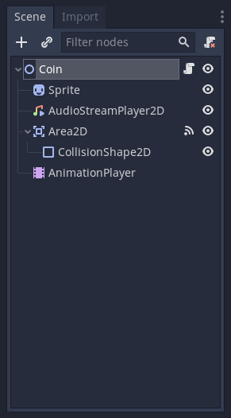
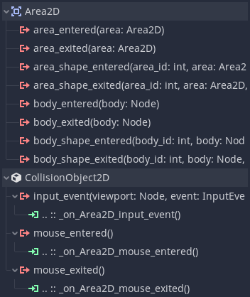

+++
title = "Cutting sound effects"
author = "henrique"
date = 2020-07-15
draft = true
+++

When dealing with sound effects, it is a common problem to have the audio cut when picking collectibles like coins, hearts, or when killing enemies.

Sound effects stop because we often free the node that's playing the sound indirectly. For instance, when the player touches a coin, we call `queue_free()` on the _Coin_ node. The _Coin_ contains an _AudioStreamPlayer_ that gets removed from the game before it finishes playing the "picked" sound effect.


To solve that, we can use an _AnimationPlayer_. Godot's animation system allows us to sequence audio, animations, and to call functions using as many animation tracks as we want.



In the picture above, you can see we're calling `queue_free()` only at the end of the animation after the sound finished playing.

With this approach, we can also disable collision shapes and avoid triggering a `queue_free()` or any unexpected behavior, like a character dying twice or picking a coin or a power-up more than once.

Using animation, we can also see the duration of a sound effect using an _Audio Playback Track_, which allows us to use a _Call Method Track_ to call the `queue_free` method when the sound effect finishes playing.

## Picking up a coin

For example, let's make a coin that we pick when clicking on it. Once picked, the coin performs an animation, plays a sound, and fades on the screen. Then we call its `queue_free()` method.

Here is the Coin scene setup:



We have the following signals from the _Area2D_ connected to the _Coin_ node:



For the _Coin_ script, it reacts to the _Area2D_ signals. It gets brighter when the mouse enters the _Area2D_. It turns back to its default _Modulation_ when the mouse exits, and it plays the _Picked_ animation if we left-click inside the _Area2D_.

```
extends Node2D
class_name Coin


onready var animation_player := $AnimationPlayer
onready var sprite := $Sprite


func _on_Area2D_mouse_entered() -> void:
	sprite.modulate = Color(1.2, 1.2, 1.2)


func _on_Area2D_mouse_exited() -> void:
	sprite.modulate = Color.white


func _on_Area2D_input_event(viewport: Node, event: InputEvent, shape_idx: int) -> void:
	if event.is_action_released("left_click"):
		animation_player.play("Picked")
```

The critical part is the _Picked_ animation. Let's break it down:


First, we add an _Audio Playback Track_ that uses the _AudioStreamPlayer_ to play the _Coin.ogg_ sound. Then we disable the _Area2D > Monitoring_ and _Monitorable_ properties to prevent it from detecting any mouse events. In parallel, we animate the _Sprite > Position_ and _Modulation_ to give players visual feedback. Doing so shows that the coin got picked. 

Then we have a _Call Method Track_ with a keyframe on the very end of the animation calling the `queue_free` method on the _Coin_ object, ensuring it gets removed from the _SceneTree_ after the sound effect and visual animation finish.


You can download our open-source sample project in the [Godot mini demos](https://github.com/GDQuest/godot-mini-tuts-demos) repository. It is in the `audio/pickup-sound-effect` directory.

