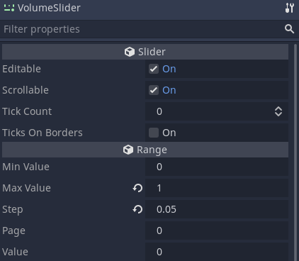
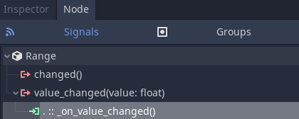
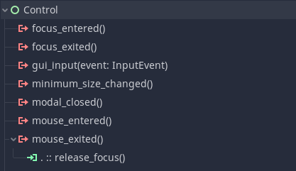

Let's see how to let players control your game's audio volume with sliders. You can use that in your game's audio settings, both on desktop and mobile platforms.



There's a dedicated node built into Godot: the _HSlider_. 

Create a new scene with an _HSlider_ and rename it to _VolumeSlider_. In the Inspector, set the node's _Max Value_ to `1.0` and the _Step_ to a low value like `0.05`. Doing so makes the slider produce values ranging from 0 to 1 in increments of 0.05. Here, we want a value of 1 to represent 100% audio volume or -0 dB.

Audio volume is measured in decibels (_dB_), a logarithmic scale. An increase of three dB doubles the volume, so it's hard to work directly with this scale. GDScript has two built-in functions to help us turn decibels into a linear scale in the `[0.0, 1.0]` range and back: `db2linear` and `linear2db`.



## Controlling mixer tracks with a slider

Add a new script to the _VolumeSlider_ node.

The idea here is that we sync the _VolumeSlider > Value_ to an _Audio Bus_ volume. So we need to know which _Audio Bus_ it syncs to. For that, we can _export_ a `String` variable that represents the _Audio Bus_ name. You can access and manage audio buses on the _Audio_ tab at the bottom of the editor. From there, you know the name of the _Audio Bus_ you want to sync. By default, the _VolumeSlider_ syncs to the _"Master"_ bus.

```
extends HSlider


export var audio_bus_name := "Master"

onready var _bus := AudioServer.get_bus_index(audio_bus_name)


func _ready() -> void:
	value = db2linear(AudioServer.get_bus_volume_db(_bus))


func _on_value_changed(value: float) -> void:
	AudioServer.set_bus_volume_db(_bus, linear2db(value))

```

Since we can only set the volume of an _Audio Bus_ using its index, we need to retrieve its index by requesting it the _Audio Server_ to find the _Audio Bus_ index using the `audio_bus_name`. We can do that using an `onready` variable.

Right when the slider is _ready_, we sync its `value` to the _Audio Bus_ volume, of course converting the volume to linear.

We need to change the bus volume every time our _VolumeSlider_ value changes, so let's connect its _value_changed_ signal to itself, here we renamed the signal callback to `_on_value_changed`.



And there we have it, an easy way to allow players to interact with the game's audio. Now a quick tip, _Sliders_ in Godot don't lose focus automatically when we stop interacting with them, which can cause some unexpected behaviors. Connect the _mouse_exited_ signal directly to the builtin `release_focus` method to ensure that as soon as the mouse is out the _VolumeSlider_, it loses the focus and stop consuming inputs.




You can download our open-source sample project in the [Godot mini demos](https://github.com/GDQuest/godot-mini-tuts-demos) repository. It is in the `audio/volume-slider` directory.

