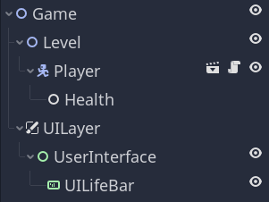
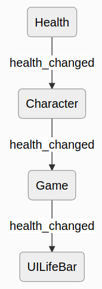
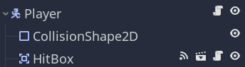
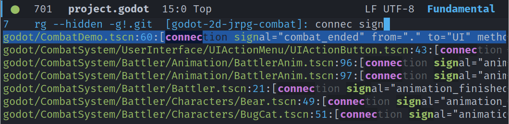
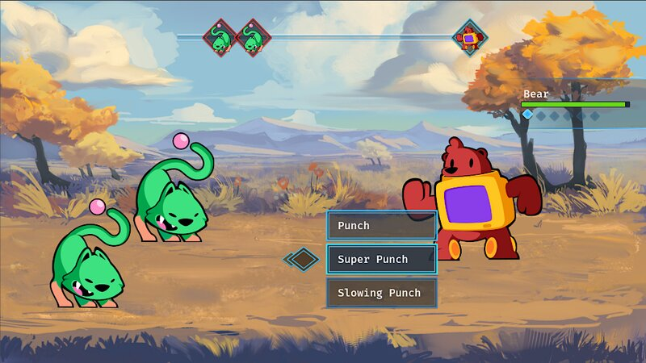

+++
title = "Best practices with Godot signals"
menuTitle = "Signals"
description = ""
author = "nathan"

date = 2021-03-30
weight = 5

difficulty = "intermediate"
keywords = ["godot best practices", "godot signal best practices", "godot signals"]
+++

This lesson discusses some good practices to follow and pitfalls to avoid when using signals in Godot.

Signals are Godot's version of the [observer pattern](http://gameprogrammingpatterns.com/observer.html): they allow a node to send out a message that other nodes can listen for and respond to.

Emitting a signal instantly triggers a callback on connected nodes, so you can also use it as a delegation mechanism. You also get to use them with coroutines and the `yield` keyword: you wait for a signal to know when another object finished processing.

Signals are an essential feature in Godot. They're not costly, performance-wise, as you'll see in a moment, and they help decouple classes or to react to specific events in the game. They're really useful.

However, as a project grows, the number of signals and connections you use grows too. If you connect nodes every which way, you can end up with a maze that'll end up slowing you down.

## When not to use signals

If you've got some experience with Godot already, you should've seen quite a few use cases for signals.

Here, we're going to talk about when **not** to use them.

In the team, we apply some rules of thumb to keep the code and connections manageable:

1. We avoid bubbling signals too many times. That is to say, re-emitting a child's signal from its parent or owner.
1. We avoid using signals if we need more than two or three steps to connect the source node to its target.

### 1. Avoid bubbling signals

Sending signals to nodes in distant node branches can make it hard to track down the connection in the code. Depending on your scene structure, you may need to "bubble up" the signal. That is to say, to have parent nodes re-emit and forward a signal from a child node. And you end up having to open three or four files just to follow the connection's path.

Imagine a game where the player character has a _Health_ node to represent and manage its current health. In the user interface, a bar named _UILifeBar_ displays the stat's current value.

Every time the health changes, you want to update the bar. But you don't want to store a reference to the _Health_ node on the _UILifeBar_, which would tightly couple the two objects.

Instead, you would likely use a signal to notify the bar when the health changed. But in the scene above, the nodes are distant from one another. You can also see that _Health_ is "encapsulated" in the _Character_ scene that's saved in the _level_ scene. In the simplified scene tree above, it looks like you could just connect the nodes in the editor. 

But imagine it's a real-world project with hundreds of nodes, where it's not so simple. In that case, and to keep the code flexible, you may think of forwarding signals like so:

That's three emissions and connections to track down.

Instead, you could use one of the following alternatives:

1. Pass the _UILifeBar_ a reference to the _Health_ node via a function call but only for a one-time setup and connecting signals. The UI shouldn't store the reference. That way, coupling stays low.
2. You can use an "Events" singleton that serves as a global signal bus. You'll find a dedicated guide in the Design Pattern chapter.

### 2. Avoid connections with many steps

When you need many steps to _connect_ two nodes, like passing a reference around several times, you get an issue similar to the previous one. While you don't need to open multiple files to track down the signal emission, you still need that to track down the initialization and connection.

When that is the case, you can favor the second solution mentioned above over the first one: using a global "Events" singleton that any node can connect to in one step.

Another option is to use the physics engine to detect interactions. The area nodes are great to detect when two objects enter in contact in the game world using their `body_entered` and `area_entered` signals.

The groups feature can also be a helpful tool. Imagine that in a game level, you have seven unique collectibles scattered around the scene tree. You want to display an icon for each one the player collected on the user interface.

If you put them all in the same "collectibles" group, to initialize the corresponding UI, you can call `get_tree().get_nodes_in_group("collectibles")` to get a reference to each of them and connect to their signals.

## How we use signals

At GDQuest, we use signals mainly in two cases:

1.  When we need another node to react to a specific, one-time event. For example, a `took_damage` signal that gets emitted when a character loses health.
2.  When we need a UI element to constantly update based on a game entity's value changes. Most of the time, we don't want the UI to store a reference to nodes in the game world and directly access their properties.

## Keeping track of signals

The number of signal connections will grow with your projects. How do you keep track of them?

When we need to track down a signal's connections, we search the codebase with a text search tool. We use something like the command-line program `grep` to search scene files on top of scripts.

Ideally, we would have a tool that draws a diagram or outputs a list of signal connections in the entire project. Unfortunately, we don't have that at the moment.

With the guidelines above and by following other object-oriented design principles, we tend to encapsulate signals inside of scenes, limiting the need to map and track them around the project.

### Also, game code changes a lot

There's another reason we don't bother creating a diagram of signal connections by hand.

Game development is highly iterative and full of moving parts. It's the game's design and the game's feel that should dictate the code you write, for the most part. And because the game's design changes a lot, code tends to change a lot throughout a project.

Because of that, you can't strictly plan your code's structure ahead of time. Keeping track of all signal connections without a good tool to automate that process could waste time.

If we had a good tool to generate dependency diagrams, as you can find in more mature ecosystems, we'd certainly use it. In the meantime, due to the time it takes to maintain a diagram, we use code search. In practice, we haven't needed to track down signal connections too much. Most of the time, we found we only look at one or two to fix a specific bug.

## Emitting signals every frame

One of you asked us if it was fine to emit signals every frame, like that, performance-wise. In the cases shown in the course, where we do that sparingly, it is.

In the JRPG series, we emit a signal every frame on the battlers to trigger an update in the user interface. This signal aims to help decouple the turn bar from the battlers: in the code, you can destroy the battler nodes, and the signal connection will automatically be cut.

You're unlikely to hit a bottleneck with those kinds of signals.

In GDScript, emitting a disconnected signal barely costs more than a function call. When connected to one node, emitting the signal plus its callback costs a little over three times slower than a direct functions call.

It takes 2300 signal emissions and related delegate function calls to consume 1ms of processing time on the main thread on my machine. You could easily do that every frame without affecting your framerate. So that's not too significant.

It's even less of a concern when you consider the tools at your disposal to only process the entities on screen. These include functions like `set_process()` and the VisibilityEnabler2D node, for instance.

While you could imagine a case where you have thousands of entities simulating in real-time, as in a heavy city-builder or other simulation game, you wouldn't continuously emit signals anymore. Instead, you would most likely need a more fitting code architecture involving some heavy engine customization.
