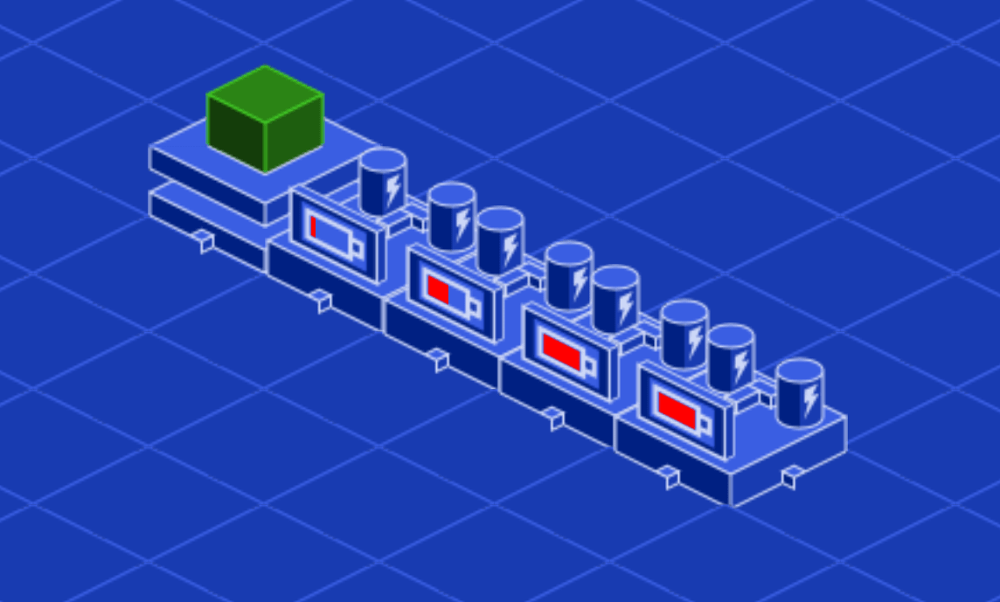

The Entity Component pattern, EC for short, is a way of designing concrete objects by adding one or more components representing a specialized data set. For example, a `Transform` component may have a 3D position, rotation, and scale, whereas a `PowerSource` component may have power units provided and an efficiency rating.

There's a similarly named structural pattern, ECS, which stands for Entity-Component-System. These days, ECS refers to a performance-oriented pattern where you store components in contiguous memory blocks and update them in systems that process them in parallel. Some game engines like [Bevy](https://bevyengine.org/) use it at their core.

In this guide, we'll focus on the Entity-Component pattern, which is just about having some data and behavior in separate components. We'll show you how to implement it in Godot to add flexibility to your simulation games and other projects. While we'll talk about some classes working as systems, and draw some inspiration from ECS, we're only concerned with a high-level design pattern for flexibility here.


_Didn't you have a big write-up about this being a pattern we don't need in Godot earlier?_, you ask.

And you're right, we did.

Often, when people ask about the Entity Component pattern or ECS architecture in Godot, they think of it as the engine's foundation or a replacement to Godot's nodes tree. But as we argued, Godot's nodes tree system can complete most tasks on its own.

But it has limitations in _some_ cases. In those cases, you can draw inspiration from this pattern to help decouple objects.

You can see an example of this Entity-Component pattern in action [on our code repository](https://github.com/GDQuest/godot-design-patterns). It contains a demo scene that corresponds to this guide.

## The problem

You have power generators, wires, and machines that require electricity to turn on. No power and the device can't do anything.

You need a way to tell the machines that they receive electricity from a connected generator and that they can turn on.



How do you notify the machine it is receiving power?

### Simple solution: a property and function

If you only have a handful of machines, you can use a simple solution.

To receive power, in a machine's script, you define a `power_required` variable and a `provide_power()` function to call from another script. If the machine gets enough power, it turns on.

```gdscript
extends Entity

export var power_required := 10.0

# Provides power to this machine.
func provide_power(power: float) -> void:
	if power >= power_required:
		do_work()
```

Imagine that you have many different kinds of machines, they all need to receive power, but they function differently.

In GDScript, you can use duck-typing to ensure the entity you're dealing with is a machine. In another script, you'd detect a machine by calling `has_method()`.

```gdscript
if entity.has_method("provide_power"):
	entity.provide_power(10.0)
```

This approach is fast to implement and can work well for small projects. But as your game grows, it has three drawbacks.

First, when someone who is not familiar with your system wants to create a new machine, they have to know they must define the `provide_power()` function.

That could be someone else on your team, or it could be you eight months from now after you haven't touched the power system of your game.

The second drawback is that we don't want to introduce inheritance in this example, and we would copy the code in the few scripts that require the feature. Thanks to duck-typing, as long as we defined the right method on a given script, it will "just work."

The third drawback arises from this solution: other objects have to figure out which machines are connected to them, get a reference to them and call their `provide_power()` method directly. This can increase the number of dependencies in your program.

We'll address these problems in a moment, but first, let's discuss using inheritance over composition and its shortcomings.

### Using inheritance to define all required properties

You can use inheritance to provide all machines that need power with the functionality they need, but this has shortcomings. Imagine we create an inheritance hierarchy like the following: `PowerReceiverEntity < Entity`.

`PowerReceiverEntity` defines the variable and method we need all machines to have.

```gdscript
class_name PowerReceiverEntity
extends Entity

export var power_required := 10.0

func provide_power(power: float) -> void:
	if power >= power_required:
		do_work()
#...
```

You can do the same with a `PowerSourceEntity` that generates power.

```gdscript
class_name PowerSourceEntity
extends Entity

export var generated_power := 30.0

var _connected_power_receivers := []

func _process(delta: float) -> void:
	var drawn_power := 0.0

	# We provide power to as many connected machines as possible every frame.
	for machine in _connected_power_receivers:
		drawn_power += machine.power_required

		if drawn_power < generated_power:
			machine.provide_power(machine.power_required)
		else:
			break
#...
```

Using classes like this can bring some improvements to our previous solution:

1. Now, you don't need duck typing anymore. Duck typing's fine to check for one method, but imagine you have to check for dozens of them. Instead, you can check for the `PowerReceiverEntity` type and know that you can access all methods on it.
2. In GDScript, by using type hints, you get much better autocompletion on top of type safety and, starting in Godot 4.0, performance improvements.
3. Every machine that needs specific features can extend the appropriate class; you don't need to copy and paste boilerplate code anymore.

But then you code a Battery that is both a power receiver _and_ a power source. Then, you would need both classes' features, but you can't inherit from both. You could create a combined class, `PowerReceiverAndSourceEntity`, but hopefully, you can see how that doesn't scale with the many features your game might need: using fuel over electricity, assigning items to the device, and more.

Inheritance that merges responsibilities instead of extending them breaks down. Defeating that problem is why composition exists. Let's see how we can solve the problem instead.

## Using components for more flexibility

Instead of using inheritance or duplicate code, we can attach reusable components to our entities.

In a pure implementation of ECS, components are instances of structures made up of data. We implement them in such a way they do not know what they're attached to.

For a version that works well in Godot, you can design components as nodes and have them as children of an entity. That way, you can instantiate them in scenes and update their properties in the _Inspector_.

Your components should still work without knowing what their parent is. It shouldn't matter that you attach a `PowerReceiver` to a battery, a car engine, or a lamp. One of this pattern's strengths is that you can reuse components anywhere.

You can do this by making them simple classes that are all about data and signals. Another object will configure and emit their signals, likely the parent entity.

```gdscript
class_name PowerReceiver
extends Node

## Emitted by the parent entity when it receives some power units per second.
signal power_provided(power, delta)

## The number of power units the parent entity requires to function.
export var power_required := 10.0

## Percentage of how much of its maximum input the power receiver can take.
var efficiency := 0.0
```

You can define functions on the component but ensure that they only use the object's properties. It should be the entity's job to configure its components, and the components should remain blind to what receives their signals or what makes them do their job.

Here's an example of a `WorkComponent` that outputs items from a blueprint stored in the `current_output` variable below.

```gdscript
class_name WorkComponent
extends Node


## Emitted by the worker when work progresses by any amount
signal work_accomplished(amount)

## Signal emitted by the worker when work finishes.
signal work_done(output)

## The entity that will come out of the worker when finished.
var current_output: BlueprintEntity

## The number of work units available for the worker to complete.
var available_work := 0.0

## The speed at which work progresses each update cycle.
var work_speed := 0.0


## The component's update function.
func work(delta: float) -> void:
	if available_work > 0.0:
		# Calculate the number of work units this frame
		var work_done := delta * work_speed
		# And reduce the work units still to go
		available_work -= work_done

		# Notify of progress
		emit_signal("work_accomplished", work_done)

		# Notify that work finished
		if available_work <= 0.0:
			emit_signal("work_done", current_output)
```

Either way, the component is blind. This keeps it safe, lowers dependency, and prevents it from needing specialization for each machine that may use it. With this approach, you specialize each entity by attaching components to them.


Entities can access the data from their components using `get_node()` and connect to their signals.

## Adding a system to track and use components

You could stop at the entity-component couple, which already solves our initial problem. We'll add a class we'll call a system to track and update components.

The system part in the Entity Component helps you collect a specific kind of components and update them sequentially. You can use systems to help keep your code grouped somewhere. When it comes time for the game to act, systems act on any instanced entities with the components the system cares about. Below, you'll see the example of a `PowerSystem` that finds all `PowerReceiver` and `PowerSource` components and processes them. 

_This is different from how systems are used in ECS: when used as an architectural pattern in a generalist game engine's core, components are kept in contiguous memory blocks, and systems process them in parallel, which helps offer great performance when you don't know how people will use your engine._

In the example below, we use groups to identify entities a system cares about. When you assign a power source component to an entity, assign it to the power_sources group. The system can then receive all the entities that are relevant by calling `SceneTree.get_nodes_in_group()` or `SceneTree.is_in_group()`.

```gdscript
extends Node

var power_system := PowerSystem.new()

func _ready() -> void:
	# Configure the power system by providing it with nodes from relevant groups
	power_system.setup(
		get_tree().get_nodes_in_group("power_sources"),
		get_tree().get_nodes_in_group("power_receivers")
	)
```

Here is the `PowerSystem` script, which uses `SceneTree.is_in_group()`.

```gdscript
class_name PowerSystem
## In this instance, the system is a Reference that is held by the main Simulation
## class and its update functions triggered from there.
## It could instead be a Node that is a child of the main game node instead.
extends Reference

## Dictionary that holds power source components keyed to their location.
## We can use these to update the system and calculate how much power is in any
## given power path.
var power_sources := {}


## When an entity is placed, a signal can trigger this function and notify the system
## of new entities. The system can search them for relevant components if they are in
## a relevant group.
func _on_entity_placed(entity, cellv: Vector2) -> void:
	if entity.is_in_group("power_sources"):
		power_sources[cellv] = _get_power_source_from(entity)

	if entity.is_in_group("power_receivers"):
		power_receivers[cellv] = _get_power_receiver_from(entity)
```

The alternative is to have entities maintain an `onready` reference to their components, but this forces them to have a variable name that is consistent across all entities. Duplicating code like that is error-prone.

To get the component, you can leverage `class_name`. We know that the component is a child node of the entity so that we can iterate over its children with `get_children()` and test nodes using the `is` keyword.

```gdscript
## We test each of a node's children until we find one that uses the `PowerSource` class.
## We return `null` if none is found.
func _find_power_source_child(parent: Node) -> PowerSource:
	for child in parent.get_children():
		if child is PowerSource:
			return child

	return null
```

How you store those components and how you use them depends on your system's jobs. In the example of our `PowerSystem`, each time it updates it could iterate over each `PowerSource`, calculate how much power it generates, and inform any power receiver that it connects to how much power they have access to.

```gdscript
func update(delta: float) -> void:
	# For each path that goes from a power source to one or more receiver
	for path in power_paths:
		# Get the source
		var source: PowerSource = power_sources[path.front()]

		# Calculate the max power the source can generate
		var available_power := source.power_amount * source.efficiency

		# Keep a running tally of power as we provide power to receivers
		var power_left := available_power

		# For each power receiver in the rest of the path
		for cell in path.slice(1, path.size()-1):
			# Get the receiver and calculate how much power it needs to function
			var receiver: PowerReceiver = receivers[cell]
			var power_required := receiver.power_required * receiver.efficiency

			# Tell it of the available power
			receiver.emit_signal("power_received", min(power_left, power_required), delta)

			# Reduce the amount of power left
			power_left -= power_required

		# Tell the source that it has had a certain amount of power drawn from it
		source.emit_signal("power_drawn", available_power - power_left, delta)
```

To create a battery that both stores and sends energy, we can give it a `PowerSource` and a `PowerReceiver` component and configure the components' efficiency based on how much power is in the battery at the time. It can connect to its components' signals and update the running tally of power still in the battery.

```gdscript
extends Node2D


## Total amount of power the battery can hold
export var max_storage := 1000.0

## Actual amount of power currently in the battery
var stored_power := 0.0 setget _set_stored_power

onready var receiver := $PowerReceiver
onready var source := $PowerSource
onready var indicator := $Indicator


func _set_stored_power(value: float) -> void:
	stored_power = value

	# Make sure all nodes are ready
	if not is_inside_tree():
		yield(self, "ready")

	# Set receiver efficiency to 0 if already full. Otherwise, set it to a percentage
	# of power that it can still receive from its input capacity.
	receiver.efficiency = (
		0.0
		if stored_power >= max_storage
		else min((max_storage - stored_power) / receiver.power_required, 1.0)
	)

	# Set efficiency to 0 if battery is empty, otherwise set it to a percentage
	# that it can provide from its amount and output capacity, up to 100%
	source.efficiency = (0.0 if stored_power <= 0 else min(stored_power/source.power_amount, 1.0))

	# Update shader with power amount so the indicator is up to date with amount
	indicator.material.set_shader_param("amount", stored_power / max_storage)


## Reduce the amount of power in the battery by the power value per second
func _on_PowerSource_power_drawn(power: float, delta: float) -> void:
	self.stored_power = max(0, stored_power - min(power, source.power_amount * source.efficiency) * delta)


## Increase the amount of power in the battery by the power value per second
func _on_PowerReceiver_power_received(power: float, delta: float) -> void:
	self.stored_power = min(max_storage, stored_power + power * delta)

```

With this Entity Component pattern, you increase the complexity of your objects' update cycle. In exchange, you get objects that know nothing about their surroundings outside of their scenes, giving you a lot of flexibility in how you can reuse code.

Systems take care of keeping track and updating components, and you do not have to copy-paste code or have deep class inheritance trees.

Be sure to use this pattern mindfully, though, as it comes at a maintenance cost compared to writing more straightforward code. It's most beneficial when creating simulation games and the likes, especially if the game's large.
