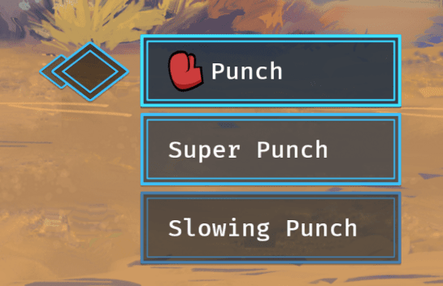
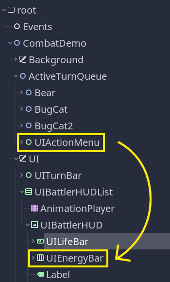
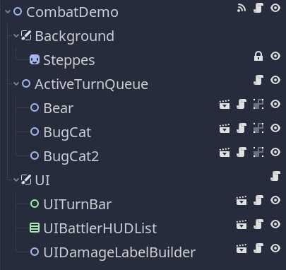

We use a pattern on almost every project at GDQuest: a singleton that only emits signals.

We call it the "Events Autoload" or events bus and have a video tutorial dedicated to it: [Smarter Godot Signals with the Event Autoload pattern](https://youtu.be/S6PbC4Vqim4).

It allows one node to react to a global event in the game or an event triggered by a node that's very far from it in the node tree. And that without having to connect the two nodes directly.

It is handy when you don't have an easy way to pass a reference from one node to the other to connect in the code or when you can't use the editor to connect them. For example, if you instantiate UI elements at runtime.

We use it when we don't have an alternative that is simpler to manage, like node groups or a direct signal connection in a small number of steps, as discussed in the previous lesson.

The advantage is it allows you to keep distant objects that need to communicate with one another decoupled at a low cost.

The main disadvantage is that you bundle a bunch of unrelated signals into a single object. You don't want to use this all over the place because you have to search your entire codebase whenever you have to track an event signal. You'll have to see for yourself how many signals you can and want to handle using this pattern. We found that even with dozens of signals on a single node, it is still fairly easy to keep track of the connections.

## How to create a global event singleton

You just need three steps to create or implement this pattern.

1. Create a new script that extends the node class, and define one or more signals on it.
1. In the Project Settings, navigate to the Autoloads tab and register your new script as an auto-loaded node.
1. Connect another node to the Events singleton via code like you would with any other: `Events.connect("signal_name", self, "_on_Events_signal_name")`.

From any script in your project, you can then write `Events.emit_signal()` to emit the corresponding signal.

## Usage example

Here's a concrete usage example from the JRPG series. You will find more information and examples of this pattern in the course.

```gdscript
# Event bus for distant nodes to communicate using signals.
# This is intended for cases where connecting the nodes directly creates more coupling
# or increases code complexity substantially.
extends Node

# Emitted when hovering a UIActionButton. The UIBattlerHUD uses this to display a preview of an
# action's energy cost.
signal combat_action_hovered(display_name, energy_cost)
# Emitted during a player's turn, when they chose an action and validated their target.
signal player_target_selection_done
```

In the series, we instantiate some UI components at run-time. For example, we create a new instance of the action menu on every battler's turn. This ensures the menu is initialized correctly in its default state every time we need to display it.



The thing is, that menu, _UIActionMenu_, and the character's heads-up display to which we need to connect it are in different node tree branches, so it's cumbersome to connect them every time we need that menu.



The image above shows the remote scene tree while the game is running. You can see the Events singleton at the top. In the editor, you don't have the _UIActionMenu_ and you don't have direct access to the _UIEnergyBar_ to which you need to connect it.



To connect them without the singleton, you'd need to:

1. Pass the _UIActionMenu_ to the _CombatDemo_.
2. Forward it to the _UIBattlerHUDList_.
3. Forward it to the correct _UIBattlerHUD_.

To do so without breaking encapsulation and keeping sane programming practices, you may need to add code in four different scripts. Imagine you need to refactor the code later and move the node. The steps could easily increase.

With the events bus pattern, you only need to add code in two places instead. And in case you need to refactor, nothing changes, nothing breaks.

Hopefully, this example illustrates the pattern's benefits. You'll find more examples in the rest of the course.
