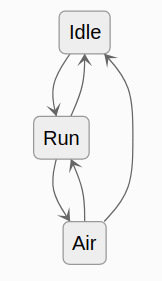
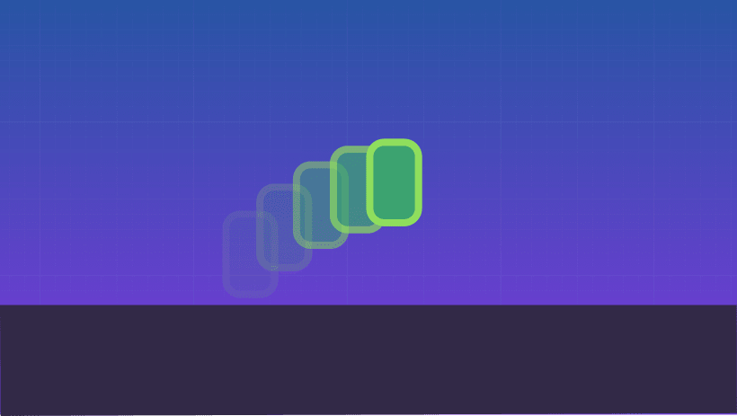
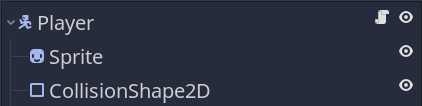
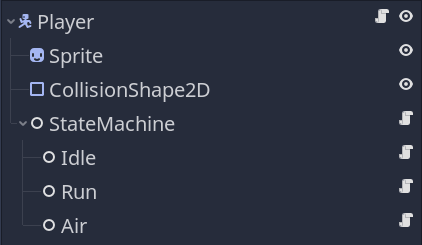

_Split an object's finite number of states or behaviors into individual state objects and only allow one of them to control their host at a time._

You've probably heard of this pattern called **State**, or **Finite State Machines**, often represented as a graph.



It's a natural way to mentally break down a game entity or a program into high-level states. It's widely used in games.

In this guide, we'll see how to implement it in Godot, with GDScript code and nodes. We will use the convenient `owner` property of nodes to keep our state code simple.

Before that, let's start by looking at the problem this pattern tries to solve and an intermediate solution for simple cases.

_The code examples you'll see in this guide are simple to keep it short and clear. You can find a complete companion demo in our [Godot design patterns](https://github.com/GDQuest/godot-design-patterns) repository._

_But please note the pattern is mostly worth it when you start to have more complex code. For a concrete example, see our [Open 3D Mannequin](https://github.com/GDQuest/godot-3d-mannequin)._

**This guide was open-sourced from and made possible by our course [Godot 2D Secrets](https://school.gdquest.com/products/godot_2d_secrets_godot_3). If you'd like to level up your game development skills, check it out!**

## The problem

Imagine you have a character that needs to stand idle, run, and jump.



In its update loop, you write all the conditions for it to do all these actions, and it goes just fine. `KinematicBody2D` in Godot makes it especially easy to detect if the character is on the floor or not.

```gdscript
# Character that moves and jumps.
class_name Player
extends KinematicBody2D

var speed := 500.0
var jump_impulse := 1200.0
var base_gravity := 4000.0

var _velocity := Vector2.ZERO


func _physics_process(delta: float) -> void:
	# Starting with input.
	var input_direction_x: float = (
		Input.get_action_strength("move_right")
		- Input.get_action_strength("move_left")
	)
	var is_jumping := is_on_floor() and Input.is_action_just_pressed("move_up")

	# Calculating horizontal velocity.
	_velocity.x = input_direction_x * speed
	# Calculating vertical velocity.
	_velocity.y += base_gravity * delta
	if is_jumping:
		_velocity.y = -jump_impulse
	# Moving the character.
	_velocity = move_and_slide(_velocity)
```

That's simple enough. Now, we want the character to glide, but only if it's in the air. When it's gliding, the character falls slower and they can't turn around instantly. Also, when gliding, the player can hop, canceling the glide, and jumping lower than a regular jump.

```gdscript
# Character that moves, jumps, and glides.
class_name Player
extends KinematicBody2D

var speed := 500.0
var jump_impulse := 1200.0
var base_gravity := 4000.0

# Here are the new variables for gliding.
var glide_max_speed := 1000.0
var glide_acceleration := 1000.0
var glide_gravity := 1000.0
var glide_jump_impulse := 500.0

var _velocity := Vector2.ZERO
# There's also a new boolean value to keep track of the gliding state.
var _is_gliding := false


func _physics_process(delta: float) -> void:
	# Starting with input.
	var input_direction_x: float = (
		Input.get_action_strength("move_right")
		- Input.get_action_strength("move_left")
	)
	var is_jumping := is_on_floor() and Input.is_action_just_pressed("move_up")

	# Initiating gliding, only when the character is in the air.
	if Input.is_action_just_pressed("glide") and not is_on_floor():
		_is_gliding = true

	# canceling gliding
	if _is_gliding and Input.is_action_just_pressed("move_up"):
		_is_gliding = false

	# Calculating horizontal velocity.
	if _is_gliding:
		_velocity.x += input_direction_x * glide_acceleration
		_velocity.x = min(_velocity.x, glide_max_speed)
	else:
		_velocity.x = input_direction_x * speed

	# Calculating vertical velocity.
	var gravity := glide_gravity if _is_gliding else base_gravity
	_velocity.y += gravity * delta
	if is_jumping:
		var impulse = jump_impulse if is_on_floor() else glide_jump_impulse
		_velocity.y = -jump_impulse

	# Moving the character.
	_velocity = move_and_slide(_velocity)

	# If we're gliding and we collide with something, we turn gliding off and the character falls.
	if _is_gliding and get_slide_count() > 0:
		_is_gliding = false
```

We have to add conditional checks in multiple places to distinguish glide movement from other movements.

The code doubled in size, even though our character movement is still dead simple. We had to introduce a boolean variable to check if the character is gliding. If it weren't for `KinematicBody2D`'s convenient `is_on_floor()` method, we'd need another one for that.

Did you notice the error up there?

```gdscript
var is_jumping := is_on_floor() and Input.is_action_just_pressed("move_up")
```

We want to allow jumping during glide, but I forgot to update the `is_jumping` variable, and so it doesn't work. When you put all your movements and state in one place, these changes are easy to miss. More issues in the code above make it brittle and difficult to change, even though it is still relatively small. But we don't have sounds, animations, and movement is still basic. In a real game project, the code gets messy fast.

Now, imagine the project moves forward, and you realize that you also want the character to dash, climb on walls, grab ledges, climb ladders, shoot, do combos with a sword, and a bazillion other things. You need more variables to check in which states the character is, and conditional combinations explode.

If you try to shove it all in the same class, using only boolean variables to keep track of your character's current state, it soon becomes unmanageable. In particular, every variable you add in one place increases the chance of bugs creeping up on you. That's because there are just too many conditions to check to know what the character can or cannot do right now and properly chain the behaviors.

You could and should split your code into multiple functions, but that won't be enough to manage the overwhelming possible interactions between all the character's states.

## State variable

A simple solution to this problem is to define a variable named `state` that stores a text string or a member from an enumeration and helps you keep track of which state the character is in.

You can then use it in conditions or in a match block to know what the character can or cannot do.

```gdscript
# Character that moves and jumps.
class_name Player
extends KinematicBody2D

# An enum allows us to keep track of valid states.
enum States {ON_GROUND, IN_AIR, GLIDING}

#...

# With a variable that keeps track of the current state, we don't need to add more booleans.
var _state : int = States.ON_GROUND


func _physics_process(delta: float) -> void:
	#...
	# Instead of using different functions and variables, we can now use a single variable 
	# to manage the current state.
	# Our character is jumping if they're on the ground and the player presses "move_up"
	# If both conditions are met, the expression below will evaluate to `true`.
	var is_jumping: bool = _state == States.ON_GROUND and Input.is_action_just_pressed("move_up")

	# To change state, we change the value of the `_state` variable
	if Input.is_action_just_pressed("glide") and _state == States.IN_AIR:
		_state = States.GLIDING

	# Canceling gliding.
	if _state == States.GLIDING and Input.is_action_just_pressed("move_up"):
		_state = States.IN_AIR

	# Calculating horizontal velocity.
	if _state == States.GLIDING:
		_velocity.x += input_direction_x * glide_acceleration * delta
		_velocity.x = min(_velocity.x, glide_max_speed)
	else:
		_velocity.x = input_direction_x * speed

	# Calculating vertical velocity.
	var gravity := glide_gravity if _state == States.GLIDING else base_gravity
	_velocity.y += gravity * delta
	if is_jumping:
		var impulse = glide_jump_impulse if _state == States.GLIDING else jump_impulse
		_velocity.y = -jump_impulse
		_state = States.IN_AIR

	# Moving the character.
	_velocity = move_and_slide(_velocity, Vector2.UP)

	# If we're gliding and we collide with something, we turn gliding off and the character falls.
	if _state == States.GLIDING and get_slide_count() > 0:
		_state = States.IN_AIR

	if is_on_floor():
		_state = States.ON_GROUND
```

_That's not the state pattern yet, only an intermediate solution that can help you in some cases._

This is a significant improvement over using boolean values only already. How? We won't have to add booleans and have to switch multiple if we add more states.

You can also wrap state changes in a function to initialize and do a cleanup, for example, by changing the horizontal acceleration and maximum speed when you are in the air.

```gdscript
var ground_speed := 500.0
var air_speed := 300.0

var _speed := 500.0


func change_state(new_state: int) -> void:
	var previous_state := _state
	_state = new_state

	# Initialize the new state.
	match _state:
		States.IN_AIR:
			_speed = air_speed
		States.ON_GROUND:
			_speed = ground_speed

	# Clean up the previous state.
	match previous_state:
		States.IN_AIR:
			#...
```

So, there are some benefits to using this solution.

However, you're left with a lot of code in one place and the ability for any function to access variables it does not need and should not be aware of. 

And to do so, you want to add extra functions and conditions to change your object's properties when you enter and exit a given state. Having it all in one place is error-prone.

Now, imagine you want to reuse some of the states for monsters. Well, with this example, either you reuse all the code or nothing. You can't just take the ability to climb walls or to make combos with a sword.

That's where the state pattern and finite state machines come in.

## State pattern

The point of the state pattern is to segregate every state into a stand-alone object. That is to say, one object for the ground or run state, one for the jump state, and so on.

We also implement a state machine that keeps track of the current state, takes care of cleanly transitioning from one state to another, and always delegates update and input callbacks to the active state only.


This has several benefits:

- Each state only has access to the properties it needs instead of all the other states' specific variables.
- Optionally, we can write characters and states in such a way we can reuse behaviors.
- Each behavior is encapsulated in one file, making it easy to debug and jump to it in your codebase.
- The state machine becomes a generic and reusable component so we can share it in our codebase.

## How to code it

Let's see how to implement the foundations. We are going to code a simple character with idle, run, and jump states.

We need to code two main components:

1. The `StateMachine` that will hold an active state and delegate work to it. It will also change the active state.
1. A virtual `State` base class that every concrete state will inherit. Doing this ensures that every state has some methods the finite state machine can call.

We'll start with the `State` class as the state machine uses it.

### The state class

We are going to make every state extends the `Node` class. This will allow us to create state nodes directly in the editor.

With a state machine, we want to control the active state and delegate process, physics process, input, and other callbacks.

To do so, we are going to give our state class functions a different name. Each of those is a virtual function, meaning that we want to override them to create state classes like the ground movement we will code in a moment.

```gdscript
# Virtual base class for all states.
class_name State
extends Node

# Reference to the state machine, to call its `transition_to()` method directly.
# That's one unorthodox detail of our state implementation, as it adds a dependency between the
# state and the state machine objects, but we found it to be most efficient for our needs.
# The state machine node will set it.
var state_machine = null


# Virtual function. Receives events from the `_unhandled_input()` callback.
func handle_input(_event: InputEvent) -> void:
	pass


# Virtual function. Corresponds to the `_process()` callback.
func update(_delta: float) -> void:
	pass


# Virtual function. Corresponds to the `_physics_process()` callback.
func physics_update(_delta: float) -> void:
	pass


# Virtual function. Called by the state machine upon changing the active state. The `msg` parameter
# is a dictionary with arbitrary data the state can use to initialize itself.
func enter(_msg := {}) -> void:
	pass


# Virtual function. Called by the state machine before changing the active state. Use this function
# to clean up the state.
func exit() -> void:
	pass

```

### The finite state machine

The finite state machine class uses the state. It keeps track of an active state, handles transitions between them, and delegates built-in callbacks. Like `_process()`, `_physics_process()`, and so on.

We chose to let the states call the `transition_to()` method on the finite state machine in our implementation.

That way, every state is responsible for defining possible transitions to other states. Also, to transition to another state, we pass in the name of the state node we want to transition to.

```gdscript
# Generic state machine. Initializes states and delegates engine callbacks
# (_physics_process, _unhandled_input) to the active state.
class_name StateMachine
extends Node

# Emitted when transitioning to a new state.
signal transitioned(state_name)

# Path to the initial active state. We export it to be able to pick the initial state in the inspector.
@export var initial_state := NodePath()

# The current active state. At the start of the game, we get the `initial_state`.
@onready var state: State = get_node(initial_state)


func _ready() -> void:
	await owner.ready
	# The state machine assigns itself to the State objects' state_machine property.
	for child in get_children():
		child.state_machine = self
	state.enter()


# The state machine subscribes to node callbacks and delegates them to the state objects.
func _unhandled_input(event: InputEvent) -> void:
	state.handle_input(event)


func _process(delta: float) -> void:
	state.update(delta)


func _physics_process(delta: float) -> void:
	state.physics_update(delta)


# This function calls the current state's exit() function, then changes the active state,
# and calls its enter function.
# It optionally takes a `msg` dictionary to pass to the next state's enter() function.
func transition_to(target_state_name: String, msg: Dictionary = {}) -> void:
	# Safety check, you could use an assert() here to report an error if the state name is incorrect.
	# We don't use an assert here to help with code reuse. If you reuse a state in different state machines
	# but you don't want them all, they won't be able to transition to states that aren't in the scene tree.
	if not has_node(target_state_name):
		return

	state.exit()
	state = get_node(target_state_name)
	state.enter(msg)
	emit_signal("transitioned", state.name)

```

Another approach to state transitions would be to have every function of the `State` class return an arbitrary text string or enum member and let the `StateMachine` handle all the transitions. That second approach can help make states a bit more reusable between scenes as they do not know the other available states they can transition to.

Although the `StateMachine.transition_to()` method above uses a conditional check to make the system work even if states try to transition to an unavailable one.

## Applying the state pattern to our player

Let's see how to code the foundations of our character now. We will create three new scripts that extend `State`, one for each of three states our character will have: idle, run, and air that will handle both jump and fall.

The `State` objects will take control of a host. In our case, it will always be the scene's root node. To that end, we set up our scene structure with a _KinematicBody2D_ as the root named _Player_, which has a _CollisionShape2D_, and a _Sprite_.



We also add a node with our `StateMachine.gd` script attached to it, and three more nodes with three new `Idle`, `Run`, and `Air` scripts that all extend `State`.



There are two ways you can go about controlling the _Player_ from the state nodes:

1. Have all the character controller's properties stored on the root _Player_ node.
2. Have properties defined in the relevant state, like having `jump_impulse` on the jump state only.

We'll use the first approach because it allows configuring an instance of the player in another scene. It generally groups all the scene's settings in one place, and it'll also allow you to write shared code in the `Player.gd` script, to which all states will have access.

### Writing the first state

Now, we can start to control the _Player_ node from our state scripts.

For each state, we only have to override the methods that it needs. In the case of idle, we only define transitions when pressing a key. If it is <kbd>Left</kbd> or <kbd>Right</kbd>, we go to the run state. If we press <kbd>Space</kbd>, we go to the jump state. Finally, if the floor disappears from under the character, we transition to the air state so it falls.

```gdscript
# Idle.gd
extends State

# Upon entering the state, we set the Player node's velocity to zero.
func enter(_msg := {}) -> void:
	# We must declare all the properties we access through `owner` in the `Player.gd` script.
	owner.velocity = Vector2.ZERO


func update(delta: float) -> void:
	# If you have platforms that break when standing on them, you need that check for 
	# the character to fall.
	if not owner.is_on_floor():
		state_machine.transition_to("Air")
		return

	if Input.is_action_just_pressed("move_up"):
		# As we'll only have one air state for both jump and fall, we use the `msg` dictionary 
		# to tell the next state that we want to jump.
		state_machine.transition_to("Air", {do_jump = true})
	elif Input.is_action_pressed("move_left") or Input.is_action_pressed("move_right"):
		state_machine.transition_to("Run")
```

Notice the use of `Node.owner` in the `enter()` function. In a saved scene, the `owner` property points to the root node. In our player's scene, every node's `owner` points to the _Player_ node. 

It's a convenient property the engine uses for scene serialization and that we can leverage. It has a limitation, though: its type is `Node`, so in the editor, we don't get full auto-completion and linting errors for the node the states control.

### Adding auto-completion and type checks

We can improve the situation by creating a short and specific `PlayerState` script. It contains some boilerplate code to get full completion and type checks for the `Player` node.


```gdscript
# Boilerplate class to get full autocompletion and type checks for the `player` when coding the player's states.
# Without this, we have to run the game to see typos and other errors the compiler could otherwise catch while scripting.
class_name PlayerState
extends State

# Typed reference to the player node.
var player: Player


func _ready() -> void:
	# The states are children of the `Player` node so their `_ready()` callback will execute first.
	# That's why we wait for the `owner` to be ready first.
	yield(owner, "ready")
	# The `as` keyword casts the `owner` variable to the `Player` type.
	# If the `owner` is not a `Player`, we'll get `null`.
	player = owner as Player
	# This check will tell us if we inadvertently assign a derived state script
	# in a scene other than `Player.tscn`, which would be unintended. This can
	# help prevent some bugs that are difficult to understand.
	assert(player != null)
```

We then update the `Idle` state to extend `PlayerState` and replace every occurrence of `owner` by our new `player` variable.

```gdscript
extends PlayerState


func enter(_msg := {}) -> void:
	player.velocity = Vector2.ZERO


func physics_update(_delta: float) -> void:
	if not player.is_on_floor():
		state_machine.transition_to("Air")
		return

	if Input.is_action_just_pressed("move_up"):
		state_machine.transition_to("Air", {do_jump = true})
	elif Input.is_action_pressed("move_left") or Input.is_action_pressed("move_right"):
		state_machine.transition_to("Run")
```

### The Run state

Here is now the run state, in which we use the owner property of the node to control the player. 

```gdscript
# Run.gd
extends PlayerState


func physics_update(delta: float) -> void:
	# Notice how we have some code duplication between states. That's inherent to the pattern,
	# although in production, your states will tend to be more complex and duplicate code
	# much more rare.
	if not player.is_on_floor():
		state_machine.transition_to("Air")
		return

	# We move the run-specific input code to the state.
	# A good alternative would be to define a `get_input_direction()` function on the `Player.gd`
	# script to avoid duplicating these lines in every script.
	var input_direction_x: float = (
		Input.get_action_strength("move_right")
		- Input.get_action_strength("move_left")
	)
	player.velocity.x = player.speed * input_direction_x
	player.velocity.y += player.gravity * delta
	player.velocity = player.move_and_slide(player.velocity, Vector2.UP)

	if Input.is_action_just_pressed("move_up"):
		state_machine.transition_to("Air", {do_jump = true})
	elif is_equal_approx(input_direction_x, 0.0):
		state_machine.transition_to("Idle")
```

### The Air state

Finally, we have the air state. It controls the jump and fall, which you could alternatively split into two states. I like to merge them into one because I want the horizontal air movement to be consistent whether the character is going up or down.

```gdscript
# Air.gd
extends PlayerState


# If we get a message asking us to jump, we jump.
func enter(msg := {}) -> void:
	if msg.has("do_jump"):
		player.velocity.y = -player.jump_impulse


func physics_update(delta: float) -> void:
	# Horizontal movement.
	var input_direction_x: float = (
		Input.get_action_strength("move_right")
		- Input.get_action_strength("move_left")
	)
	player.velocity.x = player.speed * input_direction_x
	# Vertical movement.
	player.velocity.y += player.gravity * delta
	player.velocity = player.move_and_slide(player.velocity, Vector2.UP)

	# Landing.
	if player.is_on_floor():
		if is_equal_approx(player.velocity.x, 0.0):
			state_machine.transition_to("Idle")
		else:
			state_machine.transition_to("Run")
```

Compared to our initial example, grouping all the logic in one place, you can see how much code and setup using a state machine adds. With only three states like these and an un-refined movement, it's probably not worth it. As with many patterns, it's only as your projects grow in complexity that you start to benefit from them.

That's why we saw a simpler solution first. I invite you only to use a state machine when you need it, which you'll learn to judge through practice.

**If you liked this guide, you'll certainly like our course [Godot 2D Secrets](https://school.gdquest.com/products/godot_2d_secrets_godot_3), in which you'll find many more in-depth Godot tutorials to take your skills to the next level.**
