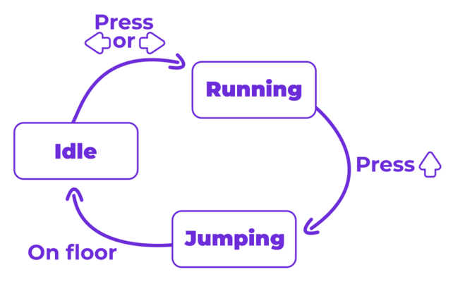
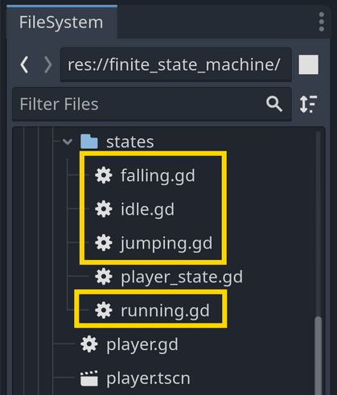
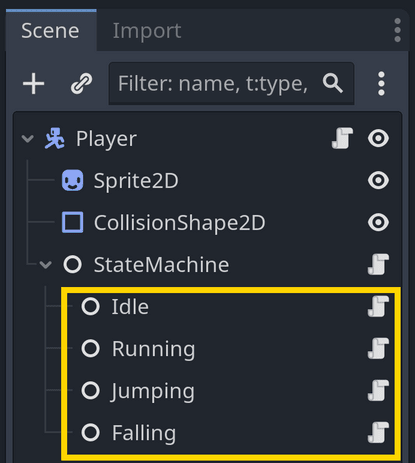

In this guide, you will learn how to create a Finite State Machine (FSM) in Godot 4. We'll talk about the problem this pattern tries to solve and see two ways to implement it: using a simple variable and functions, and using nodes for a visual representation.

You'll learn:

- What a Finite State Machine is and when to use it in games.
- What problem the pattern helps solve.
- How to implement a Finite State Machine in Godot with a simple variable, if statements, and functions.
- How to implement a more complex FSM with nodes.
- When to use either implementation.
- What are the benefits and drawbacks of using a state machine.

The code examples in this guide come from the open-source companion demo in our [Godot design pattern demos](https://github.com/GDQuest/godot-design-patterns).

## Finite State Machines in games

In short, a Finite State Machine is a way to organize your code by breaking it down into separate states. Each state has its own code and behavior, and the machine can only be in one state at a time.

For example, a character in a game can be in an idle state (standing still), a running state, or a jumping state. With a state machine, you can ensure that only one of these states is active at any given time, and only the code for that state is executed every frame.

There are four conditions for talking about a state machine:

1. There is a fixed set of states.
1. The machine can be in one state at a time.
1. The machine receives events like inputs or signals.
1. The states have transitions mapped to events. When a state receives a given event, it tells the machine to transition to the corresponding state.

We can naturally represent the behaviors of a game character with a little graph like this.



The bubbles represent states, and the arrows indicate transitions. Next to each arrow, we have a corresponding input that triggers the transition: it can be the player pressing a key or something happening in the game world, like the character colliding with the floor.

You use finite state machines to:

- Make it easier to add new states and behaviors to your game. For example, you can add a new state for a character to glide without changing the code for the other states.
- Control better the transitions between states, ensuring that the character doesn't play the wrong animation in a given state, for example.
- Split your code into separate states, making reading and isolating behaviors easier.

State machines constitute an alternative to other forms of composition such as stacks (for tracking navigation), or more powerful patterns like Goal Oriented Action Planning and behavior trees (for AIs).

The caveat of state machines is that their structure is inflexible: the entity can only be in one of the states you define at a time, and the transitions between states are often hard-coded. It works very well for simple pattern-based AIs and player characters. For example, the main character of the game Celeste uses a finite state machine.

You can introduce a state machine in your game when you have a character or another game entity that can be in different states, and you don't feel like you can manage all the behaviors with simple imperative code.

## The problem with boolean variables

Let's start with a simple example to illustrate the problem that the State pattern helps solve. Imagine that you have a character that needs to stand idle, run, and jump.


The character has a script with all the movement logic in its `_physics_process()` function. The code may look like this:

```gdscript
extends CharacterBody2D

var speed := 500.0
var jump_impulse := 1800.0
var base_gravity := 4000.0

@onready var animation_player := %AnimationPlayer


func _physics_process(delta: float) -> void:
	# Horizontal movement and gravity.
	var input_direction_x := Input.get_axis("move_left", "move_right")
	velocity.x = input_direction_x * speed
	velocity.y += base_gravity * delta

	# Jumping.
	var is_jumping := is_on_floor() and Input.is_action_just_pressed("move_up")
	if is_jumping:
		velocity.y = -jump_impulse

	# Animation.
	if not is_on_floor():
		if velocity.y < 0:
			animation_player.play("jump")
		else:
			animation_player.play("fall")
	elif input_direction_x != 0.0:
		animation_player.play("run")
	else:
		animation_player.play("idle")

	move_and_slide()
```

In its update loop, you write all the conditions for it to do all these actions, and it goes just fine. `CharacterBody2D` in Godot makes it especially easy to detect if the character is jumping thanks to the `is_on_floor()` function.

Simple enough! Now, what if you want the player to be able to glide when it's in the air? When gliding, the character falls slower and can't turn around instantly. Also, when gliding, the player can hop, canceling the glide and jumping lower than a regular jump.

A typical way to differentiate this new gliding behavior is to add a boolean variable to the script. You can then check this variable in `_physics_process()` to change the character's behavior.

This code shows the changes related to animation, which is a very easy way to demonstrate the problem.

```gdscript
# ...
# We introduce a new boolean variable to track if the character is gliding.
var is_gliding := false


func _physics_process(delta: float) -> void:
	# ...

	# Initiating and canceling gliding.
	if Input.is_action_just_pressed("glide") and not is_on_floor():
		is_gliding = true
	if is_gliding and (
		Input.is_action_just_pressed("move_up") or get_slide_count() > 0
	):
		is_gliding = false

	# ...

	# Animation.
	if not is_on_floor():
		if is_gliding:
			animation_player.play("glide")
		else:
			if velocity.y < 0:
				animation_player.play("jump")
			else:
				animation_player.play("fall")
	# ...
```

What do you notice? Two things are not great:

1. I have to add one boolean to track if the character is gliding. So, when I add a new mechanic, I likely need to add a new boolean variable to track it. If my character can glide, climb ladders, and shoot, I'll have to keep track of three new boolean variables? That's not great.
2. I had to edit the existing jump animation logic to add a new glide animation. So, to add a new mechanic, I have to change the code for the existing mechanics. That's not great either.

For a character that can move, jump and glide, here's an example of what your code would look like if you tried managing the character's behavior using boolean variables:

<details>
<summary>Examine gliding player code **without** a finite state machine</summary>

In this code example, we use one boolean variable per behavior the character can have. Notice how many booleans we have to change each time the character changes behavior.

It's necessary with this approach because a given behavior can be triggered by several others: you can fall from gliding, jumping, or when standing on a disappearing platform, for example.

Also, notice how we have to change to the same animation from multiple code blocks in the `_physics_process()` function.

```gdscript
extends CharacterBody2D

var is_idle = true
var is_running = false
var is_jumping = false
var is_falling = false
var is_gliding = false

# ...

func _physics_process(delta: float) -> void:
	var input_direction_x := Input.get_axis("move_left", "move_right")

	# Initiating a jump.
	if (is_idle or is_running or is_gliding) and Input.is_action_just_pressed("move_up"):
		animation_player.play("jump")
		var impulse := jump_impulse
		velocity.y = -jump_impulse
		if is_gliding:
			current_gravity = base_gravity

		is_idle = false
		is_running = false
		is_gliding = false
		is_jumping = true
	elif (is_jumping and velocity.y > 0.0) or ((is_idle or is_running) and not is_on_floor()):
		animation_player.play("fall")

		is_idle = false
		is_running = false
		is_jumping = false
		is_falling = true
	elif (is_jumping or is_falling) and Input.is_action_just_pressed("glide"):
		animation_player.play("glide")

		is_jumping = false
		is_falling = false
		is_gliding = true
		current_gravity = glide_gravity
		velocity.y = max(velocity.y, 0.0)
	elif is_gliding and Input.is_action_just_pressed("move_up"):
		animation_player.play("jump")

		is_jumping = true
		is_gliding = false
		velocity.y = -glide_jump_impulse
		current_gravity = base_gravity
	elif is_gliding and (get_slide_collision_count() > 0 or Input.is_action_just_pressed("glide")):
		animation_player.play("fall")

		is_falling = true
		is_gliding = false
		current_gravity = base_gravity
	elif is_on_floor():
		is_jumping = false
		is_falling = false
		is_gliding = false
		if input_direction_x != 0.0:
			is_running = true
			animation_player.play("run")
		else:
			is_idle = true
			velocity.x = 0.0
			animation_player.play("idle")
```

Of course, there are ways to simplify this code. You could use the currently playing animation to determine the character's state, for example. But that'd be using the animations as a finite state machine! So, that's an alternative to what we'll learn next.

</details>

If you try adding a dozen more mechanics like that, using only boolean variables to keep track of your character's current state, it soon becomes error-prone. You quickly end up with too many conditions to check to know what the character can or cannot do.

That's where finite state machines come in.

## Implementing a Finite State Machine with one variable

The first version of the finite state machine I want to show you is the simplest one, and it works in many cases. It consists of replacing all the boolean variables you might introduce with a single variable that keeps track of the character's current state.

The states themselves are members of an enum, so numbers under the hood.

```gdscript
extends CharacterBody2D

# This enum lists all the possible states the character can be in.
enum States {IDLE, RUNNING, JUMPING, FALLING, GLIDING}

# This variable keeps track of the character's current state.
var state: States = States.IDLE
```

That's it! Well, that's the first step. You can now use this variable to track the character's behavior: running, jumping, falling, etc. You can then use it in conditions to know what the character can or cannot do.

Here is an example of horizontal movement when gliding, running, or in the air.

```gdscript
func _physics_process(delta: float) -> void:
	# ...
	if state == States.GLIDING:
		velocity.x += input_direction_x * glide_acceleration * delta
		velocity.x = min(velocity.x, glide_max_speed)
	elif state in [States.RUNNING, States.JUMPING, States.FALLING]:
		velocity.x = input_direction_x * speed
	# ...
```

Notice how:

1. Instead of the boolean check before, you now check if the `state` variable is equal to a given state.
2. You can use the `in` keyword and an array to check if the state is in a list of states.

The conditions themselves are not very different from the boolean checks. The first benefit comes when switching states. You only have to worry about the `state` variable, which you can update in a series of `if` and `elif` blocks.

The following code groups all the logic for switching the current state in one place.

```gdscript
func _physics_process(delta: float) -> void:
	# ...
	var is_initiating_jump := is_on_floor() and Input.is_action_just_pressed("move_up")
	if is_initiating_jump:
		state = States.JUMPING
	elif state == States.JUMPING and velocity.y > 0.0:
		state = States.FALLING
	elif state in [States.JUMPING, States.FALLING] and Input.is_action_just_pressed("glide"):
		state = States.GLIDING
	# ...
```

These state changes are often called transitions. The code constrains which state the character can go to and from which other state. So, with this approach, you have a single variable to worry about and a single place to manage all the conditions for initiating a jump, opening the glider, attacking, and so on.

There's more! There is often code you only want to run once when leaving or entering a specific state. For example, when the player jumps, you want to change the velocity to make the character go up. When the player starts gliding, you want to change the gravity to make the character fall slower.

You can do that with a [setter function](https://school.gdquest.com/glossary/setter_getter) bound to the `state` variable.

The code below shows the `set_state()` function that changes gravity when starting and stopping gliding.

```gdscript
var state: States = States.ON_GROUND: set = set_state

# We have two different gravity values, one for the character on the ground and one for when gliding.
var base_gravity := 4000.0
var glide_gravity := 400.0
# This is the current gravity, which is applied to the character every frame.
var current_gravity := base_gravity

func _physics_process(delta: float) -> void:
	# ...
	velocity.y += current_gravity * delta
	# ...


func set_state(new_state: int) -> void:
	var previous_state := state
	state = new_state

	# You can check both the previous and the new state to determine what to do when the state changes. This checks the previous state.
	if previous_state == States.GLIDING:
		current_gravity = base_gravity

	# Here, I check the new state.
	if state == States.GLIDING:
		current_gravity = glide_gravity
```

The `set_state()` function is also a good place to change the character's animation. In many cases, animations correspond to the state the character switched to.

```gdscript
func set_state(new_state: int) -> void:
	# ...
	if state == States.IDLE:
		animation_player.play("idle")
	elif state == States.RUNNING:
		animation_player.play("run")
	elif state == States.JUMPING:
		animation_player.play("jump")
	# ...
```

Woohoo! You now have a simple finite state machine that you can use to manage your character's behavior. You can add new states and transitions easily and have a single place to manage all the conditions for changing states.

This is only one finite state machine implementation that gives a good idea of the basic principles behind the pattern. It's simple and works well whenever you only need to manage a few states and transitions. With some experience, you can manage complex entities with this approach.

---

**Ready to build a complete character?** In [module 13 of Pick up Gamedev From Zero](https://school.gdquest.com/courses/learn_2d_gamedev_godot_4/side_scroller_character/overview), you learn how to implement a polished side-scroller character using the enum-based finite state machine approach you just learned.



---

The main limitations of this implementation are:

1. It's not very visual.
2. You cannot easily make the code reusable. If you have states that you'd like multiple enemies to have access to, like patrol, follow, or flee, you'll have to copy-paste the code from one enemy to another.

The last issue can be addressed with relatively small changes, like turning some of the state code into a library of functions or [objects](https://school.gdquest.com/glossary/object) that can be reused across scenes and scripts.

Another common way to implement a finite state machine is to use separate classes for each state. This approach is called the "State pattern", a specific form of a state machine that aims to keep the code of different states completely independent.

In Godot, the most popular way to implement this pattern is using nodes, which allows you to visualize and debug states easily.

## Implementing a Finite State Machine with nodes

Let's learn to code a finite state machine using nodes. In this implementation, we create a script that extends `Node` for each state the character can be in and put all the code for that state in the script.

I used and taught this approach years ago when I first started making tutorials for Godot because I found it learning-friendly. The main advantages of using nodes are that:

- You can visualize the states in the editor without coding or using a plugin.
- Each state lives in a separate script, keeping the code compartmentalized and short for each state.
- You can use the node functions you're already used to when coding in Godot.
- You can put all the data and logic in individual state scripts, unlike in the previous example where all variables live in the same script. This is great if you like encapsulation.

The trade-offs are:

- Compared to the version without objects, you tend to end up with some duplicate code because each state now has its own logic.
- It takes more code than having it all in one script.
If you like encapsulation, your character data and logic can become fragmented. You'll find yourself moving variables around as you iterate over your characters and need data shared between states. It's a common problem with encapsulation.

These days, I tend to choose different implementations over the state pattern. Using nodes and separate scripts fragments the code too much for my taste, and you end up trading a bit of productivity for it. Whenever possible, I favor a simpler approach, like the one we saw before with the single variable.

Nevertheless, the node-based state machine remains one of the community's favorite implementations and has become pretty typical in Godot. The same basic principles apply to it as to all other possible implementations. Let's go over them!

In the State pattern, each state is one object. So, its code is not directly part of the character's physics process loop. You need a way to track the current state and manually call its update function on the engine's processing tick.

For that, we can use two base scripts:

1. **A State [class](https://school.gdquest.com/glossary/class_keyword).** It's a small [virtual base class](https://school.gdquest.com/glossary/virtual_class) that ensures every state has the same set of update functions available, giving all states a common interface.
2. **A state machine class.** It tracks the current state, changes the current state, and calls the state's update functions. This way, only the current state's code runs every frame.

These two classes allow you to create multiple state machines in your projects, each with its own set of states. You can also code individual states to be pluggable and reusable across different state machines.

Let's see how to do this with a simple example: a character that can stand idle, run, and jump. We'll start with the `State` class as the state machine depends on it.

### The state class

In this implementation, we will use nodes for the different states. We need to be careful because if we define the `_physics_process()` or `_process()` functions in the state script and put code in there, multiple states will process simultaneously. We want only one state's code to run at a time.

So, we define functions that will allow the state machine to control which state's code runs and when.

I went with five functions:

1. `enter()`: It's called when the state becomes active.
2. `exit()`: It's called when the state is about to change. The `enter()` and `exit()` functions correspond to the code we put in the `set_state()` function in the single variable implementation.
3. `handle_input()`: The state machine calls it when receiving input events, for example, through `_unhandled_input()`.
4. `update()`: The state machine calls it on the engine's main loop tick.
5. `physics_update()`: The state machine calls it on the engine's physics update tick.

Finally, the state emits a signal when it wants to transition to another state: `finished`. The state machine can connect to this signal and change the active state accordingly.

```gdscript
## Virtual base class for all states.
## Extend this class and override its methods to implement a state.
class_name State extends Node

## Emitted when the state finishes and wants to transition to another state.
signal finished(next_state_path: String, data: Dictionary)

## Called by the state machine when receiving unhandled input events.
func handle_input(_event: InputEvent) -> void:
	pass

## Called by the state machine on the engine's main loop tick.
func update(_delta: float) -> void:
	pass

## Called by the state machine on the engine's physics update tick.
func physics_update(_delta: float) -> void:
	pass

## Called by the state machine upon changing the active state. The `data` parameter
## is a dictionary with arbitrary data the state can use to initialize itself.
func enter(previous_state_path: String, data := {}) -> void:
	pass

## Called by the state machine before changing the active state. Use this function
## to clean up the state.
func exit() -> void:
	pass
```

### The finite state machine class

The finite state machine class uses the state. It keeps track of the active state (for example, "running") and calls the state's functions when needed. In the game, the state machine will be the parent node of all states.

First, I pick a starting state for the state machine. I use an immediately invoked function expression (IIFE) to use the first child node if no initial state is set. This way, you can optionally pick the initial state in the editor.

```gdscript
class_name StateMachine extends Node

## The initial state of the state machine. If not set, the first child node is used.
@export var initial_state: State = null

## The current state of the state machine.
@onready var state: State = (func get_initial_state() -> State:
	return initial_state if initial_state != null else get_child(0)
).call()
```

As mentioned, the states will be children of the state machine. We can use Godot's `find_children()` function to get all the states and connect to their `finished` signal to transition to the next state. I do that in the `_ready()` function. There, we also call the first state's `enter()` function to initialize it.

```gdscript
func _ready() -> void:
	# Give every state a reference to the state machine.
	for state_node: State in find_children("*", "State"):
		state_node.finished.connect(_transition_to_next_state)

	# State machines usually access data from the root node of the scene they're part of: the owner.
	# We wait for the owner to be ready to guarantee all the data and nodes the states may need are available.
	await owner.ready
	state.enter("")
```

Here's the `_transition_to_next_state()` function. It changes the active state when the state emits the signal. Because we use nodes for states, we can check if a state exists using `has_node()` before transitioning to it.

Then, in this function, we call the current state's `exit()` function, change the active state, and call the new state's `enter()` function. This allows the exiting state to run cleanup code and the entering state to initialize itself.

For example, in a gliding state, you will want to lower the character's gravity to make it fall slower. When transitioning from a gliding to a jumping state, you might want to:

- Reset gravity to the default value. This should be in the gliding state's `exit()` function so that gravity is reset whenever you leave the gliding state.
- Set the character's vertical velocity to the jump impulse. This should be in the jump state's `enter()` function.

```gdscript
func _transition_to_next_state(target_state_path: String, data: Dictionary = {}) -> void:
	if not has_node(target_state_path):
		printerr(owner.name + ": Trying to transition to state " + target_state_path + " but it does not exist.")
		return

	var previous_state_path := state.name
	state.exit()
	state = get_node(target_state_path)
	state.enter(previous_state_path, data)
```

The rest of the code calls the state's functions to update and process input.

```gdscript
func _unhandled_input(event: InputEvent) -> void:
	state.handle_input(event)


func _process(delta: float) -> void:
	state.update(delta)


func _physics_process(delta: float) -> void:
	state.physics_update(delta)
```

Here's the full code for the `StateMachine` class:

```gdscript
class_name StateMachine extends Node

@export var initial_state: State = null

@onready var state: State = (func get_initial_state() -> State:
	return initial_state if initial_state != null else get_child(0)
).call()


func _ready() -> void:
	for state_node: State in find_children("*", "State"):
		state_node.finished.connect(_transition_to_next_state)

	await owner.ready
	state.enter("")


func _unhandled_input(event: InputEvent) -> void:
	state.handle_input(event)


func _process(delta: float) -> void:
	state.update(delta)


func _physics_process(delta: float) -> void:
	state.physics_update(delta)


func _transition_to_next_state(target_state_path: String, data: Dictionary = {}) -> void:
	if not has_node(target_state_path):
		printerr(owner.name + ": Trying to transition to state " + target_state_path + " but it does not exist.")
		return

	var previous_state_path := state.name
	state.exit()
	state = get_node(target_state_path)
	state.enter(previous_state_path, data)
```

Now that we can create concrete states, let's see how to use the state machine in practice.

### The player scene

In this example, I have a player character that's a `CharacterBody2D` node. It has a minimal script with exported variables to control the character's speed, jump impulse, and gravity. In this script, you can expose all the properties and functions you want your states to access.

```gdscript
class_name Player extends CharacterBody2D

@export var speed := 500.0
@export var gravity := 4000.0
@export var jump_impulse := 1800.0
```

This node is the host of the state machine: The states are components that take control of a given node and access any other nodes they need through it.

There are two ways you can go about controlling the player from the state scripts:

1. Have all the character controller's properties stored on the root _Player_ node.
2. Have properties defined in the relevant state, like having `jump_impulse` on the jump state only.

I prefer using the first approach because it allows easy tweaking of the player variables.

In Godot, we can access the root node of the scene the state is part of using the `owner` property. Alternatively, you can define properties on individual states to control which nodes they affect and to change their settings. This way, you can reuse state scripts across different characters or entities. For a playable character in a single-player game, that's unnecessary, so I use the `owner` property below.

Let's go over the code of the player states to get a better idea of how it all ties together.

### Implementing the states

First, to get good autocompletion and type checks in the editor, I create a base class that extends `State` and stores a typed reference to the `owner` node. I also create constants to represent the different states the character can be in and help limit the risk of typos when transitioning between states.

```gdscript
class_name PlayerState extends State

const IDLE = "Idle"
const RUNNING = "Running"
const JUMPING = "Jumping"
const FALLING = "Falling"

var player: Player


func _ready() -> void:
	await owner.ready
	player = owner as Player
	assert(player != null, "The PlayerState state type must be used only in the player scene. It needs the owner to be a Player node.")
```

Then, I create scripts that extend `PlayerState` for the idle, running, jumping, and falling states.



In the player scene, I instantiate the state machine and add the states as children of the state machine node.



Here's the code for the idle state. Upon entering the state, I set the player's horizontal velocity to zero. In this example, we assume that nothing can push the player when idle, so it should not move horizontally.

In the `physics_update()` function, I apply gravity to make the character fall when the floor disappears from under them and check for input to transition to the running or jumping state.

```gdscript
extends PlayerState

func enter(previous_state_path: String, data := {}) -> void:
	player.velocity.x = 0.0
	player.animation_player.play("idle")

func physics_update(_delta: float) -> void:
	player.velocity.y += player.gravity * _delta
	player.move_and_slide()

	if not player.is_on_floor():
		finished.emit(FALLING)
	elif Input.is_action_just_pressed("move_up"):
		finished.emit(JUMPING)
	elif Input.is_action_pressed("move_left") or Input.is_action_pressed("move_right"):
		finished.emit(RUNNING)
```

The running state is similar but has extra logic to move the player horizontally. Actually, all of these simple states follow a similar pattern: they change the animation on enter, have some movement logic in `physics_update()`, and check for input to transition to another state.

```gdscript
extends PlayerState

func enter(previous_state_path: String, data := {}) -> void:
	player.animation_player.play("run")

func physics_update(delta: float) -> void:
	var input_direction_x := Input.get_axis("move_left", "move_right")
	player.velocity.x = player.speed * input_direction_x
	player.velocity.y += player.gravity * delta
	player.move_and_slide()

	if not player.is_on_floor():
		finished.emit(FALLING)
	elif Input.is_action_just_pressed("move_up"):
		finished.emit(JUMPING)
	elif is_equal_approx(input_direction_x, 0.0):
		finished.emit(IDLE)
```

The jumping state changes the player's vertical velocity on entry to make them jump. It applies gravity each frame to make the player fall back down. The state checks if the player is on the floor to transition to the idle state and if the player is falling to transition to the falling state.

```gdscript
extends PlayerState

func enter(previous_state_path: String, data := {}) -> void:
	player.velocity.y = -player.jump_impulse
	player.animation_player.play("jump")

func physics_update(delta: float) -> void:
	var input_direction_x := Input.get_axis("move_left", "move_right")
	player.velocity.x = player.speed * input_direction_x
	player.velocity.y += player.gravity * delta
	player.move_and_slide()

	if player.velocity.y >= 0:
		finished.emit(FALLING)
```

Finally, here's the falling state. It's similar to running and gives the player control over the character while falling. The main difference is that the player can't jump while falling.

```gdscript
extends PlayerState

func enter(previous_state_path: String, data := {}) -> void:
	player.animation_player.play("fall")

func physics_update(delta: float) -> void:
	var input_direction_x := Input.get_axis("move_left", "move_right")
	player.velocity.x = player.speed * input_direction_x
	player.velocity.y += player.gravity * delta
	player.move_and_slide()

	if player.is_on_floor():
		if is_equal_approx(input_direction_x, 0.0):
			finished.emit(IDLE)
		else:
			finished.emit(RUNNING)
```

Compared to the single variable implementation, this approach adds more total code and multiple files to browse to update the character. On the other hand, it keeps the code of individual states short and compartmentalized.

The idea behind the State pattern is just that: to keep the code for each state separate, typically using objects. This way, you can add new states and behaviors to your character without changing the other states' logic; you just have to add new transitions.

There are many alternative implementations for this pattern. Once you have the basic idea, it does not really matter if the objects representing the states are nodes, inner classes, or scripts that extend `RefCounted` and that you load and instantiate in your character class.

---

**Want to see advanced state machines in action?** In [module 4 of Pick Up 3D Gamedev with Godot 4](https://school.gdquest.com/courses/learn_3d_gamedev_godot_4/patrol_alert_attack/module_overview), you learn how to implement complex AI finite state machines with reusable states for enemy behaviors like looking at the player, charging at them, or doing an AoE attack when in range.



---

If you don't particularly want to see states as nodes in the scene, I suggest trying inner classes to keep all the code in one file. It allows quick navigation, a quick overview of all your character's code structure with folding.

## When to use either implementation

We just saw two implementations of a state machine. But how do you pick which to use?

There are two cases in which I would recommend using the State pattern over a simpler script with a `state` variable:

1. If you have a really complex character with pretty long state code, like the player controller of a commercial platformer or Metroidvania game, the separation can make the cognitive load of the code a bit easier to manage as you will spend months, if not years, refining it. Having separate classes for the states can make the growing code easier to navigate.
2. If you need to make states that can be reused across different characters or entities. If all your character logic is imperative and contained in one script, you cannot reuse the code elsewhere. However, reusability can also come from simpler approaches like writing a function library.

In either case, I would only introduce the State pattern once it becomes necessary for the project. I typically prototype with the simplest code possible first, and once I have a good idea of how the character should behave and feel, I [refactor](https://school.gdquest.com/glossary/refactor) it. It is much faster to iterate over a simple script than a state machine with separate classes.

Even if you end up refactoring the code later, starting with the simplest code possible is often a good idea as you're likely to throw it away or need to rewrite it anyway.

## Benefits and drawbacks of using a state machine

At the beginning of the guide, we examined the problem that state machines help us solve: They allow us to add new mechanics and behaviors to an entity without changing the existing code. That's their main advantage.

Another advantage is that, because you can organize your code, it's easier to find the logic for a specific behavior and to isolate bugs when the entity has a lot of code. You can also use different implementations of state machines to make behaviors reusable throughout your game.

The main drawbacks are:

1. They can be overkill for simple entities. You don't need a state machine if you have a character that can only run and jump. Just write the code!
2. State machines can make the code a bit longer and slower to read overall, depending on how you implement them. You need to read all the code of an entity to understand what it does exactly. The more boilerplate and splitting you have, the more time it takes to read and navigate the code.
3. You may end up duplicating code. Each state has its own logic and you may end up with similar code in multiple states. You can address this problem by moving shared code to a library of functions or objects you can reuse across states.
4. State machines tend to have a rigid structure and don't scale well to behaviors with complex interactions. We've seen how you need to code the transitions between states manually. If you have dozens of states that can transition to each other in all sorts of ways, it can become difficult to manage.

You can address the last problem by splitting complex state machines into multiple state machines running in parallel or by extending the State pattern with more features. For example, you can give states a hierarchy so that a state can have child states that can only execute in sequence (for attack combos, for example).

## Conclusion

Simple state machines and the State pattern are useful tools for game characters, mobs, or any entity following movement and attack patterns.

In this guide, you learned how to implement a state machine in two ways in Godot: with a single variable and functions and with nodes. You've also seen the State pattern's benefits and drawbacks and when to use it.

You can find the companion demo for this guide in the [Godot design pattern demos repository](https://github.com/gdquest-demos/godot-design-patterns).

## Your questions

<details>
<summary>How would I connect to signals in different states?</summary>

What if the state needs to listen to signals like a timer timing out or a hurtbox detecting a hit? You can connect to signals in the state's `enter()` function and disconnect in the `exit()` function. This way, you ensure that the state listens to signals only when it's active.

```gdscript
func enter(previous_state_path: String, data := {}) -> void:
	player.cooldown_timer.timeout.connect(_on_cooldown_timeout)

func exit() -> void:
	player.cooldown_timer.timeout.disconnect(_on_cooldown_timeout)

func _on_cooldown_timeout() -> void:
	finished.emit(IDLE)
```
</details>

<details>
<summary>Should I use a state machine plugin?</summary>
Plugins are good for visualization, but they have a major caveat for me: To make an all-purpose state machine plugin, you tend to rely on strings, signals, and dynamic typing. So, you introduce code and data that will not give you good auto-completion or error reporting during development.

Plus, as you can see, implementing a state machine can take as little as a couple dozen lines of code, and you can add features to it as needed.

With a little bit of experience, this isn't much work, and you can tailor the pattern to your needs and preferences.

I recommend using a state machine plugin mostly if you have teammates who need a user interface to set up and wire a state machine but are uncomfortable with code.

Other patterns, like behavior trees, can make more sense to use as a library or plugin because they involve much more code and can benefit from being written in a language like C++ for performance, (eg: bitbrain's [beehave](https://github.com/bitbrain/beehave) plugin). However, state machines are a simple structure.
</details>
