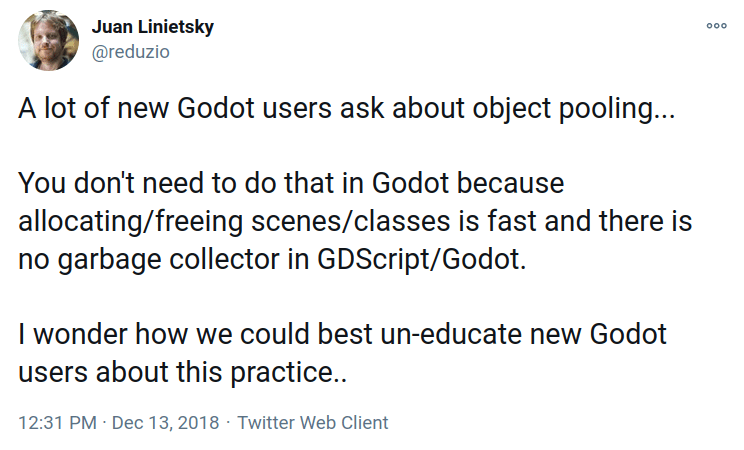

Welcome to our series on programming patterns in Godot and GDScript.

Here, we'll talk about the specifics of implementing patterns in Godot.

What are programming patterns, also commonly called design patterns?

They are common solutions to problems that pop up frequently in our job.

Rather than specific implementations, they're techniques, ideas, or general templates that you can apply in different situations to improve your code's flexibility or performance.

Many built-in engine features in Godot make it so you do not need to implement many common patterns. For example, signals are the engine's version of the [Observer pattern](https://refactoring.guru/design-patterns/observer), and nodes and their tree-like relationships allow you to favor [composition](https://refactoring.guru/design-patterns/composite) over inheritance. Likewise, [singletons](https://refactoring.guru/design-patterns/singleton) are available in the form of auto-loaded nodes.

In practice, we often use design patterns to work around the limitations of a given language or technology.

This is a point I would like to stress: you don't need the same patterns depending on the language you are working with.

In languages with first-class functions like Python and JavaScript, you don't need to code classes to implement the _Command_ pattern.

This pattern mainly allows you to turn a function call into an object and pass it around. When the language allows you to pass functions around by reference, you might as well do that.

## To use or not to use patterns

Even when it comes to patterns that are useful in Godot, you do not want to use them all the time.

Patterns come at a cost: they give you more flexibility or performance at the cost of complexity and extra maintenance work. They tend to add extra code and abstractions to your projects.

For example, I keep seeing that when someone learns about state machines, they start using them everywhere: for characters, chests, menus, and more.

Using a state machine involves coding classes to represent an object's different states. For a chest that only has an open and closed state, a boolean value is enough. For a menu where you can navigate into sub-menus, you can use an array to track navigation history.

In those two cases, using a state machine is more complicated than using a different solution. That's what I mean by "you do not want to use patterns all the time."

This is why you will see experienced game developers tell you that you should not overthink and always go with the simplest code possible.

That doesn't mean that you should use hacks everywhere because it'll cost you in the long run, but you don't want to write more code than you need to solve a given problem.

So when you are thinking of using a pattern, ask yourself whether you couldn't just write a function and if you really will benefit from the added flexibility.

In the case of a state machine, it's not worth coding unless you know that you will:

1. Have more than three or four different states for a given object.
1. Need to update, add, or remove behaviors many times as you create the game.

This second point is typically the case for a character or symbol pattern-based monster in a game where you have to go back and modify them for gameplay reasons.

We'll talk more about this when covering each pattern.

## Exploring the patterns

You may notice you already use some patterns but didn't have a name for them. Design patterns are literally techniques that we often apply in programming and that we name.

Putting a name on them and individually exploring them is useful for learning and communication with fellow professional developers. It is jargon, and as with any jargon, the purpose is to allow precise and fast communication for people working in a given field.

But when coding, you don't have to think about patterns. Once you learned them, they become another tool in your tool belt that you can use whenever they solve the problem at hand efficiently.

When I use the techniques you'll learn in the following guides, I think in terms of basic programming concepts like "Oh, we should probably encapsulate this" or "This script will likely change in the future; we need to keep it decoupled."

Depending on the kinds of projects you create and your programming style, you will like or get to use some patterns a lot and others not so much.

## The patterns you don't need

As mentioned in the introduction, Godot has some built-in tools that make it so you never need to implement some well-known programming patterns.

For example, the prototype pattern, that allows you to produce clones of an object, comes for free with nodes and scenes. You can code a spawner node that will create anything from bullets to monsters, coins, and more.

As I already mentioned, the observer pattern and singletons are also built-in. We can add [flyweight](https://gameprogrammingpatterns.com/flyweight.html) to the list, that is available in the form of resources in Godot.

### Performance-related patterns

Multiple optimization patterns are related to a game engine's internals so you will most likely never need to care about them. These include [data locality](https://gameprogrammingpatterns.com/data-locality.html) and [spacial partitioning](https://gameprogrammingpatterns.com/spatial-partition.html), that the engine uses in its back-end.

Godot already takes care of many optimizations for you, and things you can do to improve rendering performance in your game may not involve design patterns.

For example, you can use the `VisibilityNotifier` and `VisibilityEnabler` nodes to turn off processing for entities that leave the screen automatically. We have a short tutorial on that in the Mini Tuts chapter.

If you're interested in performance, check out the [docs on performance optimization](https://docs.godotengine.org/en/stable/tutorials/optimization/index.html). They were written by core developers working on rendering and performance in the engine.

### Object pooling

Another optimization pattern people always ask about, but you don't really need in GDScript is object pooling.



[Tweet](https://twitter.com/reduzio/status/1073284242086551552) by the engine's lead developer, Juan Linietski.

The main point of pooling is to pre-instantiate an object multiple times, store all instances in an array, and continuously reuse those instances instead of instantiating and destroying objects on the fly.

The most important case in which you need to do that is if you're using a garbage-collected language like C#.

For example, imagine that you have a machine-gun that spawns 20 bullets per second. As soon they leave the screen or hit something, you call `queue_free()` on them. So you are always creating new objects and destroying them, allocating memory and freeing it.

In garbage-collected languages like C#, you did not free the memory. At times you don't fully control, the language runs a performance-intensive algorithm that can take several frames, freezing the game in the meantime.

The solution to avoid that is to pre-create an array with many bullet objects and reuse them instead of continually destroying them, so they never trigger the garbage collector.

GDScript is not a garbage collected language so it does not have this problem. Nodes and resources are reference-counted, and when there is no reference to them, they get freed instantly.

Another, less common use case would be games like a bullet hell, where you need to instantiate hundreds of bullets at a time. In that case, you may want to pre-instantiate them at the start of a level to ensure gameplay is buttery smooth, even on slower devices.

An object pool may look like so in GDScript:

```gdscript
## Pool of reusable bullets
class_name BulletPool

## Number of bullets to pre-instantiate
const POOL_SIZE := 50
const BulletScene := preload("res://path/to/Bullet.tscn")

var bullets := []
var _last_index := -1


func _ready() -> void:
    # Here, we pre-instantiate `POOL_SIZE` bullets and store them in the `bullets` array.
    for i in POOL_SIZE:
        bullets.append(BulletScene.instance())


func get_bullet() -> Bullet:
    # Cycle the index between `0` (included) and `POOL_SIZE` (excluded).
    _last_index = wrapi(_last_index + 1, 0, POOL_SIZE)
    return bullets[_last_index]
```

The pool object pre-instantiates bullets and stores a reference to them so they're never freed. Every time you need a bullet, you call its `get_bullet()` method, which returns the next instance.

Notice how the code's always cycling over the bullets. When using a pool, you must ensure the array is big enough for entities to have the time to disappear in-game before you reuse them.

Using a pool also complexifies your code a bit: as you're reusing instances, you must reset their state between uses.

### Entity-Component Systems for performance

Allow me to talk specifically about the Entity-Component System (ECS) because it's misunderstood by many users, especially as it's the backbone of some general game frameworks and engines like Unity.

The ECS is an architectural pattern you generally use at the base of a game engine. It consists of composing entities, like a character, out of many components, each providing a specific feature. For instance, a collision component that handles collisions, an audio component for audio, and so on.

This can have two advantages:

1. Favoring composition over inheritance, giving you a lot of flexibility in the way you design entities.
2. Under the hood, related components are generally grouped in memory and arranged in a CPU-friendly way, offering great performance.

Performance-wise, this architecture allows you to maximize performance when you don't know how people will use a game engine in advance (which is the case for general engines like Unity or Godot).

It's powerful to process tens of thousands of objects every frame, as in triple-A titles.

Unless you're writing a triple-A title, a simulation game, or a real-time strategy game where you have tons of tiny units on screen, it's unlikely that you will _need_ something like that.

Even if you have dozens of AI agents animating on-screen and each of them uses a behavior tree, you don't need an ECS to make your game run smoothly.

Also, it does not affect rendering performance. So if your game's bottleneck is the number of polygons, textures, and shaders you use, an ECS won't benefit you. On mobile and low-end devices, rendering is generally the bottleneck.

The other benefit is flexibility.

The thing is, using an ECS in Godot means replacing its powerful node system with a different architecture.

Godot's nodes already allow you to favor composition over inheritance, and you can think of them as components in a scene.

To replace that with an ECS, you have to give up Godot's great node system and create a parallel one.

That's why we don't teach it or recommend it _when working with Godot_.

In our [simulation game demo](https://github.com/GDQuest/godot-2d-builder), you'll find a system that manages power sources and transferring electricity to machines.

It uses the concept of entities and components and will give you a sense of the pattern.

However, it's a particular use case to work around the absence of some language features in GDScript (for example, interfaces), and it doesn't fully implement the architecture.

We wrote a guide dedicated to it: [Entity-Component System in GDScript](/tutorial/godot/design-patterns/entity-component-system/).

_For an ECS to give any performance benefits, you need to write it in a compiled language like C or C++. Some users worked on experiments like these, particularly Andrea Catalina, a core contributor who worked on Godot's physics. It's a module you can compile the engine with._

_If you are interested, you can [check out his work](https://github.com/AndreaCatania/godex)._
