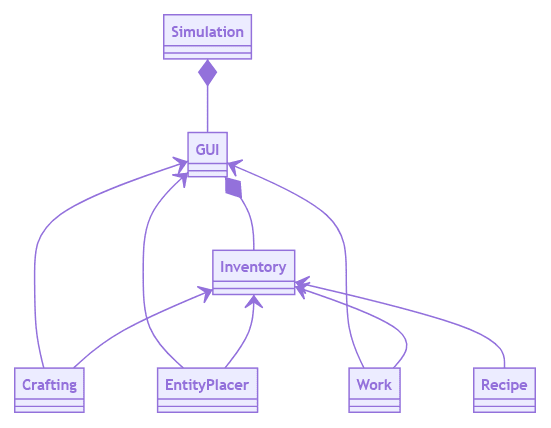
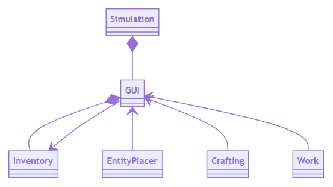
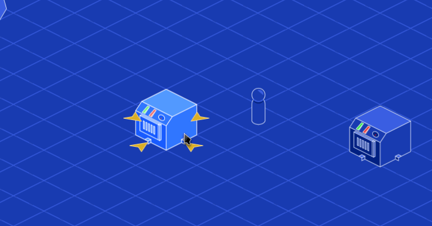
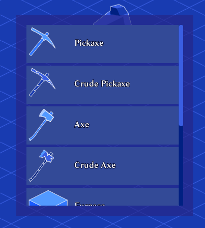

_Use an object as a funnel between two systems. The mediator acts as a boundary. It encapsulates the implementation details of the systems that communicate through it._

## The problem

You need to have your entity placement system, crafting system, work system, and recipe system interact with the player's inventory, which lives in the user interface.


When the game runs, you need to make sure everyone has a way to check the inventory slots' items. You create an array referencing all the inventory slots and hand it off to everyone. Every system can now make free edits to every property of the inventory slots, which is bug-prone.

The four systems have to loop over the slots to find items they need, modify those, and more.

Maybe you will be careful, but if you work in a team, will your teammates do the same? Maybe they'll assume that if they have access to the inventory like that, it's safe to modify.

This is especially dangerous when the targeted system is prone to change a lot, like the UI.

In Godot, we change our scene trees all the time as we refine and refactor scenes, rename and add nodes or reorder them. If you use functions like `get_node()` to explore the inventory, your code can easily fail and require repair when refactoring it.

The systems may need to access different nodes in that way. For example, on top of getting items they need, you may want to display special information in the interface, in which case they need to communicate with other UI nodes.

This creates more dependencies, and your code structure can start to look like a plate of spaghetti.



In the diagram above, three of our four systems are coupled to both the `GUI` and `Inventory`.

## The solution

Instead, as we did in the simulation game series, we can have an object act as a gateway to the inventory and force other systems to communicate through it. There is one entryway, and you choose which functions and signals it forwards down to the inventory.

This gateway is in a position of authority over its system, and if it's a node, it encapsulates its scene tree. By doing so, you can lower the number of dependencies and coupling in your codebase, as illustrated below.



In this picture, our gateway to the `Inventory` is the `GUI` node.

It is a Mediator. It keeps the `EntityPlacer`, `Crafting`, and `Work` decoupled from the `Inventory`. With this setup, they can't call functions directly on the inventory.

It keeps the references traveling through a single, safe and known point.

## Example

In our [simulation game](https://github.com/GDQuest/godot-2d-builder) demo and course, systems need access to the player's inventory, which we store inside of the user interface. 

For example, the `EntityPlacer`, which places machines on the world's grid, needs to check what is inside the mouse's inventory to display a preview of what the player is trying to build, like the bright blue furnace below.



The crafting system needs to know about the contents of the user's inventory to display what they can craft at the time.



Instead of providing the inventory's bits and pieces to everyone, we force those systems to do so through the UI. The UI maintains a list of references to everything we may need and provides helper functions to do some important work.

At no point is the `EntityPlacer` aware that the mouse's inventory is stored as a child of the `GUI` node. It won't ever save a reference to it.

Instead, it checks the `GUI` for the currently "held item", which transparently gets the mouse's held item through a getter function. The crafting system asks the `GUI` to list inventory items that match what it's looking for.

## Creating a Mediator in Godot

Godot's node system is useful to implement the pattern. We can use the root node of a scene as a gateway to the scene's internals.

We give this root node a script with functions that delegate work to its children and signals that we bubble up from its children.

### Forwarding getters

Here's an example of how we use getter and setter functions to have a property affect a "hidden" child node.

In the example below, the `blueprint` variable is always `null`, but the getter and setter affect `DragPreview`'s `blueprint` variable instead.

In our game demo, `DragPreview` represents the item's preview that follows the mouse when you selected an item.

```gdscript
class_name GUI
extends CenterContainer

var blueprint: BlueprintEntity setget _set_blueprint, _get_blueprint

onready var _drag_preview := $DragPreview


func _set_blueprint(value: BlueprintEntity) -> void:
	if not is_inside_tree():
		yield(self, "ready")
	_drag_preview.blueprint = value


func _get_blueprint() -> BlueprintEntity:
	return _drag_preview.blueprint
```

We make all the references and setter and getters on the mediator pseudo-private to indicate they're not supposed to be accessed from outside this script.

### Bubbling up signals

You'll need the mediator to connect to its children's signals and "bubble" them up, that is to say, have the mediator re-emit its children's signals.

In the example below, we re-emit the `inventory_changed` signal that the children of `Inventories` emit. Nodes who care can connect to that one signal instead of needing references to three or more inventory rows.

```gdscript
signal inventory_changed(panel, held_item)

onready var inventory_path := $WindowBack/Window/Inventories
onready var inventories := inventory_path.get_children()


func _ready() -> void:
    for inventory in inventories:
        inventory.connect("inventory_changed", self, "_on_InventoryBar_inventory_changed")


func _on_InventoryBar_inventory_changed(panel, held_item) -> void:
	emit_signal("inventory_changed", panel, held_item)
```

### Helper functions

When you have complex work to do, the mediator can delegate or forward a function call to one or more of its children. Without this mediator, we may have had to forward all of those nodes to other systems, leading to a complex reference chain.

In the example below, calling `GUI`'s `add_to_inventory()` function will automatically take care of working with the quick-bar and the player's inventory with a single function call without anyone being aware there are separate quick-bar and inventory nodes.

```gdscript
onready var player_inventory := $HBoxContainer/InventoryWindow
onready var quickbar := $MarginContainer/MarginContainer/Quickbar


func add_to_inventory(item: BlueprintEntity) -> bool:
	#...

	# The `add_to_first_available_inventory()` methods below return `true` if the item was
	# successfully added to the inventory bar.
	# If a bar is full, it can't receive the item, and so the functions will fail and return
	# `false` instead.
	if quickbar.add_to_first_available_inventory(item):
		return true

	return player_inventory.add_to_first_available_inventory(item)
```

## Advantages and drawbacks

Working with a mediator that does the hard work of maintaining and forwarding function calls to its children is a safe way to organize your code. It gives you a strong constraint when organizing your code, preventing you from coupling too many nodes with one another. It also keeps the reference chain going in a single direction when seen from outside.

When you change the system behind the mediator, you only need to update the mediator's code. You should never need to fix all the other systems as the mediator maintains the references.

On the flip side, while the mediator makes interactions between many systems easier and safer, it does hide the systems' implementation details. It becomes hard to know which source node is emitting what signal or where function calls are actually going besides the mediator.

If you need new functionality, you also need to extend the mediator to mirror additions to its children, as no one else knows about the new function or node behind it. Sometimes, it's easier to reference the final node directly.

As with any pattern, it's a tool, and it has its place to specific problems.

We generally find it useful for interactions between the game world and the user interface in Godot, as it prevents coupling between those two areas of your game.

It's one solution to the encapsulation of any scene in Godot, whether it's a spaceship, a character, a building, you name it. 

For instance, in a spaceship's case, a crew member may need to repair its weapon. Say that the character is a node separate from the ship and that the weapons are encapsulated inside the ship's scene.

You could use the ship node as a mediator between the crew member and the weapon, allowing the character to repair the damaged machine.
