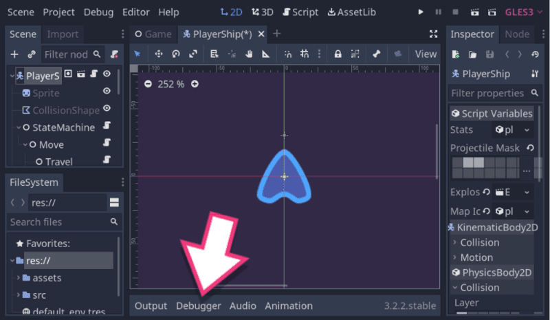
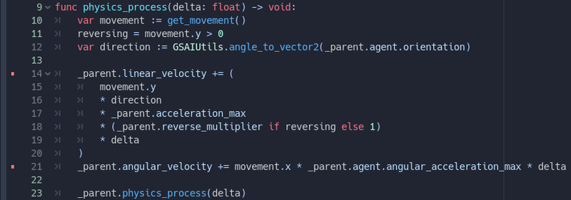
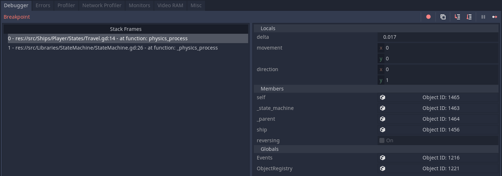
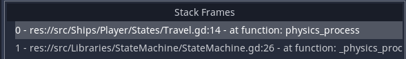
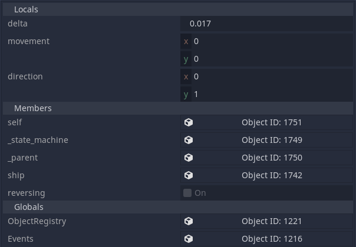
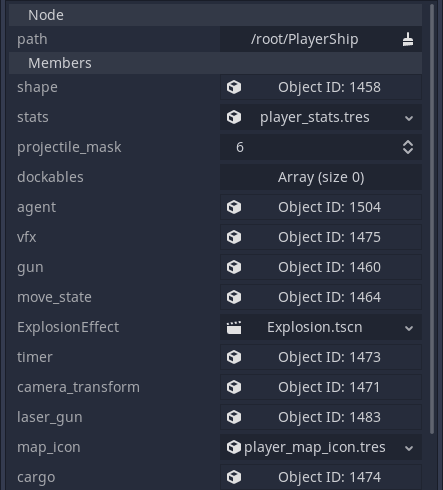
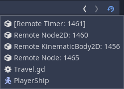
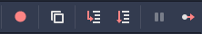

Is your code full of `print()` calls like this?

```gdscript
func get_file_data(filepath):
	var file = File.new()
	var error = file.open(filepath, File.READ)

	print(error) # 1...
	var line_length = file.get_32()
	print(line_length) # 2...
	# ...
```

Wouldn't it be great if you could pause your game anytime and inspect your values in context?

In this guide, you'll learn how, using Godot's debugger.

## Accessing the debugger

You can open the debugger in two ways:

1. By inserting breakpoints in your code in the script editor.
1. By clicking on _Debugger_ in the bottom panel.



## Breakpoints

A breakpoint tells the client running the code to ask the debugger to pause the program's execution and report to the programmer. In Godot, when you test your game, and the compiler reaches a breakpoint, the game pauses. At this point, the debugger panel displays some information. It tells you on which line the breakpoint happened, shows you a stack trace, and fills with information about the game's current state.

To set breakpoints, open the script you want to debug, navigate to the line you want to break at, click in the left margin. You can press the <kbd>F9</kbd> shortcut key instead. A red square represents the breakpoint. Click or press <kbd>F9</kbd> again to remove it.



With breakpoints set, once you run your game, it executes until it reaches the line of code. The execution stops right _before_ the line with the breakpoint. The script editor highlights the line and displays a little green arrow above the red square.


If you hover any variable you set before the breakpoint, a popup shows you its current value.



You can hover over a variable that you have _not_ set yet. In that case, the editor displays whatever the debugger was looking at in the memory, which does not correspond to anything in your game.


The ability to hover variables close to the breakpoint is nice, but you can get much more information from the _Debugger_ panel.

## The Debugger tab

In the top left of the _Debugger_ tab, Godot lists why the program paused. If your code runs into an error, it shows the error text instead. For example, `Division by Zero in operator '/'.` When reaching a breakpoint or manually pausing execution, it displays `Breakpoint` instead.



Below the red text, you can find the _Stack Frames_, also named the call stack. When the program pauses, it lists the lines of code that led to the current function. The function in which it paused is at the top. Its callers follow, stacking on top of each other, hence the name.

The compiler traces back to the initial caller and stops when it can't dig any further. In Godot's case, this happens when the C++ engine called the function. In the screenshot below, it's the built-in `_physics_process`.



If you click on any element in the list, you can see the execution state of each of those function calls. It is useful when you want to know why you got certain parameters or which conditional block or `for` loop called the function.

In the bottom right, you can find the list of all variables the debugger can see in the current call stack frame and their values. Clicking on a different line in the _Stack Frames_ switches those variables to the corresponding stack frame.



The variables area is split into three categories: locals, members, and globals.

- Locals are the variables defined in the current function.
- Members are variables that are part of the current class or classes it extends.
- Globals are variables accessible through Autolads, nodes that are accessible globally in the project.

Godot does _not_ put variables from its built-in classes, like `Node` or `Object`, in this panel, so it doesn't become crowded. But you _can_ view those variables using the inspector.

Godot lists complex objects, like references to other Nodes, in the variables panel as buttons with the name `Object ID: ####`. The ID is an internal number the engine assigns objects to keep track of them.

When you click on a value, its complete state displays in the _Inspector_, even properties from built-in types like `Node`. Every class has a member variable called `self` to refer to the current class. If you want to see the position of a class that extends Node2D, you can use the `self` button in the Members category to put it in the inspector.



You can click on more `Object ID` reference buttons in the inspector and keep drilling deeper into the game's memory until you find what you need.

It's not debugger specific, but the inspector's navigation buttons in the top-right also work when debugging.



## Navigating through live code with the toolbar

The final element of the debugger panel is its toolbar in the top-right. These buttons control the program's execution, allowing you to continue the execution or step over the code line-by-line.



The leftmost button is _Skip Breakpoints_. It makes the debugger ignore breakpoints temporarily without removing them from your code. The button next to it allows you to copy errors. If you get an exception, you clicking this button allows you to copy a lot of information, including the code backtrace in text format. You can use it when reporting a bug on an open-source Godot project.

The next group of buttons are for code navigation. You have the Step Into and the Step Over buttons. Take the following code as a example, with a breakpoint set at the `var movement := get_movement()` line:

```gdscript
func _physics_process(delta: float) -> void:
	var movement := get_movement() #--Breakpoint here
	move_and_slide(movement * speed, Vector2.UP)


func get_movement() -> Vector2:
	return Vector2(
		Input.get_action_strength("right") - Input.get_action_strength("left"),
		Input.get_action_strength("thrust_back") - Input.get_action_strength("thrust_forwards")
	)
```

If you click the _Step Into_ button, or press the shortcut key <kbd>F11</kbd>, the compiler will step into the `get_movement()` function and pause on its first line.

If you click the _Step Over_ button, or press the shortcut key <kbd>F10</kbd>, the compiler executes the `get_movement()` function and pauses on the next line after its end. In this case, it is the call to `move_and_slide()`.

Next to those is the Break button. It's greyed out when you are actively debugging, but if the game is running without breakpoints and you want to stop execution, you can click this button anytime. It does the same thing as the _Pause Scene_ button in the top right (shortcut key <kbd>F7</kbd>). There will not be any stack frame or variable data if you do so since this button triggers a pause inside C++ code. But you can still use it to look at the state of the game or inspect the remote scene tree..

The last button on the right is the Continue button. Clicking it or pressing <kbd>F12</kbd> resumes the game's execution until the next breakpoint.

## The remote scene tree

When the game is running, a tab named _Remote_ appears above the scene tree. It displays a snapshot of the node tree at runtime, as seen from the engine. It starts from the root viewport and contains every instanced node.

You can select any node and see its state in the _Inspector_, just like in the debugger's variables area.



Godot's debugger works with a server and a client, with the editor running a server and the game acting as a client. They communicate through a virtual network through notifications. You can replace the editor with your own server or an external editor, like Visual Studio Code.

The [VSCode plugin for Godot](https://github.com/godotengine/godot-vscode-plugin) offers debugger support for GDScript.


And that's it. You now know more than enough to get started debugging your projects. You don't have any excuse to litter your code with `print()` statements anymore!

If you'd like to support our work, we are on Kickstarter to crowdfund [Godot 2D Secrets](https://www.kickstarter.com/projects/gdquest/godot-2d-secrets-level-up-your-game-creation-skills), a comprehensive course to help you level up your game creation skills. All the details are on the Kickstarter campaign page.
