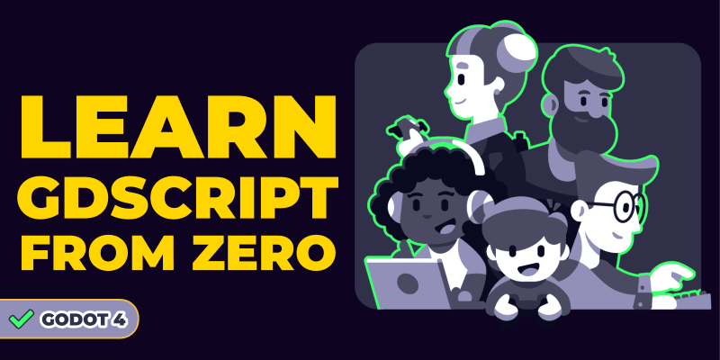
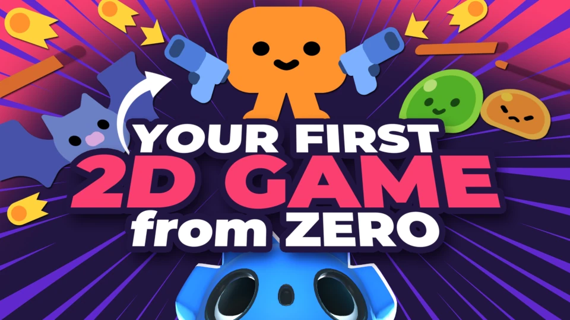

---
aliases:
- /open-source/guides/learn-godot/beginner/
- /tutorial/godot/learning-paths/beginner/
- /tutorial/redirect/guide/beginner/
- /docs/guides/learn-godot/beginner/
author: razvan
date: "2019-11-06T13:12:32+02:00"
description: This learning path and free guide is a curated list of free resources
  to get started with game development using the Free and Open Source engine Godot
difficulty: beginner
featured: true
menuTitle: Beginner edition
resources:
- name: banner
  src: banner.jpg
title: 'Make Games with Godot: Beginner Edition'
weight: 1
---

Do you want to learn to make games, but you don't know where to start?

There are loads of free Godot tutorials and other courses out there. There's an _overwhelming_ amount of them, really.

**Getting started, it's crucial to learn from the right persons, especially if you're new to programming.**

That's why we created this free curated learning path.

We made, collected, and reviewed dozens of **free resources** to help you learn to make your first video games with the free and open-source game engine [Godot](//godotengine.org/).

This learning path will take you from zero to completing your first games.

In this guide, you'll get free resources to learn:

- What the open-source Godot game engine is
- How to get into game development
- How to get started making games
- How to create your first games with Godot

_This guide is for people who are new to game development. If you are an experienced developer, check out our [developer's learning path](/tutorial/godot/learning-paths/developer/) instead._

## Getting into the right mindset

Learning to make games is a journey.

> The journey of a thousand miles begins with one step.
>
> Lao Tzu

Your first creation may not be your dream game, but you're going to learn and grow a lot taking your first steps.

You're going to discover a world full of wonders where the further you go, the more creative the process becomes.

> It is good to have an end to journey toward; but it is the journey that matters, in the end.
>
> Ursula K. Le Guin

As you will see, there are many great tutorials and tools you can use to learn game creation from anywhere, for free, today.

### Can I make my dream game?

Game creation takes time and effort.

Game developers continuously need to learn new tricks and enjoy the creation process.

I cannot tell whether you will create your dream project or not, depending on how crazy it is.

Still, you can undoubtedly make games that you and other people will enjoy, even alone.

It just takes time and dedication.

> Great things are not done by impulse, but by a series of small things brought together.
>
> Vincent Van Gogh

## What is Godot?

Godot is a feature-packed 2D and 3D game engine with a fully-fledged editor, but it is different from the other big game engines out there.



It is **Free and Open Source Software**, funded by the community, backed by large organizations like Mozilla or Microsoft, and lead by a team of experienced developers shooting for the stars.

With its permissive _MIT license_, there are no conditions or strings attached, even for a commercial project. It's free to use in any circumstance.

## How to get started making games

This section is for you if you know little about game creation and programming. The guide and videos below give some insights into what you should expect:

1. [Making Your First Game: Basics](//www.youtube.com/watch?v=z06QR-tz1_o&list=PLhyKYa0YJ_5C6QC36h5eApOyXtx98ehGi), by Extra Credits, gives great advice on how to make your first game, and general insights on how games are made.
1. [Become a Game Developer: How to Learn to Code](/tutorial/getting-started/learn-to/code/) is our guide to learn computer programming.
1. [Game Engines: what are they and how to choose the right one?](//youtu.be/2tZK75R2K2c)

## Create your first games with Godot

The best way to learn something new is through a balance of **practice** and brushing your **fundamentals**.

Here, we've decided to focus on a hands-on approach, which is what we recommend focusing on first: creating actual games.

It's motivating to start that way.

But we also included a few Godot 4 resources that go through some theory to help you better understand how game engines and programming work.

[Godot Tours 101 - The Godot Editor](/tutorial/godot/learning-paths/godot-tours-101/) is a free interactive tour of the Godot editor. It's the first interactive tutorial that runs directly in the Godot editor.

[Learn GDScript From Zero](/tutorial/godot/learning-paths/learn-gdscript-from-zero/) is a completely free and open-source 10-hour interactive course that'll teach you coding foundations, with exercises you can do right in your browser. It's up-to-date for Godot 4 and it’s the best starting point for your gamedev learning pathway.

[Create your first complete 2D game in Godot 4](/tutorial/godot/2d/first-2d-game-godot-4/) is a free 2-hour course where you'll create your first complete game from zero, with Godot 4.

Here's a series of useful guides to use along with the videos above: [the GDScript guide](//docs.godotengine.org/en/latest/getting_started/scripting/gdscript/index.html) explains GDScript core concepts.

Every Godot game developer will, without a doubt, have to search a thing or two about GDScript, and this is the number one place to find the answers.

### Become a more independent developer

There soon comes the point at which sticking to step-by-step tutorials isn't enough to grow anymore. Most of the learning happens when you **experiment**. For every tutorial you follow, you should spend several hours trying to **add new mechanics** to your last project.

After all, the goal is to get to the point where you can make your own games, right? And no tutorial will do that for you.

To get you one step away from the tutorial zone, the resources below go a little deeper into what game design and development are about.

They won't turn you into a pro right away, of course, but rather give you a taste of what’s to come:

[Game Design Tutorial](//www.youtube.com/playlist?list=PLhqJJNjsQ7KHI3oYZfZ9nLEnQMBEhbmP8) is a playlist - lots of beginner-friendly examples of how to get started on actual (small) game creation, from a designer point of view

[Basic Principles of Game Design](//www.youtube.com/watch?v=G8AT01tuyrk) goes through high-level ideas on how to think about objectives that make a game engaging and fun. How to structure the workflow around these ideas

[So, You Wanna Make Games](//www.youtube.com/watch?v=RqRoXLLwJ8g&list=PL42m9XiTqPHJdJuVXO6Vf5ta5D07peiVx) is a series by Riot Games, creators of League of Legends, that introduces you to some key art-related jobs in the game industry.

### Going further

Now you got your feet wet with the introductory material above, you want to go further. Here are a few extra resources to explore moving forward.

We've selected the following resources to give you a peek into the vast array of skills a game developer needs to hold or at least know about to be successful:

[The Book of Shaders](//thebookofshaders.com/) is one of the best resources out there to get started with shaders, simple programs to manipulate your game's art in real time, in your game.

The book explains how shaders work and what you can achieve with them. At the time of writing, this book is incomplete but still invaluable.

[Godot's Introduction to Math for Game Developers](//docs.godotengine.org/en/3.1/tutorials/math/vector_math.html) will give you some insights into the kind of maths you will often use in your games, starting with vectors.

If you're allergic to mathematics, you should still give it a read! The approach is different from the way you probably learned at school.

The next part in this series, [Learn to Make Games with Godot: Developer Edition](/tutorial/godot/learning-paths/developer/), explores advanced resources for more experienced developers who want to go one step further, or perhaps go from being hobbyists to becoming professionals.

