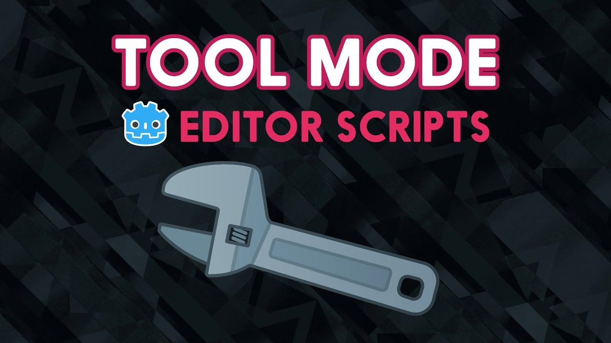

---
aliases:
- /open-source/guides/learn-godot/developer/
- /tutorial/godot/learning-paths/developer/
- /tutorial/redirect/guide/developer/
- /docs/guides/learn-godot/developer/
author: razvan
date: 2019-11-11 09:47:26+0200
description: This free guide is a curated list of free resources that help with transitioning
  to Godot - the Free and Open Source game engine.
difficulty: intermediate
menuTitle: Developer Edition
resources:
- name: banner
  src: banner.png
title: 'Make Games with Godot: Developer Edition'
weight: 2
---

We gathered a curated list of resources to make your life easier if you want to get started with Godot. This guide is for experienced developers, or game developers coming from a different game engine.

_For a beginner-friendly introduction to game development with the [Godot game engine](//godotengine.org/), check out the [beginner edition]() of this guide._

You're also welcome to [join the GDQuest Discord community](//discord.gg/87NNb3Z) to get in touch with fellow game developers.

## Making games with Godot

Godot is Free and Open Source Software. It was origionally created by Juan Linietsky ([@reduzio](//twitter.com/reduzio)) and Ariel Manzur (punto) and was a relatively small project. Godot has grown exponentially since going Open Source and now aims to be a real competitor to other state-of-the-art game engines.

**Godot offers 2D and 3D** engines under the same editor. Each has many features that cover interests for hobbyists and professional game developers alike.

### From X to Godot

There are several places where you can learn about the differences between Godot and other game engines to help with the transition:

- [coming from Unity](//docs.godotengine.org/en/3.1/getting_started/editor/unity_to_godot.html) - the official Godot documentation caters to Unity users and covers the conceptual differences between these editors
- [coming from GameMaker: Studio](//www.youtube.com/playlist?list=PLQsiR7DILTcxma-doUnpoALIX001NvcP_) - Emilio's YouTube series covers the basics of transitioning from GameMaker: Studio v1.4

### Godot UI, themes and much more

Godot treats UI-related objects differently to play-related objects. This may be confusing initially but Godot has a powerful theming mechanism that goes along with this. It may not be the friendliest of developer experiences, but we have a few guides to help you.



To get started with UI, themes and much more, have a look at the following educational resources:

1. GDQuest's [Godot User Interface Tutorials](//www.youtube.com/playlist?list=PLhqJJNjsQ7KGXNbfsUHJbb5-s2Tujtjt4) - Godot has some peculiarities when it comes to making UIs that can even trip up advanced users. This in-depth YouTube series covers this topic along with plenty of examples
1. Emilio's [Making Programs with Godot](//www.youtube.com/playlist?list=PLQsiR7DILTczMLsN8qmMym7pYfJXynzK0) - a bit of trivia: the Godot editor is built using the Godot engine itself! So it's no surprise that Godot can create programs and tools too. This series covers UI and themes in an applied manner by developing applications instead of games

### Shaders in Godot

Using Shaders in Godot is where the engine truly shines. It offers a simplified OpenGL-like scripting language (for coders) and a visual node editor (for designers) that are ridiculously easy to use. Apart from these, it comes with simplified models for creating materials directly in the options panel - the inspector.



Godot is very flexible when it comes to VFX driven by shaders. The following resources introduce you to shaders in Godot. They start slow before ramping up in difficulty:

1. [Intro to Shaders in Godot: 2D and 3D Water Tutorials](//www.youtube.com/playlist?list=PLhqJJNjsQ7KHqNMYmTwtsYTeTrqrRP_fP) is a good starting point to get your feet wet and see how easy it is to write Godot shaders. They are much simpler than Unity's. The tutorial mostly goes through 2D shaders, but this playlist includes Bastiaan's 3D examples as well
1. [Visual Shader Editor in Godot 3.1: Dissolve Shader](//youtu.be/sf_Dc4ew3eM) is a tutorial that goes through a practical 3D dissolve shader effect with the use of the Visual Shader Editor which was brought back in Godot 3.1
1. [Godot Shaders playlist](//www.youtube.com/playlist?list=PL9NDikg3iIaXtGQY6HIgzUxfuMTkybzyx) is a playlist with fairly advanced 2D shaders. It goes through specific examples such as procedural fog, cartoon fire, simple water, paper burn, Mandelbrot fractal and lava as well as looking at the Visual Shader Editor in Godot 3.1 and its limitations
1. [Godot Grass shader tutorial](//youtu.be/uMB3-g8v1B0) this is an advanced 3D tutorial for adding grass on terrain using shaders. It has a GitHub project that goes along with the video which can be found in the description

### Extending Godot

Godot can be radically customized to fit anyone's needs by using the editor plugin system. This is a powerful feature that allows for the creation of editor tools that extend the engine with new panels and functionality.

Here we'll start with the official documentation which will guide us through the necessary steps to building different plugins before moving on to a real-case example:

1. [Godot editor plugins official documentation](//docs.godotengine.org/en/3.1/tutorials/plugins/editor/index.html) goes through the conceptual and theoretical basis for extending the game engine editor. It's a good starting point for learning what this entails
1. [Smart Moving Platforms in Godot: waypoint system and Tool mode tutorial](//youtu.be/ZWO2WiH9p9s) is an example on how to build game development tools in the Godot editor to ease the game creation workflow. As the title suggests, it's about creating a waypoint system that works in the editor which can be modified in real time. It goes through all that's necessary in order to start working in tool mode in Godot

### Multiplayer in Godot

Godot offers high-level and low-level multiplayer protocols and APIs. These give simple or advanced coordination between clients and servers. Godot uses RPCs (remote procedure calls) to call and sync peers.

Currently there aren't that many educational resources that handle multiplayer systems in Godot. We hope that the following list is enough to put you on the right track:

1. [Intro to Multiplayer](//www.youtube.com/playlist?list=PLhqJJNjsQ7KHohKIdqyTHRr96zYreZMC7) in Godot is one of the few educational resources that goes through multiplayer game creation in Godot. It's an introduction to networking via a 2D shooter example where two players can interact through a server in a deathmatch setting
1. [Godot Networking](//docs.godotengine.org/en/3.1/tutorials/networking/index.html), the official documentation explains the concepts of high-level and low-level networking capabilities in Godot

### Going advanced

Bastiaan Olij has kindly created a fairly advanced tutorial series on how to make a car simulation in Godot. The official Godot demos include a truck handling simulator but this tutorial series is one step above in terms of quality.

- [Godot Vehicle Tutorial](//www.youtube.com/playlist?list=PLe63S5Eft1KapdW0-o824gCbG8LPvzxSA) explains how to get a vehicle simulation on a track. This is one of the best tutorials out there that shows advanced usage of Godot. It goes through importing the meshes in Godot, building a track and creating a car controller

### Finding more answers

While the above resources are enough to explore a significant part of Godot, it isn't an exhaustive list and there are many holes of knowledge left to fill. Here are some great places to start looking for answers when you get stuck:

- [New Features in Godot 3.1](//www.youtube.com/playlist?list=PLhqJJNjsQ7KEN1pQVRD4an4Ykd1i9t3t9) is a good overview of the tools provided by Godot 3.1. It might just get you unstuck if you don't know what the 3.1 version has to offer
- [Godot recipes](//kidscancode.org/godot_recipes/) site pulls together a series of essential code recipes. It starts at the very basics and moves on to math, physics, AI, and more. It's a to-bookmark educational resource that will no doubt help you get unstuck on specific issues
- [Godot reddit list](//www.reddit.com/r/godot/comments/an0iq5/godot_tutorials_list_of_video_and_written/). We are at a point in the list where exploring further topics by yourself is something you might like to do. This list hasn't been curated by us but it still might be useful. It's a list of topics to be explored that vary in terms of quality
- [Godot community page](//godotengine.org/community). It's a good idea to start interacting with the community through the official channels. This place gathers all of the official ways you can interact with other game developers and much more. Sometimes getting unstuck is about asking the right question and getting a good answer back

The following section includes links to demos on a wide range of topics. They're currently of varying qualities but they're good resources to bookmark for specific problem-solving ideas.

- [GDQuest Demos](//github.com/GDQuest/Godot-engine-tutorial-demos). This GitHub repository is one of the most complete out there when it comes to Godot demo projects. Some of the demos are outdated as they were built for Godot 2 but there are plenty of recent examples to get you unstuck on specific topics
- [Official Godot Demos](//github.com/godotengine/godot-demo-projects). The main GitHub Godot repository features most of the topics you might be interested in: 2D, 3D, shaders, networking, UI and more. The GDQuest team is working actively at improving the source code quality of the official demos. Stay tuned!

## Where to from here?

We've gathered a list on other game development topics that aren't specific to Godot but may be valuable nonetheless.

General game development resources:

- [The Book of Shaders](//thebookofshaders.com/) is one of the best resources out there to get started with shaders, simple programs to manipulate your game's art in realtime, in your game. The book explains how shaders work and what you can achieve with them. At the time of writing this book is incomplete, but still invaluable.
- [Game Programming Patterns](//gameprogrammingpatterns.com/). This free online book is a must-have resource for understanding the different OOP patterns used specifically in game development
- [Red Blob Games](//www.redblobgames.com/) blog is an online resource that explores topics in great detail with lots of interactive examples. It's one of the best resources out there
- [The Nature of Code](//natureofcode.com/). This free online book is about understanding how the mathematical principles behind our physical world can help us create compelling digital worlds. It's interactive and explors a wide variety of topics
- [Game AI Pro](//www.gameaipro.com/). This free online book series gathers multiple recipes in AI and behavior topics. These are very advanced overviews that don't often provide complete code but instead explore high-level ideas. This leaves the developer to do the hard work of implementing them which may be a great exercise
- [Procedural Content Generation in Games](http://pcgbook.com/) is a free online book that explores creating content using procedural generation algorithms. It doesn't go into code which leaves the reader to explore advanced ideas themselves
- [GPU Gems](//developer.nvidia.com/gpugems/GPUGems/) is a free online book series by NVidia that goes through very advanced GPU topics. Some of these ideas are low-level to the point that they could very well be implemented at the game engine development stage

(Non)Conferences useful for gathering further game development ideas:

- [NotGDC](http://www.notgdc.fun/). "A game development non-conference, for everyone". Game developers who don't go to the highly-sought-after Game Developers Conference now have a place to interact with one another. Just like the GDC Vault below, NotGDC explores a wide variety of topics and inspirational talks and methodologies for game development
- [GDC Vault](//gdcvault.com/free). The Game Developers Conference Vault gathers in-depth design, technical and inspirational talks and slides from the game development industry. It's a must-have resource for exploring further topics in the game creation process

Non-gamedev related:

- [Paul's Online Math Notes](//tutorial.math.lamar.edu/) is one of the best resources for exploring math topics going from plain and simple algebra and calculus to advanced topics such as vector calculus and differential equations. This is a good place to start learning advanced mathematics with applications in physics and game development. It's especially useful for those who want to get into creating physics models

The [previous part]() in this series [Learn to Make Games with Godot: Beginner Edition]() explores basic resources for the enthusiasts out there that want to understand how to use the Godot game engine, starting from the very beginning.

## Contributing to this document

If you want to contribute to this document please read and follow our [contributor's guide](). Your help is much appreciated.

## Support GDQuest

If you want to go further with game creation and support our work, check out our [game creation courses](//gdquest.mavenseed.com/).

To keep up to date with news from us, [follow GDQuest on Twitter](//twitter.com/NathanGDQuest).
