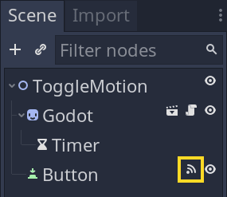
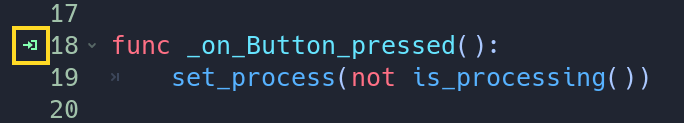
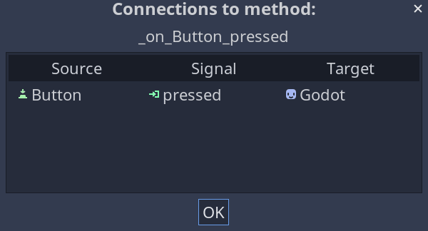

In this lesson, you will get to connect and use Godot's signals.

In the video, you will learn to:

- Connect a signal using the editor's interface.
- Access a node and connect a signal using code.
- Define and emit a custom signal in your code.

You can download the project files to follow along here: [signal lesson starter project](https://github.com/GDQuest/godot-getting-started-2021/releases/tag/0.2.0).

Below, I added extra insights to go further after watching the video.

First, we'll talk about what makes signals a useful feature. Then, we'll touch on technical details of how the signal connection code works.

## Why use signals

As we saw back in the lesson about [Godot's 4 essential concepts](), signals allow you to make nodes communicate. 

There are multiple ways to make nodes communicate in code.

Signals are only one of several, and you will get to learn and compare the alternatives as you make games with Godot. Every approach has its uses.

Here, we are focusing on signals as this is the last missing piece before creating a complete game from scratch.

The advantage of signals is that they can help keep your code clean and flexible.

All of Godot's nodes and objects emit signals when a specific event occurs. For example, when a player clicks a button, the button emits the `pressed` signal.

You can connect that signal to another node, like a character, to react to that button press.

Signals connect to functions, and so when the player clicks a button, Godot will call the target function for you.

The editor also shows you signal connections with icons, which helps you track connections.

It does so in two places.

First, in the scene dock, where it displays an icon next to nodes that connect to another. You can click the icon to jump to the node dock.



Second, inside a script, next to a function that receives a signal, an icon tells you that Godot will call it. 



You can click the icon to see a table of the connections.



In summary, signals are useful because they allow you to listen and react to specific events. Also, the editor helps you track the connections.

## Breaking down the signal connection syntax

There are details of the signals' syntax in code I didn't get to cover in the video. Let's go over them here.

In the video, we got a reference to our _Timer_ node and connected to its `timeout` signal like so:

```gdscript
func _ready():
	# We get a reference to a child node named "Timer" and store it in a new
	# variable.
	var timer = get_node("Timer")
	# We connect the timer's `timeout` signal to this node's
	# `_on_Timer_timeout()` function.
	timer.connect("timeout", self, "_on_Timer_timeout")
```

Here, `connect()` is a method we call on the _Timer_ node. It takes three arguments: the signal to emit, the object to connect to, and a function to call upon emitting the signal.

Note how we pass the name of the signal and the function's name to call inside quotes.

We use quotes to represent strings of text. In Godot 3, you often use text to refer to a signal, a function, or a node's name as in the call to `get_node()`.

{}
I'm talking about objects and nodes almost interchangeably here. What's the difference?

As mentioned in a previous lesson, you can think of objects as little machines that bundle data (properties) and behavior (methods) together. Nodes, like `Timer` and `Sprite`, are particular kinds of objects.

In Godot, every node type extends the base `Object` type, which is part of the game engine and gives you access to signals.
{}

## Understanding the `self` keyword

When connecting to the `timeout` signal, we used `self` as the second argument.

The `self` keyword in GDScript designates the object the script is attached to. In this case, it is our flying _Godot_ head.

There are many programming languages in which you write that `self` keyword (or an equivalent) a lot to specify which object should run the code. You will see that in languages like Python or JavaScript, for example.

But not in GDScript, thanks to the engine. Godot always treats your GDScript code as implicitly running on the object or node you attached it to.

When we get a node, like so:

```gdscript
get_node("Timer")
```

This is the same as writing:

```gdscript
self.get_node("Timer")
```

It reads as: "I, the _Godot_ node, want to get a reference to a child node named `Timer`".

There are only a few cases where you need to use `self` in GDScript. Connecting a signal via code is one case. Another has to do with a language feature that's beyond the scope of this series, setter and getter functions. We won't be using them here.

With that, you went through all the fundamentals to start creating complete games in Godot. In the next part, you will get to create a complete 2D game from scratch, step-by-step.
