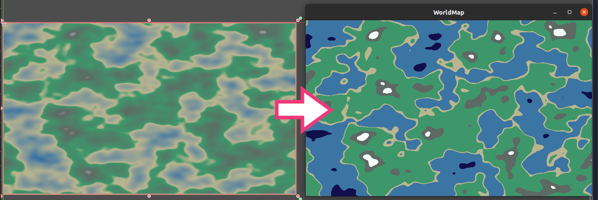
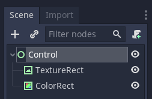
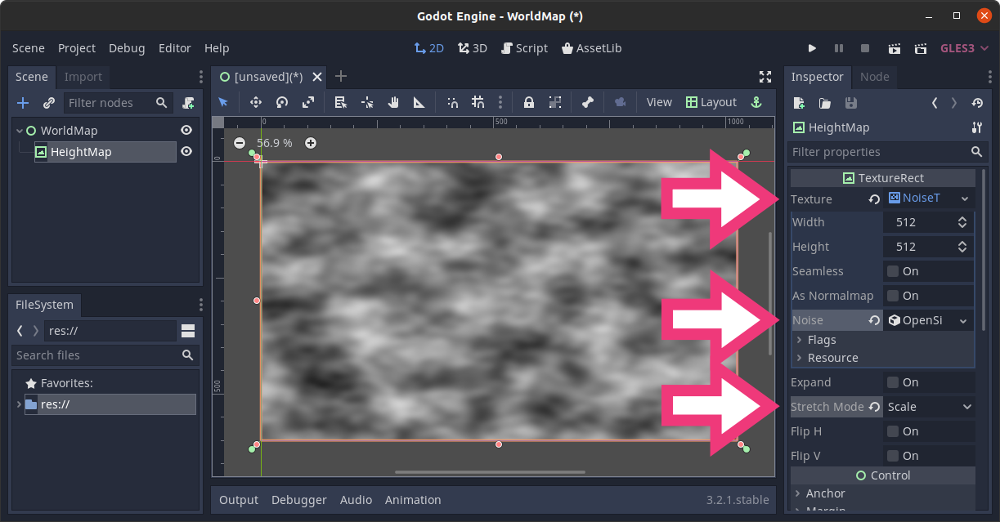
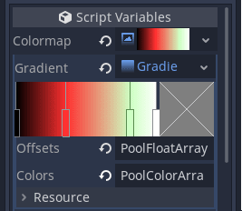
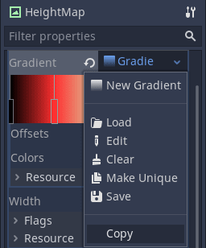
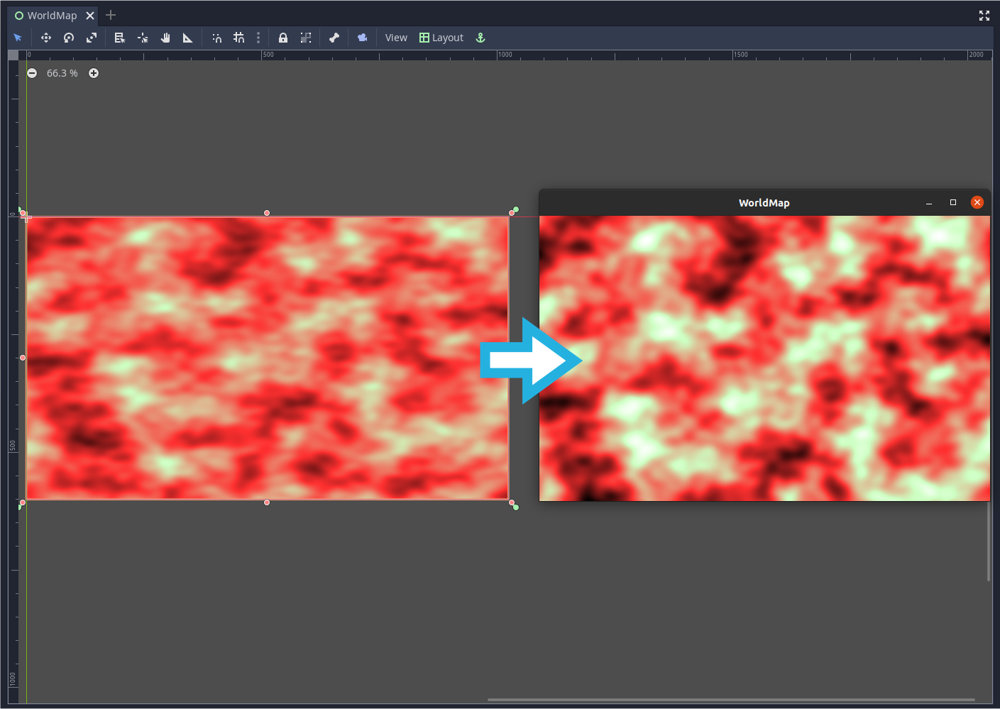
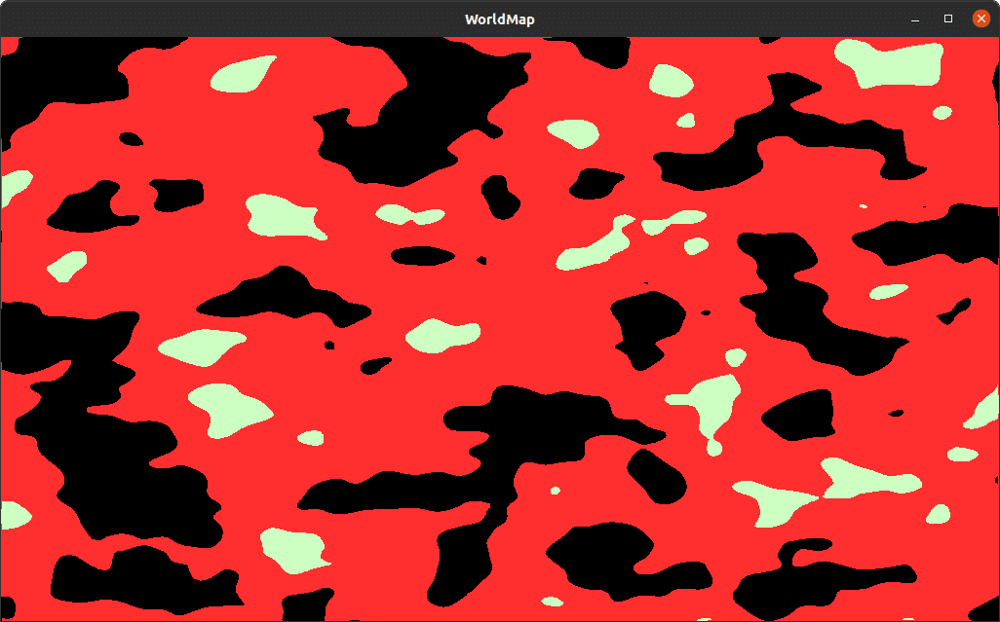
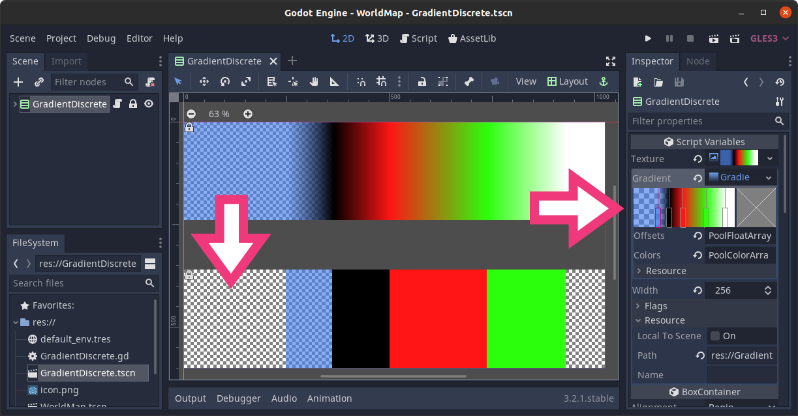

This tutorial goes over a simple world map generator using _NoiseTexture_, a modified _GradientTexture_, and shaders.

Objectives:

- Understanding _NoiseTexture_ with _OpenSimplexNoise_ to create height maps for use in shaders.
- Modifying _GradientTexture_ for our needs to use it as a discrete color map in shaders.
- Using basic shaders with input from GDScript.



## Preparing the scene structure

Let's prepare the scene. Create a _Control_ Node at the root and name it WorldMap. Add a _TextureRect_ node as its child and name it HeightMap. We will use it to display our world map's texture.

Select the two nodes, and in the toolbar, click _Layout -> Full Rect_ to make both nodes span the entire viewport.



Select the _HeightMap_ node and in the Inspector:

1. In the _Texture_ slot, create a new _NoiseTexture_ resource and assign an _OpenSimplexNoise_ resource to the _Noise_ property.
1. Set the _Stretch Mode_ to _Scale_, so the texture scales with the node.



Save the scene as _WorldMap.tscn_.

## Preparing the color-map

Add a placeholder script to the _HeightMap_ node with the following content. We're exporting a variable that should contain a gradient texture. We are going to use it to recolor our noise texture.

```gdscript
extends TextureRect


export var colormap: GradientTexture
```

Save the script and head back to the 2D workspace (<kbd>F2</kbd>). In the Inspector, assign a _GradientTexture_ to the _Colormap_ property. Add a _Gradient_ resource to it and add a few color stops to it.



Add a new _ShaderMaterial_ to the _Material_ property. Click the newly created material to open the shader editor and use the following shader:

```glsl
shader_type canvas_item;

// Our gradient texture.
uniform sampler2D colormap : hint_black;

void fragment() {
	// Sample the node's texture and extract the red channel from the image.
	float noise = texture(TEXTURE, UV).r;
	// Convert the noise value to a horizontal position to sample the gradient texture.
	vec2 uv_noise = vec2(noise, 0);
	// Replace greyscale values from the input texture by a color from the gradient texture.
	COLOR = texture(colormap, uv_noise);
}
```

Copy the _Colormap_'s _GradientTexture_ resource and paste it into the _Colormap_ under _Material -> Shader Param -> Colormap_.




The _GradientTexture_ is an object of type `Resource`. When we copy and paste it, we're copying a reference to the resource in memory rather than duplicating it. So if you update the gradient in one place, it gets updated everywhere you're using it.


You should see an immediate update in the main _Viewport_.

## Fixing the NoiseTexture value range

_OpenSimplexNoise_ generates random values between `0.0` and `1.0`. But it does not guarantee that the minimum and maximum values are `0.0` and `1.0`, respectively. For our world map and height maps in general, we want to work with a predictable value range. To ensure we always have a range of values from `0.0` to `1.0`, we are going to pass the minimum and maximum noise values to the shader. Update the shader as follows:

```glsl
shader_type canvas_item;

uniform sampler2D colormap : hint_black;
// Stores the minimum and maximum values generated by the noise texture.
uniform vec2 noise_minmax = vec2(0.0, 1.0);

void fragment() {
	// Using `noise_minmax`, we normalize our `noise` variable's range.
	float noise = (texture(TEXTURE, UV).r - noise_minmax.x) / (noise_minmax.y - noise_minmax.x);
	vec2 uv_noise = vec2(noise, 0);
	COLOR = texture(colormap, uv_noise);
}
```

Update the _HeightMap_ script to set the `noise_minmax` uniform of the shader from GDScript:

```gdscript
extends TextureRect


# The maximum 8-bit value of a color channel held into 32-bit images.
# Named after the `Image.FORMAT_L8` format we use below.
const L8_MAX := 255

export var colormap: GradientTexture


func _ready() -> void:
	# The open simplex noise algorithm takes a while to generate the noise data so
	# we have to wait for it to finish updating before using it in any calculations.
	yield(texture, "changed")
	var heightmap_minmax := _get_heightmap_minmax(texture.get_data())
	# Use the material's `set_shader_param` method to assign values to a shader's uniforms.
	material.set_shader_param("noise_minmax", heightmap_minmax)


# Returns the lowest and highest value of the heightmap, converted to be in the [0.0, 1.0] range.
func _get_heightmap_minmax(image: Image) -> Vector2:
	# We convert the image to have a single channel of integer values that go from `0` to `255`.
	image.convert(Image.FORMAT_L8)
	# Gets the lowest and biggest values in the image and divides it to have values between 0 and 1.
	return _get_minmax(image.get_data()) / L8_MAX


# Utility function that returns the minimum and maximum value of an array as a `Vector2`
func _get_minmax(array: Array) -> Vector2:
	var out := Vector2(INF, -INF)
	for value in array:
		out.x = min(out.x, value)
		out.y = max(out.y, value)
	return out
```


In this example, we use the entire texture to get the value range. With large textures or many textures, this can become slow. You can use one of the texture's smaller mipmaps instead of the full image.

It's a bit more involved and may only be beneficial for larger images. See this [Godot question thread](https://godotengine.org/qa/48245/get-mipmap-data-from-texture) for a code example.


Run the project now to see the difference between the visual representation in the editor viewport and the image normalized at runtime.



## Getting a toon shaded look

To get toon shading, we need our gradient texture to have sharp transitions between colors. For our example world map, we want a given blue to appear where `noise < 0.2`, green where `0.2 <= noise < 0.4`, etc. To do so, we can generate a discrete version of the `gradient` stored in _Colormap_. That is to say, a version of the texture with sharp color transitions instead of smooth color interpolation.

Add the following function to the end of your _HeightMap_ script:

```gdscript
# Generates a discrete texture from a gradient texture and returns it as a new `ImageTexture`.
func _discrete(gt: GradientTexture) -> ImageTexture:
	var out := ImageTexture.new()
	var image := Image.new()

	# We create an image texture as wide as the input gradient, but with a height of 1 pixel.
	image.create(gt.width, 1, false, Image.FORMAT_RGBA8)
	var point_count := gt.gradient.get_point_count()

	# To fill the new image's pixels, we must first lock it.
	image.lock()
	# For each color stop on the gradient, we fill the image with that color, up to the next color
	# stop.
	for index in (point_count - 1) if point_count > 1 else point_count:
		var offset1: float = gt.gradient.offsets[index]
		var offset2: float = gt.gradient.offsets[index + 1] if point_count > 1 else 1
		var color: Color = gt.gradient.colors[index]
		# This is where we fill the pixels in the image.
		for x in range(gt.width * offset1, gt.width * offset2):
			image.set_pixel(x, 0, color)
	image.unlock()

	out.create_from_image(image, 0)
	return out
```

Finally add the following line to the end of the script's `_ready()` function:

```gdscript
material.set_shader_param("colormap", _discrete(colormap))
```

If you run the project now you'll get a toon shading like the following:



We use the information stored in the gradient resource to create a discrete color map by expanding the color of each offset towards the right. This means that the last offset isn't taken into account. In the above image, there is no white color generated at the end of the cel-shaded _ImageTexture_.

It's easier to visually explain how we generate the toon shading using the `_discrete()` function. For this reason, we included a demo scene, _GradientDiscrete.tscn_, in our open-source demo.



You can find the demo on Github, in our [Godot mini-tuts demos](https://github.com/GDQuest/godot-mini-tuts-demos). It's in the _godot/pcg/world-map/_ directory.
