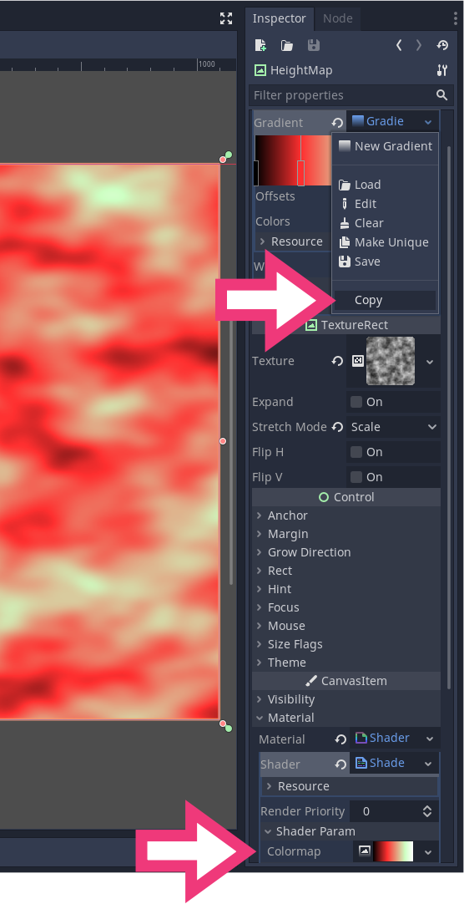

+++
title = "Heightmap-based procedural world map"
description = "Learn to use noise textures to generate a procedural world map and get started with Procedural Content Generation."
author = "razvan"
type = "post"

keywords = ["procedural content generation", "procgen", "heightmap", "godot", "godot tutorial"]

date = 2020-05-20T10:51:41+03:00
weight = 5
draft = true
+++

This tutorial goes over a simple world map generator using _NoiseTexture_, a modified _GradientTexture_, and shaders.

Objectives:

- Understand _NoiseTexture_ with _OpenSimplexNoise_ to create height maps for use in shaders.
- Modify _GradientTexture_ for our needs to use it as a discrete color map in shaders.
- Use basic shaders with input from GDScript.


## Preparing the scene structure

Create the following _SceneTree_ structure:


And rename the nodes like so:

```
WorldMap
  |
  +- HeightMap
```

Select the _HeightMap_ node and make sure to set _Full Rect_ in the _Layout_ drop-down menu.

With the _HeightMap_ node still selected:

1. Set _Texture_ to _NoiseTexture_ and make sure to assign an _OpenSimplexNoise_ resource to the _Noise_ property.
1. Also make sure to set _Stretch Mode_ to _Scale_.


Save the scene as _WorldMap.tscn_.

## Preparing the colormap

Add a script to the _HeightMap_ node with the following contents:

```gdscript
extends TextureRect


export var colormap: GradientTexture
```

And add a gradient of your choosing to play with in the next part when we'll look at the shader.


Add a new _ShaderMaterial_ with the following shader:

```glsl
shader_type canvas_item;

uniform sampler2D colormap : hint_black;

void fragment() {
	float noise = texture(TEXTURE, UV).r;
	vec2 uv_noise = vec2(noise, 0);
	COLOR = texture(colormap, uv_noise);
}
```

Copy the _Colormap_ _GradientTexture_ resource and paste it into the _Colormap_ under _Shader Param_



You will see an immediate update in the main _Viewport_.


When using resources, Godot doesn't make copies by default. It uses the same resource so when we update in one place, it gets updated everywhere we use it.


Our shader uses the _NoiseTexture_ from the main `TEXTURE` channel and gets the float value from the _red_ channel. We store this value in the `noise` variable and then use it with the `colormap` to retrieve the color from the gradient. The `noise` value is a float between `0.0` and `1.0` so we can directly use it to create a `UV` variable based on it: `vec2(noise, 0)`.

We can then use `uv_noise` with the _GradientTexture_ stored in `colormap` to remap the B&W with the new colors.

## Fixing the NoiseTexture value range

_OpenSimplexNoise_ generates noise range between `0.0` and `1.0`, with no guarantee that the minimum and maximum values are `0.0` and `1.0` respectively. To give us a full range to play with, we'll correct this by passing the min/max values to the shader. Firs, update the shader as follows:

```glsl
shader_type canvas_item;

uniform sampler2D colormap : hint_black;
uniform vec2 noise_minmax = vec2(0.0, 1.0);

void fragment() {
	float noise = (texture(TEXTURE, UV).r - noise_minmax.x) / (noise_minmax.y - noise_minmax.x);
	vec2 uv_noise = vec2(noise, 0);
	COLOR = texture(colormap, uv_noise);
}
```

We'll pass the `heightmap_minmax` values to `noise_minmax` and use it to stretch the noise values to `0.0` - `1.0` by normalizing the _NoiseTexture_ values:

```glsl
float noise = (texture(TEXTURE, UV).r - noise_minmax.x) / (noise_minmax.y - noise_minmax.x);
```

Update the _HeightMap_ script with:

```gdscript
extends TextureRect


const L8_MAX := 255

export var colormap: GradientTexture


func _ready() -> void:
	yield(texture, "changed")
	var heightmap_minmax := _get_heightmap_minmax(texture.get_data())
	material.set_shader_param("noise_minmax", heightmap_minmax)


func _get_heightmap_minmax(image: Image) -> Vector2:
	image.convert(Image.FORMAT_L8)
	return _get_minmax(image.get_data()) / L8_MAX


func _get_minmax(array: Array) -> Vector2:
	var out := Vector2(INF, -INF)
	for value in array:
		out.x = min(out.x, value)
		out.y = max(out.y, value)
	return out
```

We have introduced a number of functions here. `_get_minmax()` is a utility function that returns the minimum and maximum values of an array as components of a `Vector2`.

We use `_get_minmax()` in `_get_heightmap_minmax()` to get the minimum and maximum values of the passed in image. We treat the image as having only one channel so we convert it to `Image.FORMAT_L8` which is an image with a single channel of integer values that go from `0` to `255`.

We take the raw data of this image and pass it to `_get_minmax()`. As a final step we divide the return value of `_get_minmax()` with the `L8_MAX` constant. The `L8_MAX`, as the name implies is the maximum value of the `Image.FORMAT_L8`, thus we covert the image data maximum and minimum to the range `0.0` - `1.0`.

In the `_ready()` function we use these values to set the _Noise Minmax_ shader parameter at runtime.

Run the project now to see the difference between the visual representation in the editor viewport and the image normalized at runtime.



We need to use `yield(texture, "changed")` because _OpenSimplexNoise_ takes a while to generate the data and we have to wait for it to update before using it in any calculations.


## Getting the cell shaded look

To get the cell shaded look we need for a world map, where blue appears where `noise < 0.2`, green appears where `0.2 <= noise < 0.4` and so on, we need to create a discrete version of the `gradient` stored in _Colormap_.

Add the following function to the end of your _HeightMap_ script:

```gdscript
func _discrete(gt: GradientTexture) -> ImageTexture:
	var out := ImageTexture.new()
	var image := Image.new()
	
	image.create(gt.width, 1, false, Image.FORMAT_RGBA8)
	var point_count := gt.gradient.get_point_count()
	
	image.lock()
	for index in (point_count - 1) if point_count > 1 else point_count:
		var offset1: float = gt.gradient.offsets[index]
		var offset2: float = gt.gradient.offsets[index + 1] if point_count > 1 else 1
		var color: Color = gt.gradient.colors[index]
		for x in range(gt.width * offset1, gt.width * offset2):
			image.set_pixel(x, 0, color)
	image.unlock()
	out.create_from_image(image, 0)
	
	return out
```

Finally add the following line to the end of `_ready()` function body:

```gdscript
material.set_shader_param("colormap", _discrete(colormap))
```

If you run the project now you'll get a cell shaded look like the following:


It's easier to explain visually how we generate the cell shaded look using `_discrete()`. For this reason we have included a demo scene, _GradientDiscrete_, in our project files:


We use the information stored in the gradient resource to create a discrete color map by expanding the color of each offset towards the right. This means that the last offset isn't taken into account. That's why, in the above image, there is no white color generated at the end of the cell shaded _ImageTexture_.

## Project files

You can find the project files at https://github.com/GDQuest/godot-mini-tuts-demos under _godot/pcg/world-map_ directory.
