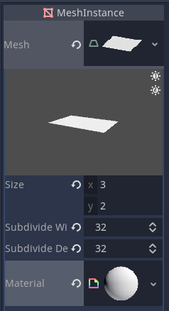
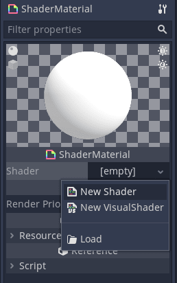
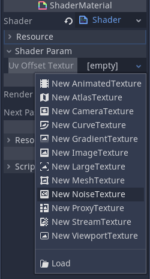
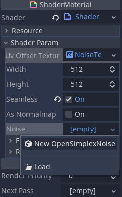
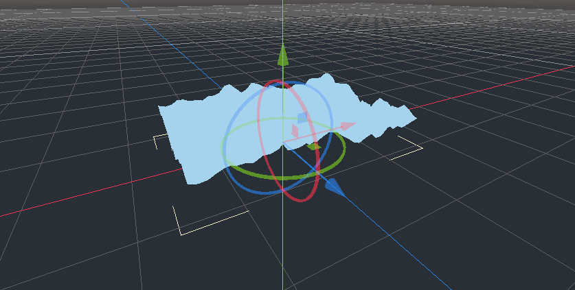
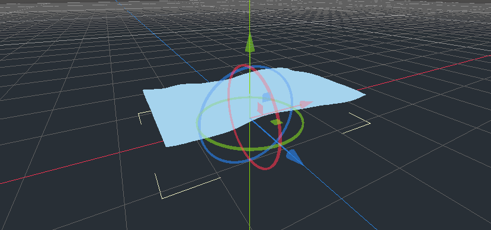
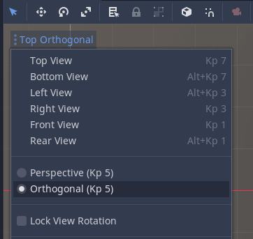

+++
title = "3D flag"
description = "Learn to animate a flag blowing in the wind with shaders."
author = "johnny"
programVersion = "3.2"

difficulty = "intermediate"
tags = ["godot", "tutorial"]
keywords = ["godot shaders tutorial", "godot shaders", "flag shader", "godot 3d shaders",]

date = "2020-05-31"
weight = 5

+++

In this tutorial you'll learn how to animate a mesh using a shader so it looks like it's blowing in the wind.



## Setting up the scene

First off, create a new 3D scene and add a `MeshInstance` node as a child. Add a new _PlaneMesh_ to it, change its size to have a 3:2 ratio and subdivide it into `32` by `32` subdivisions. We'll need these vertices to deform the flag.

Add a new _ShaderMaterial_ to the _PlaneMesh_. Your settings in the inspector should look like this.



Now, we'll set up the shader and generate a noise texture.

Click into the _ShaderMaterial_ and a new shader to it to open up the shader code editor.



## Writing the shader

We're going to use _OpenSimplexNoise_ to deform the mesh and get the fluid movement you might find on a flag. Set up the noise texture by first typing the following in the shader code editor.

```glsl
shader_type spatial;

uniform sampler2D uv_offset_texture : hint_black;
```

The `shader_type` tells Godot what kind of shader it's working with. We use `spatial` for 3D objects. The uniform `uv_offset_texture` is a parameter we can pass into the shader.

Add a new _NoiseTexture_ from the inspector.



Click into it and create a new _OpenSimplexNoise_ resource. Make sure _Seamless_ is set to `true` so we don't have obvious seams when the texture repeats.



Now we have our noise texture, we can sample it in the shader. We do this in the vertex function which controls each vertex of the mesh.

We can take any of the color values as they're the same due to the greyscale color of the texture. We take the red value at the point in the `UV` and change the position of the vertex by that amount.

```glsl
void vertex(){
	float noise = texture(uv_offset_texture, UV).r;

	VERTEX.y += noise;
}
```



The flag is looking a bit rough and spiky so we'll zoom in on the noise texture by a given scale to "stretch" it out. This will smooth the peaks and valleys.

```glsl
uniform vec2 uv_offset_scale = vec2(-0.2, -0.1);
```

We use negative values here because the `uv_scale_offset` also controls which direction the flag flows. A negative `x` value will make it look like the wind is flowing from left to right.

Update the vertex function to take this into account.

```glsl
void vertex(){
	vec2 base_uv_offset = UV * uv_offset_scale;

	float noise = texture(uv_offset_texture, base_uv_offset).r;

	VERTEX.y += noise;
}
```



It's looking softer but it needs _movement_!

We move along the texture by adding the in built `TIME` variable which tracks the elapsed time of the shader.

```glsl
base_uv_offset += TIME;
```



Add a new uniform which will control the speed of the shifting texture.

```glsl
uniform vec2 time_scale = vec2(0.3, 0.0);
```

We multiply the `TIME` by this scale.

```glsl
void vertex(){
	vec2 base_uv_offset = UV * uv_offset_scale;
	base_uv_offset += TIME*time_scale;

	float noise = texture(uv_offset_texture, base_uv_offset).r;

	VERTEX.y += noise;
}
```



You may notice the flag looks like it's hovering above the floor. This is because sampling the noise texture returns a value between `0.0` and `1.0`. Let's convert these values to values between `-1.0` to `1.0` instead.

```glsl
void vertex(){
	vec2 base_uv_offset = UV * uv_offset_scale;
	base_uv_offset += TIME*time_scale;

	float noise = texture(uv_offset_texture, base_uv_offset).r;
	// Convert from [0.0, 1.0] to [-1.0, 1.0]
	float texture_based_offset = noise * 2.0 - 1.0;

	VERTEX.y += texture_based_offset;
}
```



Flags are attached to something on one side so they don't fly away in the wind. We'll simulate this by applying dampening. We want our offset strength, or coefficient, to be `0.0` on the left and at full strength on the right. Conveniently, we can use the `UV` for this by multiplying `texture_based_offset` by `UV.x`.

```glsl
texture_based_offset *= UV.x; // Apply dampening
```



Out flag movement looks quite good from this angle but if you look face on and set the camera to _Orthogonal_, the shape doesn't change in the `x` or `z` axes.





To fix this we'll add `face_distortion` uniform which dictates how much we want the face to be warped, based on the sampled noise texture.

```glsl
uniform float face_distortion = 0.5;
```

I negated the offset on the `x` axis to make it look like the flag conserves its area better.

```glsl
VERTEX.z += texture_based_offset * face_distortion;
VERTEX.x += texture_based_offset * -face_distortion;
```



Here is the final vertex shader.

```glsl
shader_type spatial;

uniform sampler2D uv_offset_texture : hint_black;
uniform vec2 uv_offset_scale = vec2(-0.2, -0.1);
uniform vec2 time_scale = vec2(0.3, 0.0);
uniform float face_distortion = 0.5;

void vertex(){
	vec2 base_uv_offset = UV * uv_offset_scale;
	base_uv_offset += TIME*time_scale;

	float noise = texture(uv_offset_texture, base_uv_offset).r;
	// Convert from 0.0 <=> 1.0 to -1.0 <=> 1.0
	float texture_based_offset = noise * 2.0 - 1.0;
	// Apply dampening
	texture_based_offset *= UV.x;

	VERTEX.y += texture_based_offset;
	// Distort the face to give impression of conserving shape
	VERTEX.z += texture_based_offset * face_distortion;
	VERTEX.x += texture_based_offset * -face_distortion;
}
```
