To give your game worlds some depth and appeal, you want to add some life to the background. Particles can be a good option to achieve effects like falling leaves, rain, and twinkling stars.

In this tutorial, we are going to use particles to create an **animated star field** that covers the entire screen.



You will also be able to use the techniques we're going to explore for many other visual effects:

- Making the particle system follow the view infinitely.
- Making particles appear and disappear smoothly with scale animation.
- Designing a particle system that covers the entire screen.

_This tutorial is a free sample from our course [VFX Secrets](https://school.gdquest.com/products/vfx_secrets_godot_3). You can find the source code for the starfield and more on our GitHub repository [Godot Visual Effects](https://github.com/GDQuest/godot-visual-effects)._

## Pre-requisites

To follow this tutorial, you need to know:

- How to navigate Godot's editor, use the _Inspector_ and the _Scene Tree_.
- how the node system works, and how to add resources to nodes in the _Inspector_.

## Setting up the particle system

Let's get started creating the star field using Godot's <abbr title="Graphics Processing Unit">GPU-powered</abbr> particle system.

For that, create a new scene and add a `Particles2D` node as its root and name it _StarField_.

To make the particle system spawn stars, we need to assign a texture to its _Texture_ property. You can find it under the Textures category in the Inspector.

In the File System dock, you can find the image of a star in the `star_field` folder. Drag and drop the `star.svg` file on the _Texture_ property in the Inspector. As soon as you did so, you will see stars spawning from your particle system.

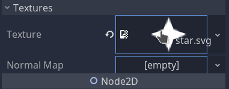

The stars are disappearing too fast. We can increase the _Lifetime_ from 1 to 6 seconds to fix that.

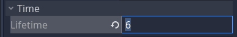

## Creating a new material

With that, we can create our particles' material to control the spawn location and the animation of the stars.

To add a new material, you can search for the _Material_ property in the Inspector's search bar at the top. Left-click on the _Empty_ slot next to it and select the _New Particles Material_ option from the drop-down menu.

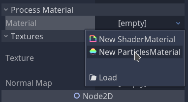

The particles should start to fall.

From here, we are going to focus on this material resources. While we can expand or fold the resource by left-clicking on it, we can also "enter" it and make it use the whole Inspector. To do so, right-click on the material slot and click on _Edit_.

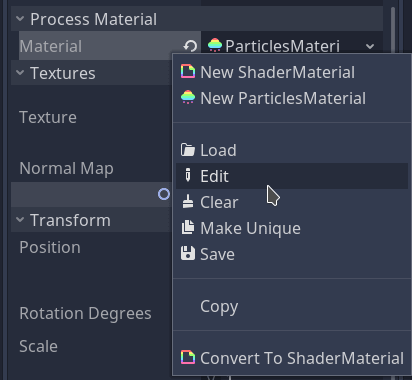

Now, the Inspector should only show the material's properties.

## Spreading the stars across the screen

By default, the particle system spawns particles at a fixed location. We can change that so it distributes stars inside a predefined shape.

As our screen is rectangular, we need a rectangular shape to cover it.

Unfold the _Emission Shape_ category, and click on the drop-down menu, where it says _Point_. Select the _Box_ option.

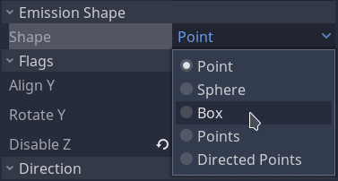

The box shape uses extents to define its area, which is the equivalent of a radius but for rectangles, meaning that when you set its `x` property, the width of the box is double that. So we need to use half the screen's horizontal size for `x`, half the screen's vertical size for the `y` value and leave `z` as zero. Respectively set the _Box Extents_' `x` and `y` components to 512 and 300.

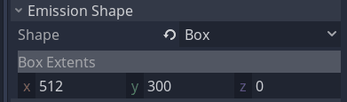

The particles now spawn across a large rectangular shape instead of a single point. Let's move the _StarField_ to the center of the screen by setting its `x` position to 512 and its `y` position to 300. That way, our particles will cover the entire screen.

## Twinkling little stars

Now we set up the particle material, let's give our stars some animation to make our background feel alive. We are going to make the stars rotate, and scale up and down, so they don't pop out of nowhere.

First, we need to turn off the gravity, so the particles stay where they spawned. Search for the _Gravity_ property under the _Gravity_ category and set all its values to 0.

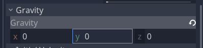

Next, let's make the stars scale in and out over their _Lifetime_. Under the _Scale_ category we have the _Scale Curve_ property. It allows us to animate each particle's scale over their _Lifetime_. Left-click on the _[empty]_ slot and create a curve texture by clicking _New CurveTexture_.

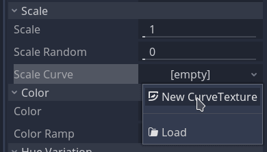

Click on the CurveTexture, then on the Curve inside of it to display the graph editor.

In the curve editor, the horizontal axis represents the particle's _Lifetime_, and the vertical axis represents its scale relative to the _Scale_ property. A value of 0.5 in the curve's vertical axis with a value of 2 in the _Scale_ property means the particle will have the same size of its source texture. Here is a sample linear animation:



For our effect, we will make the stars twinkle instead of just fading in and out once. To achieve that, we need to add some extra points in our curve to have the particle scale up and down at least twice.

To add points, right-click anywhere on the curve and select _Add Point_.

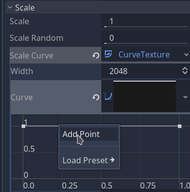

Click and drag on a point to move it. You want to move points so the scale animation starts at a y value of 0 and ends at zero. Your final curve should also look like an `M` shape, making the star appear and disappear twice.

Also, increase the _Scale Random_ above the _Scale Curve_ up to 1 to randomize the animation and add variety to the stars' animation. Your _Scale Curve_ should look something like this:

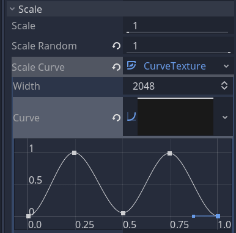

Now the stars appear and disappear, we're going to make them rotate. Expand the _Angular Velocity_ category. These properties control the starting angular speed of individual particles. Set the _Velocity_ to 50, and increase _Velocity Random_ to 1. The random slider makes it so each particle will have an angular velocity anywhere between 0 and 50 degrees per second.

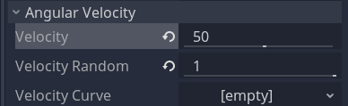

We are not going to work with curves here, because the spinning speed will be constant along the particles' life span.

With that, our material is ready. Only some tweaks left, and our effect will be ready.

## Having a screen full of stars from the start

Let's go back to the _StarField_ node. Click the back arrow at the top of the Inspector to go back to the previously edited object.

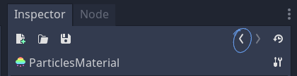

When we open the scene or first load it in a game, stars slowly appear as the particle system starts to spawn them. You can test how the effect will look like the first time it loads by Left-clicking on the _Particles_ menu at the toolbar and **Restart** the particles.

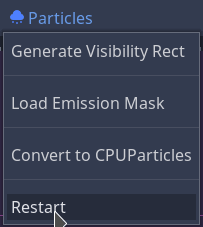

This is because we are using an _Explosiveness_ of 0, this means the particles will spawn one after the other. The _Explosiveness_ property represents how fast the effect will reach the _Amount_ number of particles along its _Lifetime_ duration.

We can pre-process the particle system so stars fill up the screen from the moment we load the scene. For that, we have to change the _Preprocess_ property. It starts the particle system's simulation at the _Preprocess_ time in seconds. Set it to 6 seconds, like the star field's _Lifetime_ property, to start from a complete cycle. By the end, this is how the _Time_ category of the Inspector should look like:

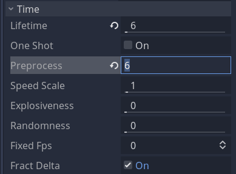

## Preventing the particles from disappearing

The _Visibility Rect_ of the particles controls when they show on the screen or not. If this rectangle is outside of the game's view, the particles disappear. We need to increase the size of this rectangle, so the stars don't become suddenly invisible when we scroll the view.

Expand the _Drawing_ category of the Inspector and set the _Visibility Rect_ to:

- `x`: -512
- `y`: -300
- `w`: 1024
- `h`: 600

The `x` and `y` values move the rectangle, so it's centered on the particle system. We set them to half the `w` and `h` values that control the width and the height. These values make the rectangle cover the whole screen.

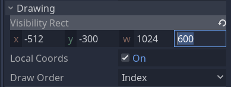

## Adding depth and infinite scrolling

If you want to add depth to your background, you'll want it to scroll slower than your camera. To do so, you can use a `ParallaxBackground` node with a `ParallaxLayer`. You can layer the stars by adding multiple layers and instancing a `StarField` inside each of them.

Change each `ParallaxLayer`'s _Motion Scale_ property to make them move at different speeds. Also, set the _Motion Mirroring_ to the screen's size. This property makes the layer duplicate the stars effect seamlessly as the camera moves.

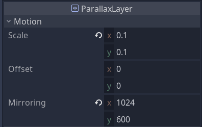

With that, our effect is ready! Here is how it looks like with a `Camera2D` moving around.



_Remember you can find the demo for this visual effect and many others in our GitHub repository [Godot Visual Effects](https://github.com/GDQuest/godot-visual-effects)._
