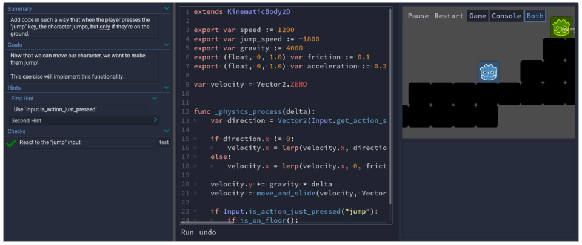

+++
title = "Learn to code with Godot"
description = "We're preparing a course and learning app for you to learn to code with Godot."
author = "nathan"

date = 2021-07-03

url = "learn-to-code"
+++

We're preparing a course and a learning app for you to learn programming and game creation from zero, with the free and open-source engine Godot.



It's an in-depth course for people who have little to no programming experience, one that'll teach you how to think like a programmer.

Among other things, we're working on an interactive app to learn and practice programming with GDScript. 

It's a massive undertaking, which is why we need your help to fund the project.

We're still in the process of planning and prototyping the course.

If you'd like to help and get it, you can subscribe via email below:

  

    

      

        

          <h4>Learn to Code with Godot</h4>
          
Get an email when we launch our Kickstarter campaign.

        

        <form class="ml-block-form" action="https://static.mailerlite.com/webforms/submit/t6g7b8" data-code="t6g7b8" method="post" target="_blank">
          

            

              

                <input aria-label="email" aria-required="true" type="email" class="form-control" data-inputmask="" name="fields[email]" placeholder="Email" autocomplete="email">
              

            

          

          

            

              
<em>You can unsubscribe anytime.</em> 

            

          

          <input type="hidden" name="ml-submit" value="1">
          

            <button type="submit" class="primary">GET GDQUEST WEEKLY</button>
            <button disabled="disabled" style="display:none" type="button" class="loading"> 

 Loading... </button>
          

          <input type="hidden" name="anticsrf" value="true">
        </form>
      

      

        

          <h4>Thanks! One more tiny step</h4>
          
You'll get an email before we launch our crowdfunding campaign.

          
<em>Well, <em>almost</em>.</em>

          
We sent you a confirmation&nbsp;email.

          
Open it and click the button it contains&nbsp;to receive our tutorials, exclusive tips, and all the good stuff!

          
<em>We use this "double opt-in" to respect privacy laws&nbsp;and&nbsp;</em><em>prevent mistakes.</em> 

        

      

    

  

